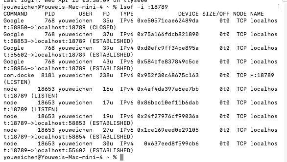

# 域名解析与反向代理部署

本文记录从零开始，将本地或云服务器上的 Agent 服务通过域名暴露到公网的完整步骤。

以 `youwei-agent.com`（阿里云购买）+ DigitalOcean 新加坡 Droplet 为例，最终效果是企业微信回调可通过 `https://youwei-agent.com/wecom/callback` 访问。

## 1. 阿里云域名解析

### 1.1 实名认证

在阿里云购买的域名必须完成实名认证，否则域名状态为 `clientHold`，DNS 解析完全暂停。

- 登录 [阿里云域名控制台](https://dc.console.aliyun.com/next/index#/domain-list/all)
- 找到目标域名，点击 **实名认证**，提交身份证照片
- 审核周期通常 **1~3 个工作日**，通过后 `clientHold` 自动解除

可以通过以下命令检查域名状态：

```bash
whois youwei-agent.com | grep -i status
```

看到 `clientHold` 消失说明已通过。

### 1.2 添加 DNS 解析记录

在阿里云 **云解析 DNS** 控制台，打开 **快速添加解析**：

| 字段 | 填写内容 |
|------|---------|
| 业务需求 | 将网站域名解析到服务器 IPv4 地址 |
| 网站域名 | 勾选 `youwei-agent.com` 和 `www.youwei-agent.com`（两个都勾）|
| 记录值 | 你的服务器公网 IPv4 地址 |

> 使用 DigitalOcean Reserved IP 作为记录值，即使重建 Droplet 也不需要改 DNS，只要保持 Reserved IP 绑定当前 Droplet 即可。


### 1.3 子域名解析配置

**理解主机记录和记录值：**

DNS 本质上是一张映射表，每条记录都由「主机记录」和「记录值」组成：

- **主机记录**：域名中主域名前面的那一段，拼上主域名就是完整域名。`@` 是特例，代表主域名本身。
- **记录值**：这条记录指向的目标，根据类型不同可以是 IP 地址（A 记录）或另一个域名（CNAME 记录）。

```text
主机记录 + 主域名 = 完整域名

@     + youwei-agent.com = youwei-agent.com       （主域名本身）
www   + youwei-agent.com = www.youwei-agent.com   （www 子域名）
notes + youwei-agent.com = notes.youwei-agent.com （notes 子域名）
blog  + youwei-agent.com = blog.youwei-agent.com  （blog 子域名）
```

**子域名配置表：**

除了主站 `@` 和 `www`，还需要配置三个子域名，各自承担不同服务：

| 主机记录 | 记录类型 | 记录值 | 用途 | 映射关系 |
|---------|---------|-------|------|---------|
| `notes` | A | `xxx.xxx.xxx.xxx` | 笔记应用 | 域名 → 服务器 IP |
| `dav` | A | `xxx.xxx.xxx.xxx` | WebDAV 文件同步服务 | 域名 → 服务器 IP |
| `blog` | CNAME | `xxx.github.io` | 博客站点（GitHub Pages） | 域名 → 另一个域名 |

**A 记录 vs CNAME 的选择逻辑：**

| 场景 | 选择 | 原因 |
|------|------|------|
| 服务跑在自己的服务器上 | A 记录 | 你知道服务器 IP 且控制它，直接指向 IP 解析更快 |
| 服务托管在第三方平台 | CNAME 记录 | 你不知道对方的 IP（如 GitHub Pages），用域名别名跟随对方 DNS 变化 |

`notes` 和 `dav` 都部署在同一台 DigitalOcean 服务器上，Nginx 通过请求中的 `server_name` 区分它们，路由到不同的后端端口。`blog` 托管在 GitHub Pages，GitHub 的出口 IP 不固定，所以用 CNAME 指向 GitHub 分配的域名，由 GitHub 的 DNS 负责最终解析。

## 2. 服务器安装 nginx 与 SSL 证书

SSH 登录到 DigitalOcean 服务器：

### 2.1 安装 nginx

```bash
apt update && apt install -y nginx
```

### 2.2 申请 Let's Encrypt SSL 证书

先确保 nginx 已启动且 80 端口未被其他服务占用：

```bash
systemctl start nginx
systemctl enable nginx
```

**Certbot 是什么：**

Certbot 是 Let's Encrypt 的官方客户端，用来自动申请免费的 HTTPS 证书，并自动续期，避免手动去证书机构网站申请、续费。

安装 certbot 并自动获取证书：

```bash
apt install -y certbot python3-certbot-nginx
certbot --nginx -d youwei-agent.com -d www.youwei-agent.com
```

**命令拆解：**

```text
certbot --nginx -d youwei-agent.com -d www.youwei-agent.com
         │       │                  │
         │       │                  └ 同一张证书同时保护 www 子域名
         │       └ 为哪个域名申请证书（-d = domain，可重复多次）
         └ 自动识别 Nginx 并重写其配置（插入 ssl_certificate 等指令）
```

**什么是 HTTP-01 验证：**

Let's Encrypt 提供多种域名所有权验证方式，HTTP-01 是最常用的一种。核心思路：

> 如果你能在域名对应的服务器上放一个特定文件，并让 CA 主动访问到它，就证明你控制了这个域名。

```text
HTTP-01 验证三步：

步骤 1：CA 给你一个随机 token，如 abc123
步骤 2：你把这个 token 放到服务器上特定路径：
        http://yourdomain.com/.well-known/acme-challenge/abc123
步骤 3：CA 主动访问这个地址，能读到正确内容 → 验证通过
```

**HTTP-01 vs DNS-01 对比：**

| 维度 | HTTP-01 | DNS-01 |
|-----|---------|--------|
| 验证方式 | 服务器上放临时文件 | DNS 里加一条 TXT 记录 |
| 通配符支持 | ❌ 不支持 `*.example.com` | ✅ 支持 |
| 端口要求 | 必须开放 80 端口 | 无端口要求 |
| 是否需要真实 IP | 必须（需要 HTTP 访问） | 不需要 |
| 自动化程度 | 全自动，无需人工干预 | 需手动配置 DNS（或接入 Cloudflare API） |
| 适用场景 | 普通单域名 | 子域名多、需要通配符证书 |

**HTTP-01 验证流程：**

Certbot 申请证书时，需要证明「你能控制这个域名指向的服务器」。验证是在你的 **DigitalOcean 服务器**上完成的，与阿里云域名注册商无关（阿里云只负责 DNS 解析）。

```text
Let's Encrypt CA
      │
      │ 访问 http://youwei-agent.com/.well-known/acme-challenge/<token>
      │
      ▼
DNS 解析（阿里云）→ 返回服务器 IP
      │
      ▼
DigitalOcean 服务器上的 Nginx（Certbot 已在此放好临时验证文件）
      │
      ▼
返回验证文件 → 验证通过 → 签发证书
```

Certbot 会自动完成整个流程：生成验证文件 → 请求证书 → 修改 Nginx 配置 → 重载 Nginx。

```text
certbot --nginx 执行的四件事：
1. 与 Let's Encrypt 通信，完成域名的 HTTP-01 验证
2. 下载证书到 /etc/letsencrypt/live/youwei-agent.com/
3. 自动修改 Nginx 配置，插入 ssl_certificate / ssl_certificate_key
4. 重载 Nginx 使证书生效
```

证书默认 90 天过期，certbot 会自动设置 systemd timer 续期，可以用以下命令验证：

```bash
certbot renew --dry-run
```

## 3. nginx 反向代理配置

使用编辑器创建站点配置文件 `/etc/nginx/sites-available/youwei-agent`（这是一个文件，不是文件夹）：

```bash
# 用 nano 新建（适合新手，Ctrl+O 保存，Ctrl+X 退出）
nano /etc/nginx/sites-available/youwei-agent

# 或用 vim（i 进入插入模式，Esc → :wq 保存退出）
vim /etc/nginx/sites-available/youwei-agent
```

填入以下内容：

```nginx
server {
    listen 443 ssl;
    server_name youwei-agent.com www.youwei-agent.com;

    # certbot 自动生成的证书路径（示例，实际路径由 certbot 填写）
    # ssl_certificate /etc/letsencrypt/live/youwei-agent.com/fullchain.pem;
    # ssl_certificate_key /etc/letsencrypt/live/youwei-agent.com/privkey.pem;

    # 企业微信回调 → bot-wecom (8080)
    location /wecom/ {
        proxy_pass http://127.0.0.1:8080;
        proxy_set_header Host $host;
        proxy_set_header X-Real-IP $remote_addr;
        proxy_set_header X-Forwarded-For $proxy_add_x_forwarded_for;
        proxy_set_header X-Forwarded-Proto $scheme;
    }

    # Web 界面 → web (8090)
    location / {
        proxy_pass http://127.0.0.1:8090;
        proxy_set_header Host $host;
        proxy_set_header X-Real-IP $remote_addr;
        proxy_set_header X-Forwarded-For $proxy_add_x_forwarded_for;
        proxy_set_header X-Forwarded-Proto $scheme;
    }
}

server {
    listen 80;
    server_name youwei-agent.com www.youwei-agent.com;
    return 301 https://$host$request_uri;
}
```

这份配置由两个 `server` 块组成，各自职责如下：

### 第一个 server 块：处理 HTTPS 请求（443 端口）

```nginx
server {
    listen 443 ssl;                                    # 监听 HTTPS 端口（443）
    server_name youwei-agent.com www.youwei-agent.com; # 匹配哪个域名的请求

    # ssl_certificate / ssl_certificate_key 由 certbot 自动填入，
    # 告诉 Nginx 用哪个证书和私钥做 TLS 握手
```

`location` 是路由规则，Nginx 按请求路径分配给不同后端：

| 客户端请求 | location 匹配 | 转发到 |
|---|---|---|
| `https://youwei-agent.com/wecom/callback` | `/wecom/` | `127.0.0.1:8080`（bot-wecom） |
| `https://youwei-agent.com/` 或其他路径 | `/` | `127.0.0.1:8090`（web-ui） |

`proxy_set_header` 把客户端的真实信息透传给后端，否则后端拿不到真实 IP 和域名：

| Header | 作用 |
|---|---|
| `Host $host` | 告诉后端请求来自哪个域名 |
| `X-Real-IP $remote_addr` | 客户端真实 IP（否则后端只看到 127.0.0.1） |
| `X-Forwarded-For` | 多级代理时追踪完整链路 |
| `X-Forwarded-Proto $scheme` | 客户端用的是 http 还是 https |

### 第二个 server 块：HTTP 强制跳转 HTTPS（80 端口）

```nginx
server {
    listen 80;
    server_name youwei-agent.com www.youwei-agent.com;
    return 301 https://$host$request_uri;  # 所有 HTTP 请求 301 跳转到 HTTPS
}
```

用户输入 `http://youwei-agent.com/xxx` 时，浏览器被强制跳转到 `https://youwei-agent.com/xxx`，确保所有流量都走加密通道。

启用站点并重载 nginx：

```bash
ln -s /etc/nginx/sites-available/youwei-agent /etc/nginx/sites-enabled/
nginx -t            # 检查配置语法
systemctl reload nginx
```

  

