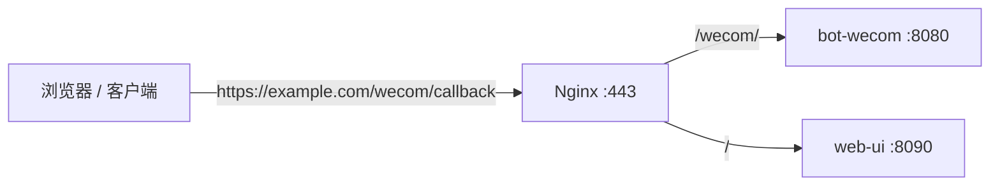

# Nginx 反向代理：从概念到实战

> **适用场景**：用 Nginx 作为 Web 服务的入口层，承担域名路由、SSL 终止、请求转发等职责。
>
> **前置阅读**：[域名解析与反向代理部署](./deploy-dns-nginx.md) 提供了一个完整的阿里云 + DigitalOcean 部署案例，建议配合阅读。

## 1. 代理的本质

代理（Proxy）是流量路径上的**中间层**。无论哪种代理，核心模式不变：

```
发起方 → 代理 → 目标
```

区别只在于代理**站在哪一侧**。

### 1.1 正向代理（Forward Proxy）

代理站在**客户端一侧**，替客户端发请求。

```
Client → Forward Proxy → Internet → Server
```

典型场景：
- VPN / 翻墙：Hysteria2、WireGuard 让流量通过海外 VPS 出去
- 公司内网：所有员工的 HTTP 请求走公司代理
- `curl` 的 `--proxy` 参数

特征：**Server 看到的 IP 是代理服务器的 IP**，Server 不知道有 Proxy 的存在。

### 1.2 反向代理（Reverse Proxy）

代理站在**服务端一侧**，接收来自客户端的请求再分发给后端。

```
Client → Internet → Reverse Proxy → Backend Server(s)
```

典型场景：
- Nginx 接收 443 请求，根据 `location` 转发给不同后端服务
- 负载均衡：多个后端实例轮询接收请求
- API 网关：统一认证、限流、路由

特征：**Client 看到的 IP 是代理服务器的 IP**，Client 不知道有后端的真实服务存在。

### 1.3 两者对比

| 维度 | 正向代理 | 反向代理 |
|------|---------|---------|
| 位置 | 客户端侧 | 服务端侧 |
| 谁配置 | 客户端配置 proxy | 服务端部署 Nginx |
| 隐藏谁 | 隐藏客户端 IP | 隐藏后端服务 IP |
| 目标知不知道 | 不知道有代理 | 不知道有后端 |
| 典型工具 | Hysteria2、v2rayN、Clash | Nginx、Caddy、Kong |

## 2. Nginx 作为反向代理的角色

Nginx 在反向代理场景中的职责：



Nginx 在这个位置做三件事：

1. **SSL 终止**：客户端和 Nginx 之间是 HTTPS，Nginx 和后端之间是 HTTP。后端不需要管证书。
2. **路径路由**：根据 `location` 指令把不同路径转发到不同端口/服务。
3. **Header 传递**：把客户端的真实信息（IP、协议）透传给后端。

## 3. 核心指令详解

### 3.1 proxy_pass

`proxy_pass` 是反向代理的核心，语法：

```nginx
location /wecom/ {
    proxy_pass http://127.0.0.1:8080;
}
```

**各部分含义：**

| 部分                      | 含义                                          |     |
| ----------------------- | ------------------------------------------- | --- |
| `location /wecom/`      | 匹配**客户端请求 URL** 中以 `/wecom/` 开头的路径（与后端地址无关） |     |
| `proxy_pass`            | Nginx 指令，将匹配到的请求转发给后端服务                     |     |
| `http://127.0.0.1:8080` | 后端地址，由协议 + 主机 + 端口三部分组成（见下方说明）        |     |

> **`location` 匹配的是客户端发来的请求路径，不是后端内部路径。** 例如客户端请求 `https://youwei-agent.com/wecom/callback`，Nginx 取 URL 中的 `/wecom/callback` 与 `location /wecom/` 做前缀匹配，命中后转发给 `proxy_pass` 指定的后端。后端的地址和路径结构不影响 `location` 的匹配逻辑。

**后端地址 `http://127.0.0.1:8080` 拆解：**

- `http://` — Nginx 与后端之间的通信协议。后端跑 HTTP 就用 `http`，跑 HTTPS 就用 `https`
- `127.0.0.1` — IPv4 的**本地回环地址**（loopback），即"指向本机"的特殊 IP。Nginx 和后端服务跑在同一台服务器上，所以用 `127.0.0.1` 访问本机上的进程（也可以写成 `localhost`）。如果后端部署在另一台机器，这里改为那台机器的内网 IP 或公网 IP，如 `http://10.0.0.5:8080`
- `8080` — 后端服务**监听的端口号**。Nginx 把匹配到的请求转发到本机的这个端口，由跑在该端口上的后端进程（如 bot-wecom）接收处理

**关键细节：URL 末尾有没有 `/`，行为完全不同。**

```nginx
# 没有尾随斜杠：请求路径原样转发
location /wecom/ {
    proxy_pass http://127.0.0.1:8080;
}

# 有尾随斜杠：location 匹配的部分被替换
location /wecom/ {
    proxy_pass http://127.0.0.1:8080/;
}
```

两种写法的转发结果对比（`callback`、`api/send` 等只是示例路径，实际取决于客户端请求）：

| 客户端请求的完整路径 | 无尾部 `/`（原样转发） | 有尾部 `/`（去掉前缀） |
|---|---|---|
| `/wecom/api/send` | `http://127.0.0.1:8080/wecom/api/send` | `http://127.0.0.1:8080/api/send` |
| `/wecom/hello` | `http://127.0.0.1:8080/wecom/hello` | `http://127.0.0.1:8080/hello` |
| `/wecom/` | `http://127.0.0.1:8080/wecom/` | `http://127.0.0.1:8080/` |

规律：**没有尾部 `/`** — `location` 匹配到的部分保留，原封不动传给后端；**有尾部 `/`** — `location` 匹配到的 `/wecom/` 被替换成 `/`，等于去掉了这个前缀。

在 LLM API 代理场景（参考 [海外 VPS 部署多 LLM API 代理](../tutorials/vps-llm-proxy.md)），这个区别尤其重要：

```nginx
# /openai/v1/chat/completions → https://api.openai.com/v1/chat/completions
location /openai/ {
    proxy_pass https://api.openai.com/;
    # ↑ 尾随斜杠，/openai/ 前缀被剥除
}
```

### 3.2 proxy_set_header

Nginx 默认传递给后端的 Header 有限。有些重要信息需要显式设置：

```nginx
location / {
    proxy_pass http://127.0.0.1:8090;

    proxy_set_header Host              $host;
    proxy_set_header X-Real-IP         $remote_addr;
    proxy_set_header X-Forwarded-For   $proxy_add_x_forwarded_for;
    proxy_set_header X-Forwarded-Proto $scheme;
}
```

| Header | 含义 | 为什么需要 |
|--------|------|----------|
| `Host` | 请求的域名 | 后端靠它判断是哪个站点 |
| `X-Real-IP` | 客户端真实 IP | 否则后端只能看到 Nginx 的 127.0.0.1 |
| `X-Forwarded-For` | 代理链路 IP 列表 | 多级代理时追踪完整链路 |
| `X-Forwarded-Proto` | 客户端用的协议（http/https） | 后端生成绝对 URL 时用它 |

**SSE 流式场景的特殊 Header**（如 LLM 流式输出）：

```nginx
proxy_buffering    off;
proxy_cache        off;
proxy_http_version 1.1;
proxy_set_header   Connection "";
```

这四行确保 Nginx 不缓冲响应，客户端能实时收到 `data: {...}` 事件流。

### 3.3 SSL 相关指令

反向代理场景最经典的做法是**前端 HTTPS + 后端 HTTP**：

```nginx
server {
    listen 443 ssl;
    server_name example.com;

    ssl_certificate     /etc/letsencrypt/live/example.com/fullchain.pem;
    ssl_certificate_key /etc/letsencrypt/live/example.com/privkey.pem;
    ssl_protocols       TLSv1.2 TLSv1.3;

    location / {
        proxy_pass http://127.0.0.1:8090;  # ← HTTP，不是 HTTPS
    }
}

server {
    listen 80;
    server_name example.com;
    return 301 https://$host$request_uri;  # HTTP 强制跳转 HTTPS
}
```

当 Nginx 代理到**外部 HTTPS 服务**（如 OpenAI API），需要额外加 SNI：

```nginx
location /openai/ {
    proxy_pass https://api.openai.com/;
    proxy_ssl_server_name on;          # ← 发 SNI 给上游
    proxy_ssl_name api.openai.com;     # ← SNI 值
    proxy_ssl_verify off;              # 调试时可关闭证书验证
}
```

`proxy_ssl_server_name on` 是必须的：不启用 SNI，上游服务器（如 Cloudflare 后的服务）无法知道你要访问哪个域名，会返回证书错误。

## 4. 配置文件结构

Nginx 推荐把站点配置放在 `sites-available/`，通过软链接启用：

```
/etc/nginx/
├── nginx.conf              # 全局配置
├── sites-available/        # 配置文件（未启用）
│   └── my-site
└── sites-enabled/          # 软链接 → sites-available（已启用）
    └── my-site → ../sites-available/my-site
```

操作步骤：

```bash
# 1. 写配置文件
vim /etc/nginx/sites-available/my-site

# 2. 创建软链接启用
ln -s /etc/nginx/sites-available/my-site /etc/nginx/sites-enabled/

# 3. 测试语法
nginx -t

# 4. 重载（不中断现有连接）
systemctl reload nginx
```

## 5. 实战：完整配置模板

以下是一个可直接使用的通用反向代理配置，适用于部署一个域名下多个后端服务的场景：

```nginx
server {
    listen 443 ssl http2;
    server_name example.com www.example.com;

    # SSL 证书路径（certbot 申请）
    ssl_certificate     /etc/letsencrypt/live/example.com/fullchain.pem;
    ssl_certificate_key /etc/letsencrypt/live/example.com/privkey.pem;
    ssl_protocols       TLSv1.2 TLSv1.3;
    ssl_ciphers         HIGH:!aNULL:!MD5;
    ssl_session_cache   shared:SSL:10m;
    ssl_session_timeout 10m;

    # 日志
    access_log /var/log/nginx/example-access.log;
    error_log  /var/log/nginx/example-error.log warn;

    # 通用配置
    client_max_body_size    50M;
    proxy_connect_timeout   60s;
    proxy_send_timeout      120s;
    proxy_read_timeout      120s;

    # API 服务 → 后端 :8080
    location /api/ {
        proxy_pass http://127.0.0.1:8080/;
        proxy_set_header Host              $host;
        proxy_set_header X-Real-IP         $remote_addr;
        proxy_set_header X-Forwarded-For   $proxy_add_x_forwarded_for;
        proxy_set_header X-Forwarded-Proto $scheme;
    }

    # 前端界面 → :8090
    location / {
        proxy_pass http://127.0.0.1:8090;
        proxy_set_header Host              $host;
        proxy_set_header X-Real-IP         $remote_addr;
        proxy_set_header X-Forwarded-For   $proxy_add_x_forwarded_for;
        proxy_set_header X-Forwarded-Proto $scheme;
    }

    # 健康检查
    location = /health {
        access_log off;
        return 200 "ok\n";
        add_header Content-Type text/plain;
    }
}

server {
    listen 80;
    server_name example.com www.example.com;
    return 301 https://$host$request_uri;
}
```

## 6. 常见问题排查

### 502 Bad Gateway

后端服务没有响应。检查后端进程是否运行：

```bash
# 后端进程是否存活
ps aux | grep your-backend

# 端口是否在监听
ss -tlnp | grep 8080

# 手动测试后端
curl http://127.0.0.1:8080
```

### 504 Gateway Timeout

后端处理太慢，超过了 `proxy_read_timeout`。临时调大：

```nginx
proxy_read_timeout 300s;
```

LLM API 流式场景建议设为 `600s` 以上。

### 后端获取不到真实客户端 IP

检查是否缺少 `X-Real-IP` 或 `X-Forwarded-For` Header。同时后端框架需要启用「信任代理」配置：

- Go 的 `http.Server`：手动读 `r.Header.Get("X-Forwarded-For")`
- Node.js Express：`app.set('trust proxy', true)`
- Python FastAPI：使用 `Middleware` 读取

### SSL 证书错误（代理外部 HTTPS 时）

```nginx
# 加 SNI 支持
proxy_ssl_server_name on;
proxy_ssl_name api.example.com;
```

### 流式响应（SSE）不工作

确保关闭缓冲：

```nginx
proxy_buffering off;
proxy_cache off;
proxy_http_version 1.1;
proxy_set_header Connection "";
```

## 7. 延伸阅读

- [域名解析与反向代理部署](./deploy-dns-nginx.md) - 阿里云域名 + DigitalOcean + Let's Encrypt 的完整部署流程
- [海外 VPS 部署多 LLM API 代理](../tutorials/vps-llm-proxy.md) - Nginx 代理 OpenAI / Anthropic / Gemini 的专项实战，包含 Token 认证和速率限制
- [基于 Hysteria2 的高性能代理服务器](../tutorials/build-vpn.md) - 正向代理视角的 QUIC 协议实践
