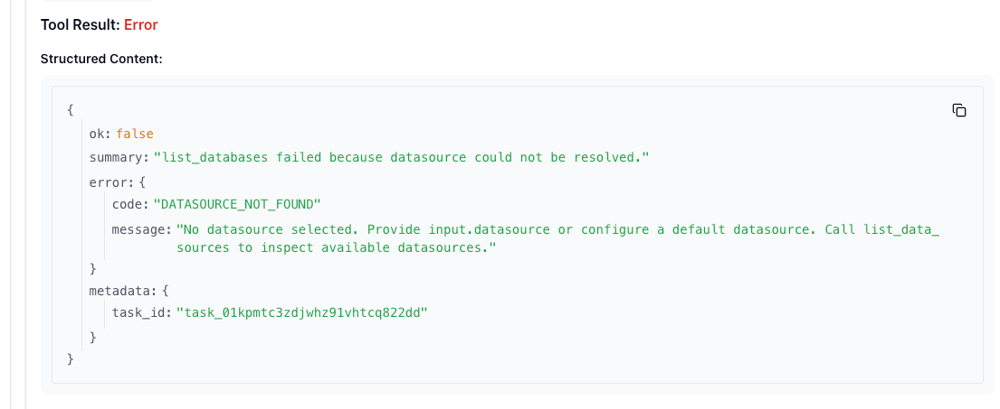

# MCP Inspector 完全指南

## 1. 什么是 MCP Inspector？

**MCP Inspector** 是官方提供的 MCP 服务器调试工具，它可以帮助你：

- **测试 MCP 服务器**：验证服务器是否正常工作
- **调试工具和资源**：检查服务器提供的工具、资源、提示词
- **模拟客户端请求**：模拟 Claude 等客户端的调用行为
- **排查连接问题**：定位 stdio 或 SSE 通信问题

### 1.1 Inspector 的核心功能

Inspector 提供了一个可视化界面，让你可以：

1. **查看服务器信息**：服务器名称、版本、支持的协议版本
2. **列出可用工具**：查看所有工具的名称、描述、参数 schema
3. **测试工具调用**：输入参数，执行工具，查看返回结果
4. **浏览资源列表**：查看服务器暴露的资源
5. **查看提示词模板**：检查预定义的提示词

### 1.2 Inspector vs Claude Desktop

| 特性         | Inspector          | Claude Desktop  |
| ------------ | ------------------ | --------------- |
| **用途**     | 开发调试           | 生产使用        |
| **界面**     | Web UI             | 集成在聊天中    |
| **控制粒度** | 可单独测试每个工具 | AI 自动选择工具 |
| **错误信息** | 详细的技术错误     | 用户友好的提示  |
| **适用阶段** | 开发和测试阶段     | 部署后日常使用  |

---

## 2. 安装和启动 Inspector

### 2.1 安装方式

Inspector 是一个 npm 包，可以通过 `npx` 直接运行，无需全局安装：

```bash
npx @modelcontextprotocol/inspector
```

### 2.2 启动 Inspector

#### 基本启动（无参数）

```bash
npx @modelcontextprotocol/inspector
```

启动后，Inspector 会：

1. 在本地启动一个 Web 服务器（默认端口 5173）
2. 自动打开浏览器访问 `http://localhost:5173`
3. 显示 Inspector 界面，等待你连接 MCP 服务器

#### 连接到 MCP 服务器

在 Inspector 界面中，你需要指定 MCP 服务器的启动命令：

**stdio 方式连接**：

```
命令: node
参数: /path/to/your/mcp-server/dist/index.js
```

**Python 服务器连接**：

```
命令: python
参数: /path/to/your/server.py
```

---

## 3. 带环境变量启动 Inspector

### 3.1 为什么需要配置环境变量？

很多 MCP 服务器依赖环境变量来获取配置信息，例如：

- **数据库连接信息**：连接字符串、用户名、密码
- **API 密钥**：第三方服务的认证 token
- **配置文件路径**：指定服务器读取配置的位置
- **运行模式**：开发/生产环境切换

**如果不传递这些环境变量，服务器可能**：

1. 无法启动（缺少必需配置）
2. 连接失败（数据库/API 无法访问）
3. 功能受限（缺少认证信息）
4. 行为异常（使用了错误的配置）

### 3.2 使用 `-e` 参数传递环境变量

Inspector 支持 `-e` 参数来传递环境变量：

```bash
npx @modelcontextprotocol/inspector \
    -e ENV_VAR_NAME=value \
    -e ANOTHER_VAR=another_value \
    -- command args
```

**示例：传递数据库配置**

```bash
npx @modelcontextprotocol/inspector \
    -e DATABASE_URL=postgresql://localhost/mydb \
    -e DB_USER=admin \
    -e DB_PASSWORD=secret \
    -- python /path/to/db-server.py
```

**示例：传递 API 密钥**

```bash
npx @modelcontextprotocol/inspector \
    -e GITHUB_TOKEN=ghp_your_token \
    -e SLACK_BOT_TOKEN=xoxb_your_token \
    -- node /path/to/api-server.js
```

### 3.3 实战示例：TaurusDB MCP 服务器

以下是一个完整的示例，展示如何启动一个需要配置文件的 MCP 服务器：

```bash
npx @modelcontextprotocol/inspector \
    -e TAURUSDB_SQL_PROFILES=/tmp/taurusdb-local-profiles.json \
    -e TAURUSDB_DEFAULT_DATASOURCE=local_mysql \
    -- node packages/mcp/dist/index.js
```

**参数说明**：

| 参数                                         | 说明                                |
| -------------------------------------------- | ----------------------------------- |
| `-e TAURUSDB_SQL_PROFILES=...`               | 指定数据库连接配置文件的路径        |
| `-e TAURUSDB_DEFAULT_DATASOURCE=local_mysql` | 指定默认使用的数据源名称            |
| `--`                                         | 分隔符，后面是 MCP 服务器的启动命令 |
| `node packages/mcp/dist/index.js`            | 启动编译后的 MCP 服务器             |

---

## 4. Inspector 界面详解

### 4.1 连接面板

启动 Inspector 后，首先看到的是连接面板：



**主要元素**：

- **Transport Type**：选择 `stdio` 或 `sse`
- **Command**：可执行文件路径（如 `node`、`python`）
- **Arguments**：命令参数
- **Environment Variables**：环境变量配置
- **Connect Button**：点击连接服务器

### 4.2 服务器信息面板

连接成功后，可以看到：

```
Server Info:
  Name: my-mcp-server
  Version: 1.0.0
  Protocol Version: 2024-11-05
```

### 4.3 Tools 面板

列出服务器提供的所有工具：

```
Tools:
  ├── execute_sql
  │   Description: Execute SQL query
  │   Input Schema: { query: string }
  │
  ├── get_table_schema
  │   Description: Get table structure
  │   Input Schema: { table_name: string }
  │
  └── list_tables
      Description: List all tables
      Input Schema: {}
```

**测试工具**：

1. 选择一个工具
2. 输入参数（JSON 格式）
3. 点击 "Call Tool"
4. 查看返回结果

### 4.4 Resources 面板

列出服务器暴露的资源：

```
Resources:
  ├── file:///path/to/config.json
  │   Name: Configuration
  │   MIME Type: application/json
  │
  └── database://tables/users
      Name: Users Table
      MIME Type: application/json
```

### 4.5 Prompts 面板

列出预定义的提示词模板：

```
Prompts:
  ├── analyze_table
  │   Description: Analyze table structure
  │   Arguments: [table_name]
  │
  └── generate_report
      Description: Generate data report
      Arguments: [start_date, end_date]
```

---

## 5. 常见问题与解决方案

### 5.1 问题：缺少环境变量导致服务器无法启动

**错误表现**：


Inspector 显示连接失败，服务器日志提示找不到配置文件或环境变量。

**原因分析**：

MCP 服务器在启动时需要读取环境变量来初始化配置。如果 Inspector 启动时没有传入这些变量，服务器就会：

1. 找不到配置文件路径
2. 缺少数据库连接信息
3. 无法确定默认数据源

**解决方案**：

关闭当前的 Inspector，用带环境变量的命令重新启动：

```bash
npx @modelcontextprotocol/inspector \
    -e TAURUSDB_SQL_PROFILES=/tmp/taurusdb-local-profiles.json \
    -e TAURUSDB_DEFAULT_DATASOURCE=local_mysql \
    -- node packages/mcp/dist/index.js
```

### 5.2 问题：路径不存在或无效

**错误表现**：

```
Error: Configuration file not found: /wrong/path/profiles.json
```

**解决方案**：

1. 检查文件路径是否正确
2. 确保使用绝对路径（不是相对路径）
3. 验证文件是否存在：

```bash
ls -la /tmp/taurusdb-local-profiles.json
```

### 5.3 问题：Node.js 或 Python 命令找不到

**错误表现**：

```
Error: Command 'node' not found
Error: Command 'python' not found
```

**解决方案**：

1. 确认 Node.js/Python 已安装：

```bash
node --version
python --version
```

2. 如果使用虚拟环境，指定完整路径：

```bash
npx @modelcontextprotocol/inspector \
    -- /path/to/venv/bin/python /path/to/server.py
```

### 5.4 问题：服务器启动但工具调用失败

**错误表现**：

服务器连接成功，但调用工具时返回错误。

**排查步骤**：

1. **检查环境变量是否正确传递**：
   - 在 Inspector 中查看 Environment Variables 面板
   - 确认所有必需变量都已设置

2. **检查配置文件内容**：

   ```bash
   cat /tmp/taurusdb-local-profiles.json
   ```

3. **测试数据库连接**：

   ```bash
   # 手动测试连接
   mysql -u user -p -h localhost mydb
   ```

4. **查看服务器日志**：
   - Inspector 通常会显示服务器输出
   - 检查是否有错误信息

### 5.5 问题：SSE 服务器连接失败

**错误表现**：

```
Error: Failed to connect to SSE endpoint
```

**解决方案**：

1. **确认服务器正在运行**：

```bash
curl http://localhost:8000/sse
```

2. **检查端口是否被占用**：

```bash
lsof -i :8000
```

3. **使用正确的 SSE URL**：

在 Inspector 中选择 `sse` transport，输入完整的 URL：

```
http://localhost:8000/sse
```

---

## 6. 环境变量配置最佳实践

### 6.1 哪些信息应该通过环境变量传递？

**推荐使用环境变量的场景**：

| 信息类型     | 示例                               | 原因                   |
| ------------ | ---------------------------------- | ---------------------- |
| 配置文件路径 | `CONFIG_PATH=/path/to/config.json` | 灵活切换不同环境配置   |
| 数据库连接   | `DATABASE_URL=postgresql://...`    | 避免硬编码敏感信息     |
| API 密钥     | `API_KEY=sk-xxx`                   | 便于更换密钥，保护安全 |
| 运行模式     | `ENV=development`                  | 区分开发和生产行为     |
| 日志级别     | `LOG_LEVEL=DEBUG`                  | 调试时开启详细日志     |

**不推荐使用环境变量的场景**：

| 信息类型   | 建议         | 原因               |
| ---------- | ------------ | ------------------ |
| 固定常量   | 写在代码中   | 环境变量增加复杂度 |
| 大型配置   | 使用配置文件 | 环境变量长度有限制 |
| 二进制数据 | 使用文件     | 环境变量不支持     |

### 6.2 配置文件方式 vs 环境变量方式

**配置文件方式**：

```bash
-e CONFIG_PATH=/path/to/config.json
```

```json
// config.json
{
  "database": {
    "host": "localhost",
    "port": 5432,
    "name": "mydb"
  },
  "api": {
    "endpoint": "https://api.example.com",
    "timeout": 30000
  }
}
```

**优点**：

- 结构化配置，支持复杂嵌套
- 便于管理多个配置项
- 配置文件可以版本控制

**环境变量方式**：

```bash
-e DB_HOST=localhost \
-e DB_PORT=5432 \
-e DB_NAME=mydb
```

**优点**：

- 无需额外文件
- 适合少量简单配置
- 更易于容器化部署

### 6.3 创建配置文件示例

**数据库连接配置文件**：

```json
{
  "profiles": {
    "local_mysql": {
      "type": "mysql",
      "host": "localhost",
      "port": 3306,
      "user": "root",
      "password": "password",
      "database": "mydb"
    },
    "remote_postgres": {
      "type": "postgresql",
      "host": "remote.server.com",
      "port": 5432,
      "user": "admin",
      "password": "secret",
      "database": "analytics"
    }
  },
  "default": "local_mysql"
}
```

保存到 `/tmp/taurusdb-local-profiles.json`。

---

## 7. Inspector 调试流程

### 7.1 标准调试流程

```
┌─────────────────────────────────────────────────────────┐
│                  Inspector 调试流程                      │
├─────────────────────────────────────────────────────────┤
│                                                          │
│  Step 1: 准备环境变量                                    │
│  ├─ 确定需要的环境变量                                   │
│  ├─ 创建配置文件（如果需要）                             │
│  └─ 检查文件路径和内容                                   │
│                                                          │
│  Step 2: 启动 Inspector                                  │
│  ├─ 使用 npx 运行                                        │
│  ├─ 传递所有环境变量                                     │
│  └─ 指定服务器启动命令                                   │
│                                                          │
│  Step 3: 验证连接                                        │
│  ├─ 检查服务器信息是否显示                               │
│  ├─ 查看 Tools/Resources/Prompts 面板                   │
│  └─ 确认没有错误信息                                     │
│                                                          │
│  Step 4: 测试功能                                        │
│  ├─ 选择一个工具                                         │
│  ├─ 输入测试参数                                         │
│  ├─ 执行并查看结果                                       │
│  └─ 验证返回数据是否正确                                 │
│                                                          │
│  Step 5: 修复问题                                        │
│  ├─ 如果出错，查看错误详情                               │
│  ├─ 检查环境变量和配置                                   │
│  ├─ 修改后重新连接                                       │
│  └─ 重复测试直到成功                                     │
│                                                          │
└─────────────────────────────────────────────────────────┘
```

### 7.2 调试技巧

#### 技巧 1：逐步添加环境变量

如果不确定需要哪些环境变量，可以：

1. 先不传任何环境变量启动
2. 观察错误信息，了解缺少什么
3. 逐个添加环境变量
4. 每次添加后重新测试

#### 技巧 2：使用 DEBUG 日志级别

```bash
-e LOG_LEVEL=DEBUG
```

开启详细日志可以帮助定位问题。

#### 技巧 3：验证配置文件

```bash
# 验证 JSON 格式
python -m json.tool /path/to/config.json

# 检查文件内容
cat /path/to/config.json
```

#### 技巧 4：单独测试服务器

在连接 Inspector 之前，先手动运行服务器：

```bash
# 设置环境变量
export TAURUSDB_SQL_PROFILES=/tmp/taurusdb-local-profiles.json
export TAURUSDB_DEFAULT_DATASOURCE=local_mysql

# 运行服务器
node packages/mcp/dist/index.js
```

如果服务器本身有问题，先修复服务器。

---

## 8. Inspector 与 Claude Code CLI 的区别

### 8.1 Claude Code CLI 配置 MCP

Claude Code CLI 提供了 `claude mcp` 命令来管理 MCP 服务器：

```bash
# 添加 MCP 服务器
claude mcp add my-server \
    --transport stdio --scope local \
    --env MY_VAR=value \
    -- node /path/to/server.js

# 列出已配置的服务器
claude mcp list

# 删除服务器
claude mcp remove my-server
```

### 8.2 Inspector vs Claude Code CLI

| 场景         | 使用 Inspector | 使用 Claude Code CLI |
| ------------ | -------------- | -------------------- |
| **开发阶段** | 测试新服务器   | 配置本地开发环境     |
| **调试问题** | 详细查看错误   | 查看运行状态         |
| **生产使用** | 不适用         | 配置 Claude Code     |
| **工具测试** | 单独调用工具   | 通过 AI 自动调用     |

### 8.3 工作流程建议

**开发新 MCP 服务器时**：

1. 使用 Inspector 测试服务器功能
2. 验证所有工具正常工作
3. 确认环境变量配置正确
4. 使用 Claude Code CLI 正式配置

**调试现有服务器时**：

1. 如果 Claude Code 中服务器不工作
2. 先用 Inspector 单独测试
3. 定位问题后修复
4. 重新配置到 Claude Code

---

## 9. 完整示例

### 9.1 开发一个需要环境变量的 MCP 服务器

**服务器代码示例**：

```typescript
// server.ts
import { Server } from "@modelcontextprotocol/sdk";

const server = new Server({
  name: "my-database-server",
  version: "1.0.0",
});

// 从环境变量读取配置
const configPath = process.env.DB_CONFIG_PATH;
const defaultDb = process.env.DEFAULT_DATABASE;

if (!configPath) {
  throw new Error("DB_CONFIG_PATH environment variable is required");
}

// 读取配置文件
const config = JSON.parse(fs.readFileSync(configPath, "utf-8"));

server.addTool({
  name: "query",
  description: "Execute SQL query",
  inputSchema: {
    type: "object",
    properties: {
      sql: { type: "string" },
    },
  },
  handler: async (params) => {
    const db = config[defaultDb];
    // 执行查询...
    return { result: "..." };
  },
});

server.start();
```

### 9.2 使用 Inspector 测试

**创建配置文件**：

```bash
cat > /tmp/db-config.json << 'EOF'
{
  "main_db": {
    "host": "localhost",
    "port": 3306,
    "user": "root",
    "database": "mydb"
  }
}
EOF
```

**启动 Inspector**：

```bash
npx @modelcontextprotocol/inspector \
    -e DB_CONFIG_PATH=/tmp/db-config.json \
    -e DEFAULT_DATABASE=main_db \
    -e LOG_LEVEL=DEBUG \
    -- node dist/server.js
```

**在 Inspector 中测试**：

1. 连接服务器
2. 选择 `query` 工具
3. 输入参数：`{"sql": "SELECT * FROM users LIMIT 10"}`
4. 执行并查看结果

---

## 10. 总结

### 10.1 Inspector 的核心价值

MCP Inspector 是开发 MCP 服务器的必备工具：

- **可视化调试**：直观查看服务器状态
- **隔离测试**：单独测试每个功能
- **快速定位问题**：详细的错误信息
- **环境变量验证**：确保配置正确传递

### 10.2 环境变量配置要点

记住这些关键点：

1. **必需的环境变量必须传递**：否则服务器无法启动
2. **使用 `-e` 参数传递**：`-e VAR_NAME=value`
3. **使用 `--` 分隔符**：分隔环境变量和命令
4. **使用绝对路径**：配置文件路径必须是绝对路径
5. **验证配置文件**：确保 JSON 格式正确，内容有效

### 10.3 下一步

现在你已经掌握了 MCP Inspector：

1. 尝试调试你自己的 MCP 服务器
2. 集成到 Claude Code CLI 正式使用
3. 探索更多高级功能
