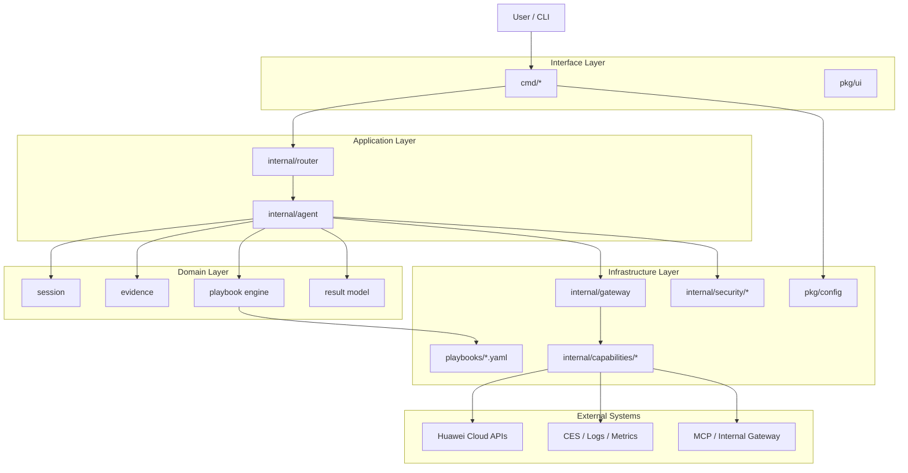
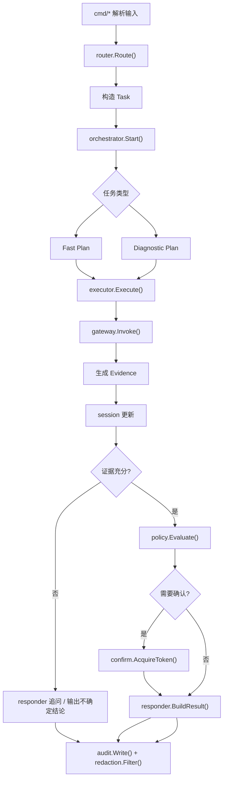
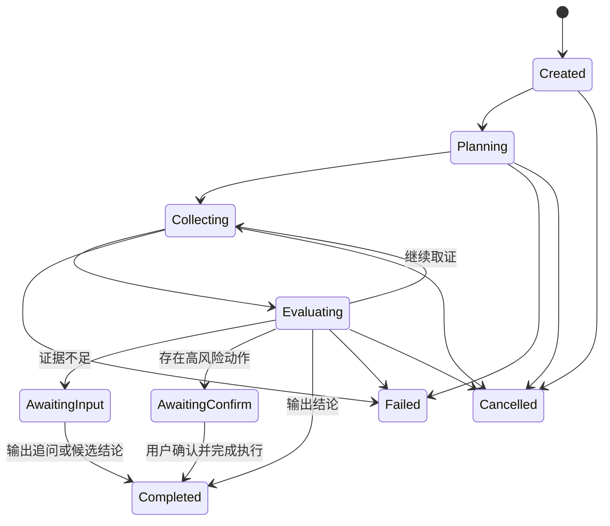
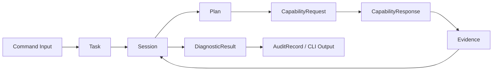

# OpenTaurus 架构设计文档

> 基于 [requirements.md](./requirements) 的整体架构，补充为一份面向实现与评审的设计稿。
> 目标是把 OpenTaurus 从“方案描述”收敛为“可直接落地的工程架构”。

---

## 01 · 文档定位

本文档聚焦三个问题：

1. OpenTaurus 的运行时由哪些核心模块组成，各模块边界是什么。
2. direct / chat / diagnose 三类请求如何进入统一主链路。
3. 诊断、执行、安全、审计、扩展能力如何在同一架构内协同。

与 `requirements.md` 的分工如下：

| 文档 | 关注点 |
| --- | --- |
| `requirements.md` | 方案背景、整体架构、功能清单、测试策略、MVP 边界 |
| `architecture.md` | 模块职责、依赖方向、核心契约、状态机、执行模型、落地规则 |

---

## 02 · 设计目标与约束

### 2.1 目标

| 目标 | 说明 |
| --- | --- |
| 统一主链路 | direct / chat / diagnose 统一进入 `router -> orchestrator -> executor` 主链路，不允许命令层旁路业务逻辑 |
| 证据驱动 | 诊断结论必须绑定证据引用，避免无依据输出 |
| 安全默认开启 | 高风险动作默认进入 `policy + confirm + audit + redaction` 链路 |
| 能力可扩展 | 新增云能力或内部能力时，应以新增 `capability` 或 `playbook` 为主，而不是修改主控流程 |
| 单二进制交付 | 保持 Go 单二进制、跨平台构建和本地 CLI 使用体验 |
| 可观测可治理 | 每次请求都应具备 task/session/audit 三条可追踪主线 |

### 2.2 非目标

| 非目标 | 说明 |
| --- | --- |
| 通用 Shell Agent | 不支持任意系统命令执行，能力边界必须显式注册 |
| 静默自动修复 | 删除、重启、配置变更等动作不做无确认自动执行 |
| 多云统一层 | MVP 只聚焦华为云 RDS，不抽象多云兼容接口 |
| 长期记忆系统 | 首版不引入复杂知识库或长期用户画像，优先 Playbook + 实时证据 |

### 2.3 关键约束

| 约束 | 规则 |
| --- | --- |
| 依赖方向 | `cmd -> router -> agent -> core/gateway/security`，下层不得反向依赖上层 |
| 写操作门禁 | 所有写操作必须先完成策略评估；高风险动作必须带确认令牌 |
| 契约稳定 | `Task / Session / Evidence / Result / CapabilityRequest` 作为跨模块稳定边界 |
| 输出约束 | 所有对外输出先脱敏，再格式化 |
| 资源预算 | 每次请求都必须有超时、步数、轮次和并发预算 |

---

## 03 · 总体架构视图

### 3.1 分层视图



### 3.2 分层职责

| 层次 | 模块 | 负责内容 | 明确不负责 |
| --- | --- | --- | --- |
| Interface | `cmd/*`, `pkg/ui` | 参数解析、输入预校验、用户交互、输出展示 | 云 API 调用、诊断推理、证据存储 |
| Application | `internal/router`, `internal/agent` | 请求分流、生命周期控制、计划生成、执行编排、回答生成 | 具体云接口细节、底层 SDK 适配 |
| Domain | `session`, `evidence`, `playbook engine`, `result` | 诊断状态、证据模型、剧本执行语义、结果契约 | CLI 交互、网络调用、脱敏落地 |
| Infrastructure | `gateway`, `capabilities`, `security`, `playbooks`, `config` | 能力接入、策略治理、审计、脱敏、配置和剧本加载 | 业务路由决策、回答编排 |

### 3.3 横切关注点

下列能力不是单独链路，而是横切所有执行路径：

| 横切点 | 落点 |
| --- | --- |
| 超时与重试预算 | `gateway` |
| 风险分级与确认 | `security/policy.go`, `security/confirm.go` |
| 审计与脱敏 | `security/audit.go`, `security/redaction.go` |
| 关联 ID 与观测字段 | `router`, `agent`, `gateway` |
| 输出格式化 | `responder`, `pkg/ui` |

---

## 04 · 统一执行模型

### 4.1 请求分类

| 类型 | 示例 | 执行特征 |
| --- | --- | --- |
| `direct` | `instance show`, `flavor list`, `backup list` | 目标明确，通常不需要多轮证据收集 |
| `chat` | `chat "实例为什么变慢了"` | 自然语言输入，需要意图识别和补充上下文 |
| `diagnose` | `diagnose "复制延迟高"` | 明确进入诊断主循环，优先走 Playbook |

### 4.2 统一主链路



### 4.3 会话状态机



### 4.4 关键执行规则

| 规则 | 说明 |
| --- | --- |
| direct 也走 Task | 即使是简单命令，也先构造统一 `Task`，避免形成第二套执行框架 |
| 读写分离 | 读操作可并发采证；写操作必须串行，并先经过策略评估 |
| 证据优先于回答 | `Responder` 只能消费 `Session + Evidence + Result`，不能直接调用能力 |
| 失败要可解释 | 对外失败结果必须带“失败点 + 原因类别 + 下一步建议” |
| 不确定性显式化 | 证据不足时输出候选结论和置信度，而不是伪装成确定性结果 |

---

## 05 · 核心模块设计

### 5.1 Router

`Router` 是唯一合法入口，负责把命令输入转成稳定的任务对象。

职责：

| 职责 | 说明 |
| --- | --- |
| 命令分类 | 判定 `direct / chat / diagnose` |
| 上下文补齐 | 注入配置、region、project_id、target_resource 等上下文 |
| 预算初始化 | 填充超时、最大步数、并发上限、是否允许写动作 |
| 关联 ID 生成 | 生成 `task_id` 并种入日志上下文 |

边界：

| 不做的事 | 原因 |
| --- | --- |
| 不直接调用云 API | 避免命令层和基础设施耦合 |
| 不做结论推理 | 推理责任属于 `Planner + Responder` |
| 不写审计日志正文 | 审计由安全层统一处理 |

### 5.2 Agent

`Agent` 层是运行时编排中心，由 `Orchestrator / Planner / Executor / Responder / Recorder` 组成。

| 模块 | 职责 | 输出 |
| --- | --- | --- |
| `Orchestrator` | 管理请求生命周期、轮次、超时和异常收敛 | `Session` 状态推进 |
| `Planner` | 选择主剧本、重规划、决定下一步取证或行动 | `Plan` |
| `Executor` | 按计划调用 `Gateway` 并标准化结果 | `Evidence`、`ActionCandidate` |
| `Responder` | 组装最终输出、追问、建议、置信度 | `DiagnosticResult` |
| `Recorder` | 记录步骤轨迹、摘要和关键事件 | `TraceEvent` |

设计约束：

| 约束 | 规则 |
| --- | --- |
| `Planner` 不直接触网 | 只能基于 `Task + Session + Playbook` 决策 |
| `Executor` 不产出最终口语答案 | 避免执行与回答耦合 |
| `Responder` 不越过 `Gateway` | 所有事实必须来自证据层 |
| `Recorder` 记录摘要，不存敏感原文 | 原始载荷由 `payload_ref` 指向 |

### 5.3 Playbook Engine

Playbook 是诊断知识的主要承载物，代码负责解释与执行，不把场景逻辑硬编码在 Go 流程里。

建议 DSL 结构：

```yaml
id: replication_delay
version: 1
intent: diagnose.replication_delay
resource: rds_instance
safety: read_only
preconditions:
  - target.instance_id != ""
steps:
  - id: fetch_replication_metric
    use: metrics.query
    with:
      metric: replication_delay
      window: 5m
  - id: fetch_replication_logs
    use: logs.search
    when: evidence.fetch_replication_metric.value > 0
  - id: assess_root_cause
    decide:
      - if: evidence.fetch_replication_logs.contains("network jitter")
        then: network_issue
fallback:
  - generic_replication_check
outputs:
  summary_template: "主从复制延迟升高，优先怀疑 {{ root_cause }}"
```

执行语义：

| 语义点 | 规则 |
| --- | --- |
| `preconditions` | 不满足时快速失败或触发追问 |
| `use` | 映射到注册能力，例如 `metrics.query` |
| `when` | 基于已有证据做条件执行 |
| `decide` | 只做结构化决策，不直接负责文案输出 |
| `fallback` | 主剧本证据不足时切换候选剧本 |
| `version` | 作为回放、灰度和兼容性治理依据 |

### 5.4 Gateway 与 Capability

`Gateway` 负责把能力调用治理集中化，`Capability` 负责适配具体外部系统。

建议接口：

```go
type Capability interface {
    Name() string
    Invoke(ctx context.Context, req CapabilityRequest) (CapabilityResponse, error)
}

type Gateway interface {
    Register(cap Capability)
    Invoke(ctx context.Context, req CapabilityRequest) (CapabilityResponse, error)
}
```

网关职责：

| 职责 | 说明 |
| --- | --- |
| 注册与发现 | 统一管理已注册能力，未知能力默认拒绝 |
| 超时与重试 | 为每类能力设置默认超时、退避和重试预算 |
| 错误归一 | 统一转换为 `Timeout / RateLimited / Unauthorized / PartialData / InternalError` |
| 幂等治理 | 写操作必须带 `idempotency_key` |
| 观测字段注入 | 注入 `task_id`, `session_id`, `capability`, `latency_ms` |

能力适配规则：

| 规则 | 说明 |
| --- | --- |
| 一类资源一个 capability 包 | 如 `capabilities/metrics`, `capabilities/logs` |
| capability 只做协议和数据映射 | 不做诊断结论判断 |
| 对外返回标准响应 | 不把底层 SDK 结构体泄漏到上层 |

### 5.5 Security

安全治理必须是主链路内建能力，而不是可选插件。

| 模块 | 责任 |
| --- | --- |
| `policy` | 风险分级、动作准入、环境与租户策略 |
| `confirm` | 高风险动作确认、确认令牌签发与 TTL 管理 |
| `audit` | 路由、执行、策略决策、确认、输出的全链路事件记录 |
| `redaction` | 对外输出和审计落盘前的敏感信息脱敏 |

风险等级建议：

| 级别 | 示例 | 策略 |
| --- | --- | --- |
| `L0` | 查询实例信息、查看指标 | 直接执行 |
| `L1` | 有资源消耗的读操作 | 允许执行并记录 |
| `L2` | 重启、切换、触发修复动作 | 必须确认 |
| `L3` | 删除、修改核心配置 | 默认阻断或强确认 |

---

## 06 · 核心数据契约

### 6.1 核心对象

| 对象 | 关键字段 | 说明 |
| --- | --- | --- |
| `Task` | `task_id`, `source`, `type`, `intent`, `raw_input`, `target`, `budgets` | 路由层产物，描述一次请求 |
| `Session` | `session_id`, `task_id`, `status`, `playbook_id`, `step_index`, `deadline`, `confidence` | 编排主状态 |
| `Evidence` | `evidence_id`, `session_id`, `source`, `kind`, `summary`, `payload_ref`, `confidence`, `timestamp` | 标准化证据 |
| `ActionCandidate` | `name`, `params`, `risk_level`, `need_confirm`, `idempotency_key` | 待执行动作候选 |
| `CapabilityRequest` | `capability`, `action`, `params`, `timeout`, `idempotency_key` | 统一能力请求 |
| `CapabilityResponse` | `status`, `data`, `retryable`, `error_code`, `latency_ms` | 统一能力响应 |
| `DiagnosticResult` | `summary`, `root_cause`, `evidence_refs`, `recommendations`, `risk_level`, `confidence`, `follow_up_question` | 对用户输出的最终对象 |

### 6.2 对象流转



### 6.3 契约不变量

| 不变量 | 说明 |
| --- | --- |
| 结论必须可追溯 | `DiagnosticResult.evidence_refs` 不可为空，除非结果是“证据不足” |
| 证据必须归属会话 | 每条 `Evidence` 都必须可关联到 `session_id` |
| 写操作必须可幂等 | `ActionCandidate.need_confirm=true` 时必须包含 `idempotency_key` |
| 原始数据不直接出站 | 对外只暴露摘要和引用，不直接输出原始敏感载荷 |
| 状态变更必须留痕 | `Session.status` 变更必须产生日志或审计事件 |

---

## 07 · 目录边界与依赖规则

建议目录结构：

```text
cmd/
  root.go
  instance.go
  flavor.go
  backup.go
  diagnose.go
  chat.go

internal/
  router/
    router.go
    types.go
  agent/
    orchestrator.go
    planner.go
    executor.go
    responder.go
    recorder.go
  core/
    session.go
    evidence.go
    result.go
    playbook_engine.go
  gateway/
    gateway.go
    errors.go
  capabilities/
    instance/
    metrics/
    ces/
    logs/
    node/
  security/
    policy.go
    confirm.go
    audit.go
    redaction.go

playbooks/
  cpu_high.yaml
  replication_delay.yaml
  instance_unavailable.yaml
  backup_failed.yaml

pkg/
  config/
  ui/
  logger/
```

依赖规则：

| 规则 | 说明 |
| --- | --- |
| `cmd` 只能依赖 `router` 和轻量公共包 | 不允许直接 import `capabilities/*` |
| `router` 产出 `Task`，不持有 capability 实例 | 入口层只做分流 |
| `agent` 依赖 `core/gateway/security` | 运行编排集中在应用层 |
| `capabilities` 只能依赖 `gateway` 契约和基础设施 | 不能反向依赖 `agent/responder` |
| `security` 对外提供独立接口 | 避免安全逻辑散落到各层 |

---

## 08 · 可观测性与异常处理

### 8.1 最低可观测要求

| 类型 | 关键字段 |
| --- | --- |
| 日志 | `task_id`, `session_id`, `playbook_id`, `step_id`, `capability`, `status` |
| 指标 | `request_total`, `request_latency`, `capability_latency`, `diagnose_success_rate`, `confirm_block_total` |
| 审计 | `actor`, `action`, `risk_level`, `decision`, `timestamp`, `resource_id` |

### 8.2 错误分类

| 错误类别 | 处理策略 |
| --- | --- |
| 输入错误 | 直接返回可修复提示，不进入主循环 |
| Playbook 错误 | 标记规则问题，回退通用诊断模板 |
| Capability 超时 | 按预算重试，仍失败则降级并标注证据不足 |
| 策略阻断 | 明确拒绝，返回原因和替代建议 |
| 脱敏失败 | 阻断对外输出，仅写内部告警 |
| 内部异常 | 统一包装并带 `task_id/session_id` 返回 |

### 8.3 资源预算建议

| 预算项 | 建议值 |
| --- | --- |
| 单请求总超时 | 60s |
| 单次能力调用超时 | 30s |
| 单会话最大轮次 | 8 |
| 单剧本最大步骤数 | 20 |
| 并发采证数 | 3 到 5 |

---

## 09 · 演进建议

### 9.1 首版实现建议

| 建议 | 原因 |
| --- | --- |
| `Planner` 首版规则优先 | 先把流程和证据闭环跑通，降低 LLM 依赖带来的不稳定性 |
| `EvidenceStore` 先内存化，再补持久化 | 首版以 CLI 单次会话为主，优先控制复杂度 |
| `Gateway` 先做统一超时和错误归一 | 这是稳定性收益最高的基础设施 |
| 首批 Playbook 控制在 4 个场景 | 聚焦复制延迟、CPU 高、实例不可用、备份失败 |

### 9.2 后续演进方向

| 方向 | 说明 |
| --- | --- |
| 可注册 Router | 支持新增诊断子域时免改主分发逻辑 |
| Playbook 版本治理 | 支持灰度、回放和兼容性校验 |
| 持久化 Evidence | 为复盘、审计和历史对比提供基础 |
| 策略中心化配置 | 支持环境、租户、命令级策略下发 |
| LLM 辅助 Planner | 在不破坏确定性链路前提下增强意图识别与解释能力 |

---

## 10 · 与 Requirements 的对齐关系

| `requirements.md` 关注点 | 架构落点 |
| --- | --- |
| 整体架构 | 本文第 03 节分层视图与依赖边界 |
| 统一执行链路 | 本文第 04 节统一主链路与会话状态机 |
| Diagnostic Agent 主控循环 | 本文第 05 节 Agent 设计 |
| 核心数据契约 | 本文第 06 节对象模型与不变量 |
| 目录落地建议 | 本文第 07 节目录边界与依赖规则 |
| 边界与异常处理 | 本文第 08 节可观测性与错误分类 |
| MVP 范围与非目标 | 本文第 02 节目标、非目标与约束 |

---

## 11 · 结论

OpenTaurus 的关键不在于“再加一层 Agent”，而在于把 CLI、诊断、能力调用和安全治理收敛到同一套可控执行框架中。  
首版最重要的不是做复杂，而是先把四件事做稳：

1. 统一路由，不再出现命令层旁路。
2. 证据闭环，所有结论都能回溯。
3. 能力治理，所有外部调用都经过统一网关。
4. 安全内建，高风险动作默认受控。

只要这四点成立，后续无论是扩 Playbook、补能力域，还是引入更强的 Planner，都不会破坏整体架构。
