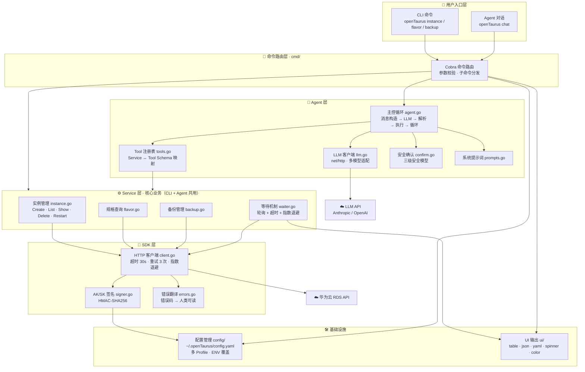
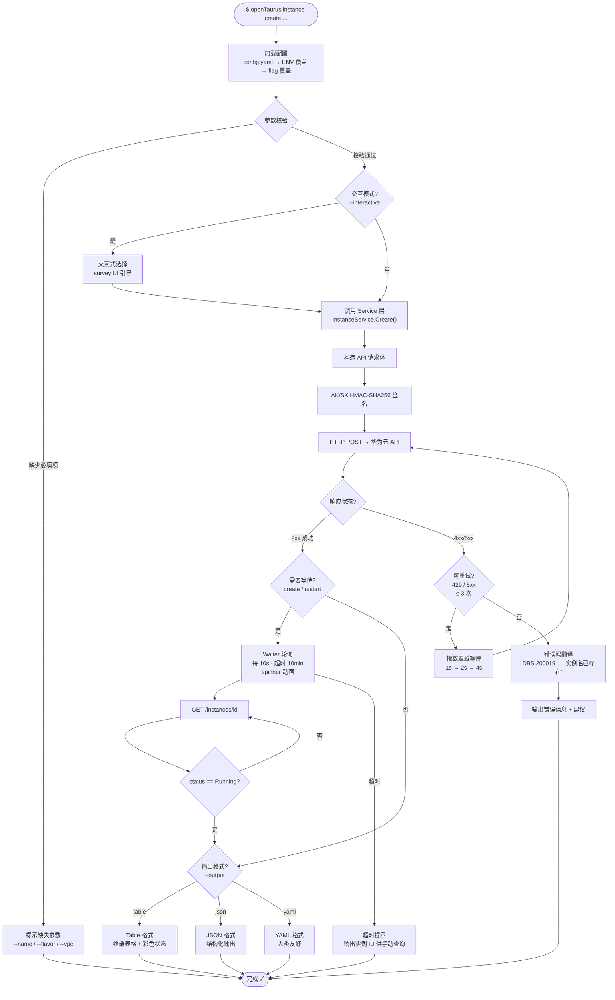
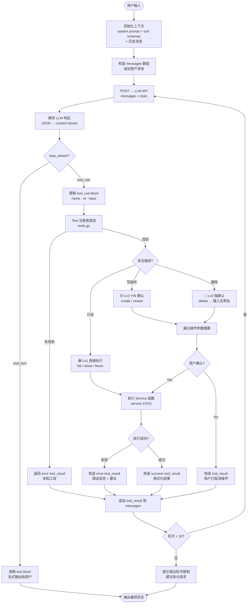
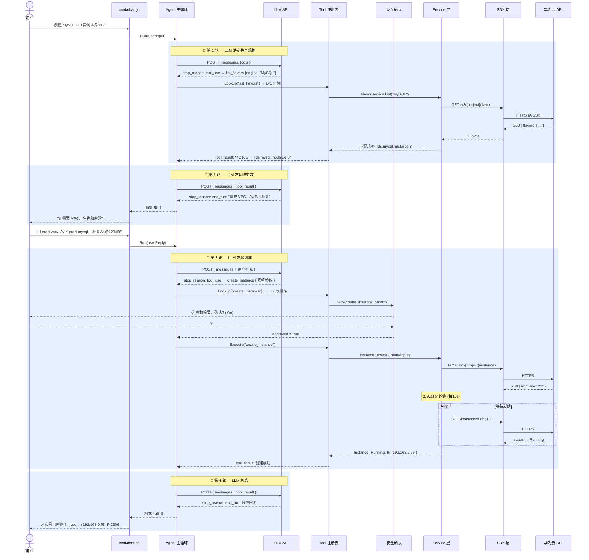
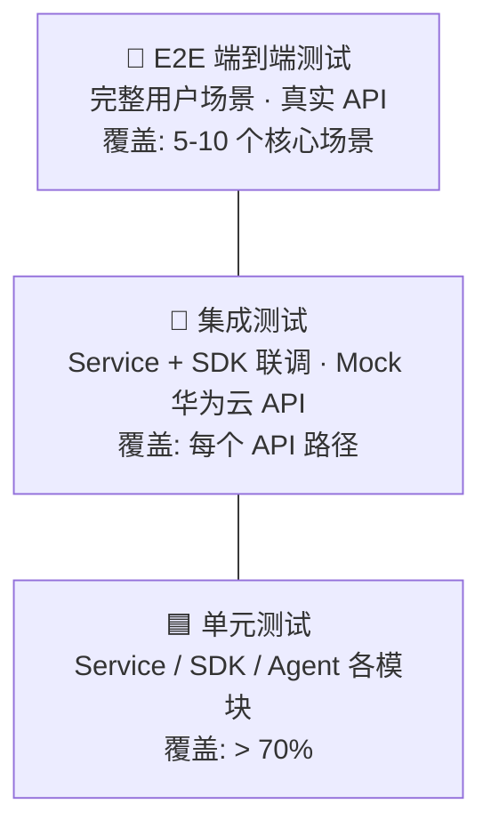
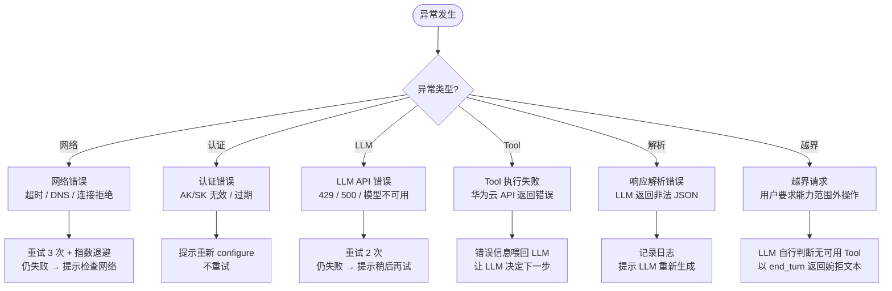

# OpenTaurus 架构设计优化版

> 华为云 RDS 命令行工具 + AI Agent 智能交互层
> 架构设计 · 流程图 · 功能清单 · 测试观测点

---

## 01 · 方案概要设计

OpenTaurus 采用三层分离架构，CLI 与 Agent 共享同一 Service 层，实现业务逻辑零重复。

### 整体架构

### 核心设计原则

| 原则                   | 说明                                                                                                                   |
| ---------------------- | ---------------------------------------------------------------------------------------------------------------------- |
| **两条路径，一个核心** | CLI 路径与 Agent 路径共享 Service 层，所有业务逻辑只写一遍。新增功能只需在 Service 层实现一次，CLI 和 Agent 同时获益。 |
| **零依赖分发**         | Go 交叉编译生成单二进制文件（~12MB），覆盖 Linux/macOS/Windows 三平台五架构，客户下载即用，无需安装任何运行时。        |
| **自定义 Agent**       | 不依赖第三方 Agent 框架，用 Go 标准库（net/http + encoding/json）实现 LLM 调用 + Tool Calling 循环，支持多模型切换。   |

---

## 02 · CLI 执行流程（优化版）

优化后的 CLI 流程增加了参数校验、错误分类处理、重试策略和格式化输出的细粒度控制。

### CLI 命令执行全流程

---

## 03 · Agent 主控循环（优化版）

优化后的 Agent 流程增加了轮次控制、错误恢复、多 Tool 并发编排和上下文窗口管理。

### Agent Tool-Calling 主循环

### Agent 多轮对话时序（创建实例完整示例）

---

## 04 · 功能清单

按阶段和优先级组织的完整功能清单，涵盖 CLI 命令、Agent 能力和基础设施。

### Phase 1 — CLI 基础能力（W1–W6）

| 编号   | 功能模块   | 命令 / 接口                   | 详细说明                                                                                                                         | 优先级 | 周次 |
| ------ | ---------- | ----------------------------- | -------------------------------------------------------------------------------------------------------------------------------- | ------ | ---- |
| F-1.1  | 凭证配置   | `openTaurus configure`        | 交互式设置 AK/SK/Region/ProjectID；支持多 Profile；文件权限 0600；ENV 覆盖                                                       | P0     | W1   |
| F-1.2  | SDK 基座   | `sdk/client.go + signer.go`   | HTTP 客户端封装；AK/SK HMAC-SHA256 签名；超时 30s；自动重试 3 次（指数退避）；错误码翻译                                         | P0     | W1   |
| F-1.3  | 规格查询   | `openTaurus flavor list`      | 列出可用数据库规格；支持 --engine 过滤（MySQL/PostgreSQL）；多格式输出                                                           | P0     | W2   |
| F-1.4  | 格式化输出 | `ui/formatter.go`             | 支持 --output table\|json\|yaml；table 模式含彩色状态标识；JSON 模式适合管道和脚本                                               | P0     | W2   |
| F-1.5  | 创建实例   | `openTaurus instance create`  | 必填：--name, --flavor, --vpc, --subnet, --password；可选：--engine, --version, --volume-size, --ha；支持 --interactive 交互模式 | P0     | W3   |
| F-1.6  | 等待机制   | `service/waiter.go`           | 创建/重启后轮询实例状态；10s 间隔；10min 超时；spinner 动画；--no-wait 跳过等待                                                  | P0     | W3   |
| F-1.7  | 列出实例   | `openTaurus instance list`    | 列出所有 RDS 实例；显示 ID/名称/引擎/状态/规格；支持分页                                                                         | P0     | W4   |
| F-1.8  | 实例详情   | `openTaurus instance show`    | 查看单个实例详情；含连接信息（IP:Port）、规格、存储、创建时间                                                                    | P0     | W4   |
| F-1.9  | 删除实例   | `openTaurus instance delete`  | 二次确认（需输入实例名）；--force 跳过确认（脚本场景）；删除前显示实例信息                                                       | P0     | W5   |
| F-1.10 | 重启实例   | `openTaurus instance restart` | Y/N 确认；等待恢复 Running；显示预估停机时间                                                                                     | P1     | W5   |
| F-1.11 | 错误处理   | `sdk/errors.go`               | 华为云错误码 → 人类可读中文/英文；附带修复建议；区分网络/认证/业务错误                                                           | P0     | W6   |

### Phase 2 — Agent 智能交互层（W7–W12）

| 编号   | 功能模块            | 接口 / 文件                     | 详细说明                                                                              | 优先级 | 周次 |
| ------ | ------------------- | ------------------------------- | ------------------------------------------------------------------------------------- | ------ | ---- |
| F-2.1  | LLM HTTP 客户端     | `agent/llm.go`                  | net/http 调用 LLM API（Anthropic / OpenAI）；不依赖第三方 SDK；流式响应可选；超时 60s | P0     | W7   |
| F-2.2  | 响应解析器          | `agent/parser.go`               | JSON 解析 LLM 响应；提取 text / tool_use / end_turn；处理 content blocks 数组         | P0     | W7   |
| F-2.3  | Tool 注册表         | `agent/tools.go`                | 将 Service 函数映射为 LLM Tool Schema；自动生成 JSON Schema；运行时注册 + 查找        | P0     | W8   |
| F-2.4  | Tool-Calling 主循环 | `agent/agent.go`                | 构造 messages → 调 LLM → 解析 → 执行 Tool → 喂回 → 循环；最多 10 轮；超时 5min        | P0     | W8   |
| F-2.5  | 安全确认机制        | `agent/confirm.go`              | 三级安全模型：Lv1 只读直接执行，Lv2 写操作 Y/N 确认，Lv3 删除需输入实例名             | P0     | W9   |
| F-2.6  | 系统提示词          | `agent/prompts.go`              | 角色定义；能力边界声明；行为约束（不编造 Tool）；参数补全引导策略                     | P0     | W9   |
| F-2.7  | chat 命令（单次）   | `openTaurus chat "..."`         | 单次自然语言输入 → Agent 执行 → 输出结果；适合脚本和管道                              | P0     | W10  |
| F-2.8  | chat 命令（交互式） | `openTaurus chat`               | 多轮交互式对话；保持上下文；支持 /exit, /clear, /help 内置命令                        | P0     | W10  |
| F-2.9  | 备份管理            | `openTaurus backup create/list` | 创建手动备份；列出备份记录；Agent 同样可通过自然语言操作                              | P1     | W11  |
| F-2.10 | 交叉编译打包        | `goreleaser`                    | 5 平台自动打包；GitHub Release 自动发布；SHA256 校验和                                | P0     | W12  |

---

## 05 · 开发迭代路线图

按周次展示 CLI（W1–W6）和 Agent（W7–W12）的开发迭代路径及依赖关系。

### 12 周开发路线与依赖关系

```mermaid
flowchart LR
    subgraph P1["Phase 1 · CLI 基础"]
        W1["W1<br/>━━━━━<br/>configure<br/>SDK 基座<br/>AK/SK 签名"]
        W2["W2<br/>━━━━━<br/>flavor list<br/>Formatter<br/>table/json/yaml"]
        W3["W3<br/>━━━━━<br/>instance create<br/>Waiter 轮询<br/>交互式创建"]
        W4["W4<br/>━━━━━<br/>instance list<br/>instance show<br/>分页 + 详情"]
        W5["W5<br/>━━━━━<br/>instance delete<br/>instance restart<br/>二次确认"]
        W6["W6<br/>━━━━━<br/>错误处理<br/>单元测试<br/>CI 流水线"]
    end

    subgraph P2["Phase 2 · Agent 层"]
        W7["W7<br/>━━━━━<br/>LLM 客户端<br/>响应解析器<br/>多模型适配"]
        W8["W8<br/>━━━━━<br/>Tool 注册表<br/>主控循环<br/>轮次控制"]
        W9["W9<br/>━━━━━<br/>安全确认<br/>系统提示词<br/>三级模型"]
        W10["W10<br/>━━━━━<br/>chat 单次<br/>chat 交互式<br/>内置命令"]
        W11["W11<br/>━━━━━<br/>备份管理<br/>交互式创建<br/>Agent 集成"]
        W12["W12<br/>━━━━━<br/>E2E 测试<br/>交叉编译<br/>文档 + 发布"]
    end

    W1 --> W2 --> W3 --> W4 --> W5 --> W6
    W6 -->|"Service 层完成"| W7
    W7 --> W8 --> W9 --> W10 --> W11 --> W12
```

---

## 06 · 测试策略与观测点

覆盖单元测试、集成测试、E2E 测试三层，以及关键性能与安全观测指标。

### 6.1 测试分层策略

### 6.2 单元测试观测点（Service 层）

**实例管理 `service/instance_test.go`**

| #   | 测试项           | 验证内容                       |
| --- | ---------------- | ------------------------------ |
| 1   | Create 参数缺失  | 必填参数缺失时返回明确错误信息 |
| 2   | Create 密码校验  | 密码不满足复杂度要求时校验拦截 |
| 3   | Create 成功      | 成功返回实例 ID 和初始状态     |
| 4   | List 空列表      | 空列表返回空数组（非 nil）     |
| 5   | List 分页        | 分页参数正确传递到 SDK 层      |
| 6   | Show 不存在      | 实例不存在时返回 404 错误      |
| 7   | Delete 成功      | 返回成功状态码                 |
| 8   | Restart 状态限制 | 实例非 Running 状态时拒绝重启  |

**SDK 层 `sdk/client_test.go`**

| #   | 测试项            | 验证内容                           |
| --- | ----------------- | ---------------------------------- |
| 1   | Signer 签名一致性 | 签名结果与华为云官方示例一致       |
| 2   | Client 超时       | 超时 30s 后返回超时错误            |
| 3   | Client 429 重试   | 429 触发重试（最多 3 次）          |
| 4   | Client 5xx vs 4xx | 5xx 触发重试，4xx 不重试（除 429） |
| 5   | 退避间隔          | 指数退避间隔正确（1s / 2s / 4s）   |
| 6   | 已知错误码翻译    | 已知错误码正确翻译为中文           |
| 7   | 未知错误码        | 未知错误码返回原始信息             |
| 8   | Config 权限       | 文件权限验证为 0600                |

### 6.3 Agent 测试观测点

**LLM 客户端 `agent/llm_test.go`**

| #   | 测试项           | 验证内容                               |
| --- | ---------------- | -------------------------------------- |
| 1   | 请求体格式       | messages + tools 结构正确              |
| 2   | 解析 text block  | 正确提取 text 类型内容                 |
| 3   | 解析 tool_use    | 正确提取 tool_use（name / id / input） |
| 4   | 识别 stop_reason | 正确区分 end_turn 和 tool_use          |
| 5   | 超时处理         | 60s 超时返回友好提示                   |
| 6   | API 错误         | LLM API 返回非 200 时的处理            |
| 7   | 多模型适配       | Anthropic 和 OpenAI 格式兼容           |

**Tool-Calling 主循环 `agent/agent_test.go`**

| #   | 测试项        | 验证内容                          |
| --- | ------------- | --------------------------------- |
| 1   | 单轮 end_turn | end_turn 直接输出文本             |
| 2   | 多轮循环      | tool_use → 执行 → 喂回 → 再调 LLM |
| 3   | 轮次上限      | 超过 10 轮时终止并提示            |
| 4   | 未知 Tool     | 返回 error tool_result            |
| 5   | Tool 执行失败 | 错误信息正确喂回 LLM              |
| 6   | 用户取消      | 取消信息正确喂回 LLM              |
| 7   | 上下文累积    | messages 数组正确追加             |

**安全确认机制 `agent/confirm_test.go`**

| #   | 测试项             | 验证内容                |
| --- | ------------------ | ----------------------- |
| 1   | Lv1 list_instances | 无确认直接执行          |
| 2   | Lv1 show_instance  | 无确认直接执行          |
| 3   | Lv1 list_flavors   | 无确认直接执行          |
| 4   | Lv2 create → Y     | 展示参数摘要 → Y → 执行 |
| 5   | Lv2 create → N     | 展示参数摘要 → N → 取消 |
| 6   | Lv2 restart        | 确认后执行              |
| 7   | Lv3 delete 匹配    | 需输入实例名匹配才执行  |
| 8   | Lv3 delete 不匹配  | 实例名不匹配时拒绝      |
| 9   | 未注册 Tool        | 默认拒绝执行            |

### 6.4 集成测试观测点

| 场景编号 | 测试场景                 | 测试方法                                | 核心验证点                                    | 通过标准            |
| -------- | ------------------------ | --------------------------------------- | --------------------------------------------- | ------------------- |
| IT-01    | SDK 签名 → Mock API      | httptest.Server 模拟华为云              | Authorization Header 格式、时间戳、签名值     | 签名与预期一致      |
| IT-02    | Service → SDK → Mock API | Mock 返回预定义 JSON                    | Service 层正确解析 API 响应并映射为 Go struct | 字段无丢失          |
| IT-03    | Waiter 轮询              | Mock 返回 Creating → Creating → Running | 轮询次数、间隔、最终状态                      | 3 次轮询后 Running  |
| IT-04    | Waiter 超时              | Mock 持续返回 Creating                  | 超时后返回错误而非死循环                      | 超时退出 + 友好提示 |
| IT-05    | 重试策略                 | Mock 前 2 次 429，第 3 次 200           | 重试次数、退避间隔、最终成功                  | 第 3 次成功         |
| IT-06    | Agent 单轮 Tool-Calling  | Mock LLM 返回 tool_use → end_turn       | Tool 正确执行，result 正确喂回                | 完整循环            |
| IT-07    | Agent 多轮对话           | Mock LLM 返回多次 tool_use              | messages 累积正确，上下文连贯                 | 上下文保持          |
| IT-08    | Agent 安全拦截           | Mock LLM 返回 delete tool_use           | 确认机制触发，取消时 LLM 收到取消消息         | 未执行删除          |

### 6.5 E2E 端到端测试场景

| 场景编号 | 测试场景         | 操作步骤                                                                                       | 预期结果                                                    |
| -------- | ---------------- | ---------------------------------------------------------------------------------------------- | ----------------------------------------------------------- |
| E2E-01   | CLI 完整生命周期 | configure → flavor list → instance create → instance show → instance restart → instance delete | 全流程无报错，各阶段输出正确                                |
| E2E-02   | Agent 创建实例   | chat "创建一个 MySQL 实例 2核4G" → 补充参数 → 确认                                             | Agent 正确调用 list_flavors + create_instance，实例创建成功 |
| E2E-03   | Agent 查询实例   | chat "列出所有 MySQL 实例"                                                                     | Agent 调用 list_instances 并格式化输出                      |
| E2E-04   | Agent 删除保护   | chat "删除 prod-mysql" → 输入错误实例名 → 输入正确实例名                                       | 首次拒绝，再次确认后删除                                    |
| E2E-05   | Agent 越界请求   | chat "帮我优化这条 SQL"                                                                        | Agent 拒绝并告知能力边界                                    |
| E2E-06   | 错误恢复         | AK/SK 错误 → configure 修复 → 重新操作                                                         | 错误信息友好，修复后操作成功                                |
| E2E-07   | 多格式输出       | instance list --output table/json/yaml                                                         | 三种格式均正确，JSON 可被 jq 解析                           |

### 6.6 性能与安全观测指标

**性能指标**

| 指标           | 目标              | 测量方法                                |
| -------------- | ----------------- | --------------------------------------- |
| CLI 启动时间   | < 100ms           | go test -bench 测量 main 启动到命令路由 |
| API 单次调用   | < 3s（P95）       | 超时 30s                                |
| Agent 单轮响应 | < 10s（P95）      | 超时 60s                                |
| Agent 完整对话 | < 60s（4 轮以内） | 超时 5min                               |
| 二进制体积     | < 15MB            | 单平台编译产物                          |
| 内存占用       | < 50MB            | Agent 多轮对话峰值                      |

**安全指标**

| 指标                 | 要求                                       | 验证方式              |
| -------------------- | ------------------------------------------ | --------------------- |
| 配置文件权限         | config.yaml 必须为 0600                    | 非安全权限时告警      |
| AK/SK 不泄露         | 日志、错误输出、Agent 对话中不出现凭证     | grep 扫描 + 代码审查  |
| 删除二次确认         | 无论 CLI 还是 Agent，delete 必须经过强确认 | E2E 测试覆盖          |
| ENV 覆盖优先级       | 环境变量 > 配置文件 > 默认值               | 单元测试验证优先级链  |
| HTTPS 强制           | 所有 API 调用必须走 HTTPS，拒绝 HTTP       | SDK 层硬编码 https:// |
| Agent 不执行任意命令 | Tool 注册表之外的操作一律拒绝              | Agent 集成测试验证    |

### 6.7 CI/CD 流水线观测点

| #   | 检查项         | 说明                                                        |
| --- | -------------- | ----------------------------------------------------------- |
| 1   | **Lint**       | golangci-lint 零 warning（含 errcheck, staticcheck, gosec） |
| 2   | **单元测试**   | go test ./... 全部通过，覆盖率 ≥ 70%                        |
| 3   | **竞态检测**   | go test -race 无 data race                                  |
| 4   | **交叉编译**   | 5 平台编译成功（linux/darwin amd64/arm64 + windows amd64）  |
| 5   | **二进制体积** | 编译产物 ≤ 15MB                                             |
| 6   | **集成测试**   | Mock API 集成测试通过                                       |
| 7   | **安全扫描**   | govulncheck 无已知漏洞                                      |

---

## 07 · Agent 边界与异常处理

Agent 运行过程中可能遇到的边界情况及对应处理策略。

### Agent 异常处理决策树

---

> **OpenTaurus Architecture Design v2.0** · 优化版 · 2026-04
