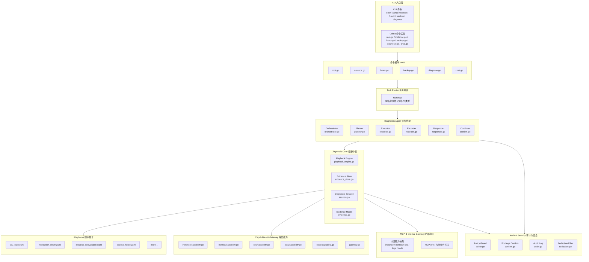
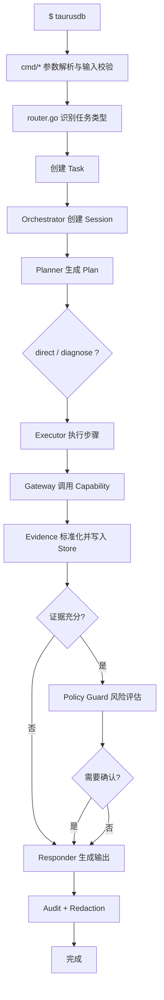
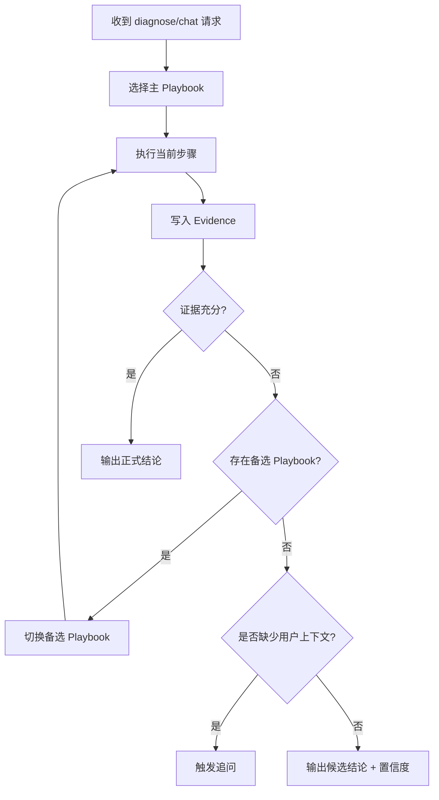
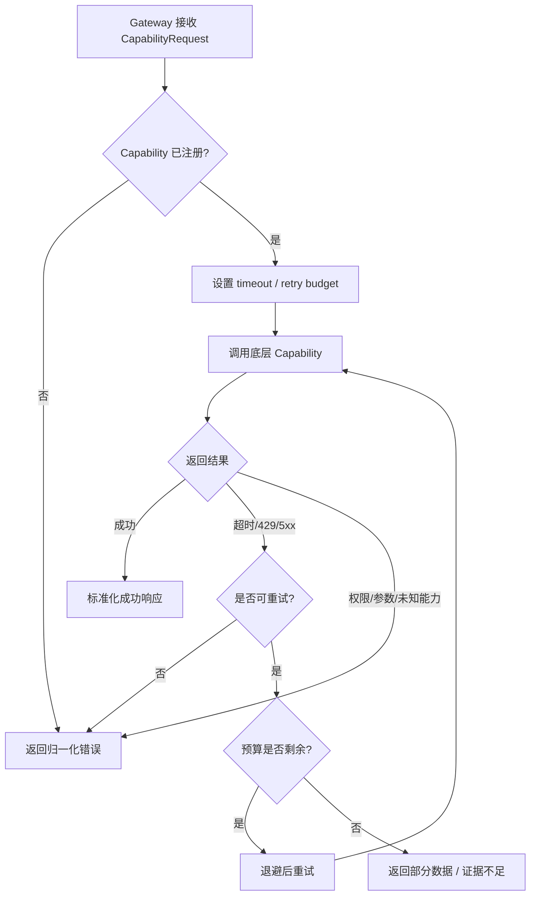
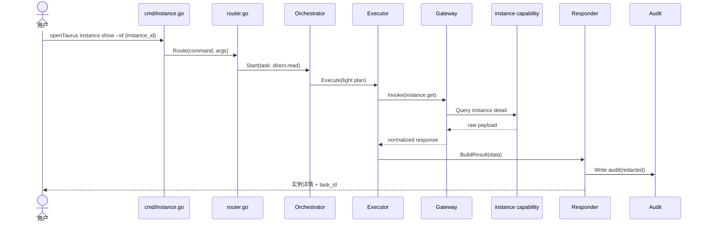
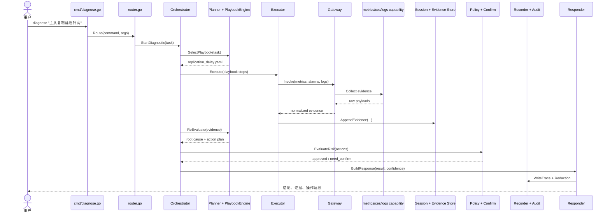
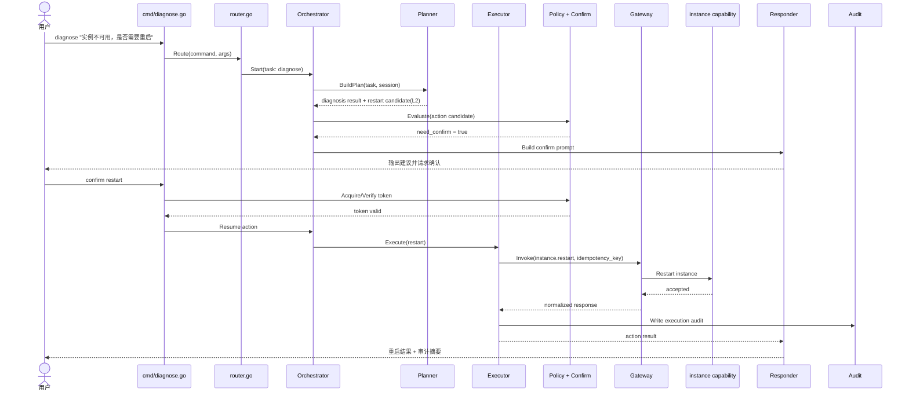

## 01 · 方案概要设计

OpenTaurus 采用三层分离架构，CLI 与 Agent 共享同一 Service 层，实现业务逻辑零重复。

### 设计目标

| 目标         | 说明                                                      |
| ------------ | --------------------------------------------------------- |
| 统一入口     | direct / chat / diagnose 三类请求统一进入主链路           |
| 业务复用     | CLI 与 Agent 共享 Service/Capability 能力，避免重复实现   |
| 证据驱动     | 所有诊断结论必须绑定 Evidence，不输出无依据判断           |
| 安全默认开启 | 高风险动作必须经过 `policy + confirm + audit + redaction` |
| 易扩展       | 新增能力优先通过 Playbook 或 Capability 扩展              |
| 易治理       | 全链路具备可观测、可审计、可回放能力                      |

### 整体架构

### 核心设计原则

| 原则           | 说明                                                         |
| -------------- | ------------------------------------------------------------ |
| 统一主链路     | 命令层只做参数解析和输入校验，业务全部进入 Router/Agent/Core |
| 编排执行分层   | Planner 决策、Executor 执行、Responder 输出、Recorder 记录   |
| 证据先于结论   | 所有结论都必须引用 Evidence                                  |
| 高风险默认受控 | 删除、重启、切换类动作必须先经过策略评估和确认               |
| 能力统一出口   | 所有外部依赖统一通过 Gateway 调用，统一超时、重试、错误归一  |
| 剧本驱动诊断   | 诊断知识优先沉淀为 Playbook，避免硬编码在流程中              |

---

## 02 · 功能清单

### 2.1 用户可见功能

| 编号 | 功能         | 描述                                               | 优先级 |
| ---- | ------------ | -------------------------------------------------- | ------ |
| F-01 | 配置初始化   | `configure` 配置 AK/SK、Region、Project 等基础信息 | P0     |
| F-02 | 实例查询     | `instance list/show` 查询实例列表和详情            | P0     |
| F-03 | 规格查询     | `flavor list` 查询规格信息                         | P0     |
| F-04 | 备份查询     | `backup list/show` 查看备份信息                    | P1     |
| F-05 | 实例创建     | `instance create` 创建实例                         | P0     |
| F-06 | 实例重启     | `instance restart` 受控重启实例                    | P0     |
| F-07 | 实例删除     | `instance delete` 高风险删除实例                   | P0     |
| F-08 | 自然语言诊断 | `diagnose` / `chat` 输入故障描述，触发诊断流程     | P0     |
| F-09 | 诊断证据输出 | 输出结论、证据摘要、建议、置信度                   | P0     |
| F-10 | 证据不足追问 | 目标不明或证据不足时触发澄清问题                   | P0     |
| F-11 | 多格式输出   | 支持 `table/json/yaml`                             | P0     |
| F-12 | 审计与回放   | 所有重要动作具备审计记录和关联 ID                  | P1     |

### 2.2 系统能力功能

| 编号 | 模块            | 描述                                            | 优先级 |
| ---- | --------------- | ----------------------------------------------- | ------ |
| S-01 | Router          | 识别 direct/chat/diagnose，请求分类与预算初始化 | P0     |
| S-02 | Session         | 维护诊断会话状态、轮次、截止时间                | P0     |
| S-03 | Evidence Store  | 证据写入、检索、去重、关联会话                  | P0     |
| S-04 | Playbook Engine | 解析 YAML 剧本，推进步骤、条件与回退            | P0     |
| S-05 | Gateway         | 统一能力注册、超时、重试、错误归一              | P0     |
| S-06 | Capability      | 对接 instance/metrics/ces/logs/node 等能力      | P0     |
| S-07 | Policy Guard    | 风险分级、动作准入、拦截                        | P0     |
| S-08 | Confirm         | 高风险动作二次确认、确认令牌管理                | P0     |
| S-09 | Audit           | 关键路径事件记录                                | P0     |
| S-10 | Redaction       | 输出和审计前统一脱敏                            | P0     |

### 2.3 MVP 范围

| 范围         | 内容                                                                          |
| ------------ | ----------------------------------------------------------------------------- |
| CLI 基础命令 | `configure`、`flavor list`、`instance create/list/show/delete/restart`        |
| 诊断能力     | 支持 `cpu_high`、`replication_delay`、`instance_unavailable`、`backup_failed` |
| 证据闭环     | 诊断结果必须附 Evidence 引用                                                  |
| 安全治理     | 高风险动作默认需要确认并记录审计                                              |
| 输出能力     | 支持 `table/json/yaml` 三种结果格式                                           |

---

## 03 · 测试观测点

### 3.1 链路级观测点

链路级观测点的测试目标不是“字段有没有打印出来”，而是验证请求在关键节点是否按设计流转、观测数据是否完整、字段值是否可信。测试实现上建议为日志、事件、指标、审计分别提供测试收集器，在单元测试和集成测试里直接断言结构化记录，而不是依赖终端输出。

| 链路节点       | 测试场景                 | 测试方法                                                                           | 关键断言                                                                                                          |
| -------------- | ------------------------ | ---------------------------------------------------------------------------------- | ----------------------------------------------------------------------------------------------------------------- |
| `cmd`          | direct 命令入口          | 构造 `instance show --id xxx --output json` 并执行命令入口                         | 产生 `command`、`args_digest`、`output_format`；敏感参数不明文出现在观测数据里                                    |
| `router`       | 请求分类                 | 分别构造 `instance show`、`chat "..."`、`diagnose "CPU 高"` 三类输入调用 `Route()` | `task_type` 分别为 `direct/chat/diagnose`；`task_id` 非空；`intent` 与请求匹配                                    |
| `orchestrator` | 会话推进与超时           | 跑一个完整 diagnose 场景，再注入一个超时场景                                       | `session_id` 贯通全链路；状态按 `created -> planning -> collecting -> completed/failed` 推进；超时后正确终止      |
| `planner`      | 主剧本选择与回退         | 注入复制延迟、CPU 高、证据不足三类输入调用 `BuildPlan()`                           | `playbook_id` 选择正确；证据不足时 `fallback=true` 或触发重新规划；`decision_reason` 非空                         |
| `executor`     | 步骤执行成功、失败、重试 | Mock capability 返回成功、429、5xx、timeout                                        | `step_id` 正确；`capability` 与计划一致；`retry_count` 符合预算；`result_status` 正确标识成功/失败/降级           |
| `gateway`      | 外部依赖治理             | 用 fake capability 注入慢响应、限流、权限错误                                      | `latency_ms` 有值；`timeout_ms` 使用配置预算；`error_code` 归一为统一错误；只有可重试错误才标记 `retryable=true`  |
| `evidence`     | 证据写入与去重           | 同一诊断步骤重复写入同源证据，再写入另一条新证据                                   | `evidence_id` 非空；`source` 正确；重复证据 `dedup_hit=true`；正式结论场景下至少存在 1 条有效证据                 |
| `policy`       | 风险分级                 | 构造 `show/restart/delete` 三类动作候选执行 `Evaluate()`                           | 只读动作为低风险；重启为需确认；删除为阻断或强确认；`matched_rule` 可定位到具体策略                               |
| `confirm`      | 确认通过、拒绝、过期     | 构造有效 token、拒绝确认、过期 token 三类场景                                      | `confirm_required` 正确；`confirm_result` 分别为 `approved/rejected/expired`；拒绝和过期都不得继续执行            |
| `responder`    | 正式结论、追问、候选结论 | 分别输入证据充分、证据不足、证据冲突三类会话结果                                   | `result_type` 分别为最终结论/追问/候选结论；正式结论必须 `evidence_ref_count > 0`；证据不足时不能伪装成确定性输出 |
| `audit`        | 高风险动作留痕           | 执行一次 restart 或 delete 场景并检查审计输出                                      | 存在 `actor/action/decision`；`task_id/session_id` 可串联；敏感字段已脱敏，`redaction_hits` 大于 0                |

### 3.1.1 测试实施建议

| 维度     | 建议做法                              | 说明                                         |
| -------- | ------------------------------------- | -------------------------------------------- |
| 事件采集 | 使用内存版 `EventSink` / `AuditSink`  | 测试直接断言结构化事件，避免依赖 stdout 文本 |
| 时间控制 | 使用 `FakeClock`                      | 便于验证超时、重试间隔和 token 过期          |
| 外部依赖 | 使用 `FakeGateway` / `FakeCapability` | 便于稳定注入 success、timeout、429、5xx      |
| ID 生成  | 使用固定 `task_id/session_id` 生成器  | 便于断言链路关联字段是否贯通                 |
| 断言策略 | 每条业务用例都增加观测断言            | 不只验证“结果对”，还验证“链路走对”           |

### 3.2 关键指标

| 指标                     | 目标                     |
| ------------------------ | ------------------------ |
| CLI 启动时间             | < 100ms                  |
| direct 查询耗时 P95      | < 3s                     |
| diagnose 首次响应 P95    | < 3s                     |
| 单次 capability 调用超时 | 30s                      |
| diagnose 完成耗时 P95    | < 60s                    |
| 高风险确认漏拦截率       | 0                        |
| 敏感信息脱敏命中率       | 100%                     |
| 审计写入失败次数         | 0                        |
| 证据不足返回率           | 持续监控，异常上升需排查 |

### 3.3 故障注入观测点

| 场景          | 注入方式                       | 通过标准                               |
| ------------- | ------------------------------ | -------------------------------------- |
| Gateway 超时  | 模拟 metrics/logs 长时间无响应 | 在预算内重试，超限后降级返回           |
| 429 限流      | 模拟 CES 返回 429              | 不打爆下游，用户得到限流说明           |
| 未注册能力    | 构造未知 capability 调用       | 返回 `UnknownCapability`，主进程不中断 |
| 非法 Playbook | 缺字段 YAML 或非法配置         | 被拦截或回退，不 crash                 |
| 确认令牌过期  | 构造过期 token                 | 执行被阻断，提示重新确认               |
| 审计写入失败  | 模拟 audit 存储失败            | 主链路可完成，内部有告警               |
| 脱敏失败      | 注入密码/连接串样本            | 对外输出阻断或字段被掩码               |

---

## 04 · 测试用例设计

### 4.1 核心测试用例

| 用例 ID | 场景                  | 前置条件                        | 步骤                                    | 预期结果                       |
| ------- | --------------------- | ------------------------------- | --------------------------------------- | ------------------------------ |
| TC-01   | 配置成功              | 提供合法 AK/SK/Region           | 执行 `configure`                        | 配置保存成功，可被后续命令复用 |
| TC-02   | Direct 查询成功       | 已完成配置，实例存在            | 执行 `instance show --id {instance_id}` | 返回实例详情，带 `task_id`     |
| TC-03   | Direct 写操作被拦截   | 已完成配置，实例存在            | 执行 `instance restart` 并拒绝确认      | 动作未执行，返回阻断说明       |
| TC-04   | Direct 写操作确认通过 | 已完成配置，实例存在            | 执行 `instance restart` 并确认          | 动作执行一次，审计完整         |
| TC-05   | 复制延迟诊断成功      | 存在延迟指标与日志样本          | 执行 `diagnose "复制延迟高"`            | 输出根因、证据、建议、置信度   |
| TC-06   | 证据不足追问          | 未提供实例 ID                   | 执行 `diagnose "CPU 高"`                | 不输出确定性结论，转为追问     |
| TC-07   | Playbook 回退成功     | 主剧本证据不足，备选剧本可命中  | 执行对应诊断                            | 成功回退并正常输出结果         |
| TC-08   | Gateway 超时降级      | 模拟 metrics 超时               | 执行 `diagnose "CPU 高"`                | 重试后降级输出“证据不足”       |
| TC-09   | 未注册能力拒绝        | 注入未知 capability             | 执行诊断步骤                            | 返回可解释错误，不 panic       |
| TC-10   | 脱敏正确性            | 日志或结果中含密码/连接串       | 执行任意 direct/diagnose                | 敏感字段被完全脱敏             |
| TC-11   | 审计完整性            | 执行一次 direct 和一次 diagnose | 检查审计记录                            | 能按 `task_id/session_id` 串联 |
| TC-12   | 错误可解释性          | 注入权限错误/参数错误/429       | 执行 direct 或 diagnose                 | 返回原因类别、建议和关联 ID    |

### 4.2 回归测试包

| 回归包   | 包含用例                           | 目的                       |
| -------- | ---------------------------------- | -------------------------- |
| 冒烟回归 | `TC-01`, `TC-02`, `TC-05`          | 验证基础主链路可用         |
| 安全回归 | `TC-03`, `TC-04`, `TC-10`, `TC-11` | 验证确认、脱敏、审计不回退 |
| 韧性回归 | `TC-07`, `TC-08`, `TC-09`, `TC-12` | 验证回退、降级、错误归一   |

---

## 05 · 流程图

### 5.1 命令统一执行流程

### 5.2 证据不足与回退流程

### 5.3 Gateway 重试与降级流程

---

## 06 · 时序图

### 6.1 Direct 只读查询时序

### 6.2 复制延迟诊断时序

### 6.3 高风险动作确认时序

---

## 07 · 验收标准

| 验收项   | 要求                                             |
| -------- | ------------------------------------------------ |
| 路由基线 | direct/chat/diagnose 全部进入统一主链路          |
| 诊断基线 | 首批 4 个 Playbook 可加载，至少 2 个场景完成 E2E |
| 证据基线 | 所有诊断结论带 Evidence 引用                     |
| 安全基线 | 删除、重启等高风险动作必须经过确认与审计         |
| 输出基线 | `table/json/yaml` 输出稳定可用                   |
| 质量基线 | 单元、集成、关键 E2E 测试全部通过                |
