# 需求设计（OpenTaurus）

---

## 1. 项目背景

### 1.1 行业现状

当前主流云厂商均提供了成熟的数据库管理 CLI 工具：AWS 的 `aws rds` 命令集支持完整的 RDS 实例生命周期管理，阿里云的 `aliyun rds` 同样覆盖了从创建到删除的全流程操作。这些工具已成为企业客户日常运维的标配。

华为云在 RDS 产品能力上已经具备竞争力，但在命令行工具层面与 AWS 和阿里云存在差距。客户在自动化运维、脚本化管理场景下缺乏高效工具，往往需要通过控制台手动操作，效率低下。

### 1.2 项目目标

开发一套对标 AWS CLI 和阿里云 CLI 的华为云 RDS 命令行工具，并创新性地叠加 AI Agent 智能交互层，实现：

- 客户通过命令行完成 RDS 实例全生命周期管理（创建、查询、删除、重启、备份）
- 客户通过自然语言对话完成复杂操作，降低使用门槛
- 单二进制分发，客户下载即用，零依赖

### 1.3 目标用户

- **企业 DevOps / SRE 团队：** 需要脚本化、自动化管理数据库
- **开发者：** 在开发/测试环境快速创建和销毁数据库实例
- **DBA：** 日常实例管理、备份、监控
- **新手用户：** 通过 Agent 自然语言交互降低学习曲线

---

## 2. 需求分析

### 2.1 竞品对标分析

| 功能维度          | AWS CLI             | 阿里云 CLI | OpenTaurus（本项目） |
| ----------------- | ------------------- | ---------- | -------------------- |
| 实例 CRUD         | ✓                   | ✓          | ✓                    |
| 备份管理          | ✓                   | ✓          | ✓                    |
| 规格查询          | ✓                   | ✓          | ✓                    |
| 等待机制 (Waiter) | ✓                   | ✗          | ✓                    |
| 交互式创建        | ✗                   | ✓          | ✓                    |
| 多格式输出        | ✓ (table/json/yaml) | ✓ (json)   | ✓ (table/json/yaml)  |
| AI Agent 智能交互 | ✗                   | ✗          | **✓ 创新**           |
| 自然语言参数补全  | ✗                   | ✗          | **✓ 创新**           |

> **竞争优势：** OpenTaurus 在对标 AWS 和阿里云全部基础功能的同时，创新性地加入 AI Agent 智能交互层，这是竞品均未提供的差异化能力。

### 2.2 核心功能需求

#### Phase 1：CLI 基础能力（第 1-6 周）

| 命令                          | 说明                        | 优先级 | 周次     |
| ----------------------------- | --------------------------- | ------ | -------- |
| openTaurus configure          | 配置 AK/SK/Region/ProjectID | P0     | 第 1 周  |
| openTaurus flavor list        | 查询可用数据库规格          | P0     | 第 2 周  |
| openTaurus instance create    | 创建 RDS 实例 + 等待就绪    | P0     | 第 3 周  |
| openTaurus instance list      | 列出所有实例                | P0     | 第 4 周  |
| openTaurus instance show      | 查看实例详情 + 连接信息     | P0     | 第 4 周  |
| openTaurus instance delete    | 删除实例（二次确认）        | P0     | 第 5 周  |
| openTaurus instance restart   | 重启实例                    | P1     | 第 5 周  |
| openTaurus backup create/list | 备份管理                    | P1     | 第 11 周 |

#### Phase 2：Agent 智能交互层（第 7-12 周）

| 模块                 | 说明                                    | 优先级 | 周次     |
| -------------------- | --------------------------------------- | ------ | -------- |
| LLM HTTP 客户端      | net/http 调用 LLM API，不依赖第三方 SDK | P0     | 第 7 周  |
| 响应解析器           | JSON 解析，提取 tool_use / end_turn     | P0     | 第 7 周  |
| Tool 注册表          | Service 函数映射为 LLM Tool             | P0     | 第 8 周  |
| Tool-calling 主循环  | 调 LLM → 执行 Tool → 喂回结果 → 循环    | P0     | 第 8 周  |
| 安全确认机制         | 三级安全模型：直接执行/确认/强确认      | P0     | 第 9 周  |
| 系统提示词           | 角色定义 + 行为约束 + 参数补全引导      | P0     | 第 9 周  |
| openTaurus chat 命令 | 单次模式 + 交互式多轮对话               | P0     | 第 10 周 |

### 2.3 非功能需求

- **分发：** 单二进制分发，支持 Linux / macOS / Windows 三平台，客户下载即用
- **性能：** CLI 启动时间 < 100ms，API 调用超时 30s，Agent 单轮超时 60s
- **安全：** AK/SK 本地存储权限 0600，支持环境变量覆盖，删除操作必须二次确认
- **可用性：** API 调用自动重试（最多 3 次，指数退避），错误码翻译为人类可读提示
- **测试：** Service 层覆盖率 > 70%，CI 自动运行全量测试

---

## 3. 技术选型：为什么选择 Go

### 3.1 CLI 场景的天然优势

Go 是 CLI 工具开发的行业标准选择。以下知名 CLI 工具均基于 Go 构建：

| 工具      | 开发者        | 用途                |
| --------- | ------------- | ------------------- |
| kubectl   | Google / CNCF | Kubernetes 集群管理 |
| docker    | Docker Inc.   | 容器管理            |
| gh        | GitHub        | GitHub CLI          |
| terraform | HashiCorp     | 基础设施即代码      |
| hugo      | Hugo Authors  | 静态网站生成        |

### 3.2 与其他语言的对比

| 维度       | Go                      | TypeScript         | Python               |
| ---------- | ----------------------- | ------------------ | -------------------- |
| 二进制体积 | **10-15 MB**            | 50-70 MB (pkg)     | 80+ MB (PyInstaller) |
| 启动速度   | **~10ms**               | ~200ms             | ~500ms               |
| 打包复杂度 | **go build 一条命令**   | 需要 esbuild + pkg | 需要 PyInstaller     |
| 交叉编译   | **极简（GOOS/GOARCH）** | 需分平台打包       | 需分平台打包         |
| 运行时依赖 | **无**                  | 内嵌 Node.js       | 内嵌 Python          |
| CLI 生态   | **Cobra（业界标准）**   | oclif（成熟）      | Click（成熟）        |
| 并发能力   | **goroutine 原生支持**  | 单线程 async       | GIL 限制             |

### 3.3 Go 做自定义 Agent 的可行性

本项目采用自定义 Agent 方案，不依赖任何第三方 Agent 框架。Agent 的核心本质是一个 HTTP 调用 + JSON 解析的循环，Go 的标准库完全能胜任：

- **net/http：** 调用 LLM API，构造请求 / 解析响应
- **encoding/json：** 解析 tool_use 参数、构造 tool_result
- **fmt + os：** 确认机制的用户交互

> **为什么不用 LLM SDK？** 本项目选择自定义实现 Agent，不使用 Anthropic SDK 或 OpenAI SDK。原因是：Agent 的核心就是 HTTP POST + JSON 解析 + 循环，Go 标准库完全覆盖；自定义实现可以同时支持 Anthropic、OpenAI 等多个 LLM 提供商，通过配置切换；减少第三方依赖，保持二进制体积最小。

### 3.4 Go 的分发优势

Go 的交叉编译能力是选择它的决定性因素之一。一条 `go build` 命令即可生成目标平台的二进制文件，客户下载后直接运行，无需安装任何运行时环境：

| 平台                  | 编译命令                           | 产物体积 |
| --------------------- | ---------------------------------- | -------- |
| Linux (amd64)         | GOOS=linux GOARCH=amd64 go build   | ~12 MB   |
| Linux (arm64)         | GOOS=linux GOARCH=arm64 go build   | ~12 MB   |
| macOS (Intel)         | GOOS=darwin GOARCH=amd64 go build  | ~13 MB   |
| macOS (Apple Silicon) | GOOS=darwin GOARCH=arm64 go build  | ~13 MB   |
| Windows               | GOOS=windows GOARCH=amd64 go build | ~13 MB   |

---

## 4. 架构设计

### 4.1 分层架构

项目采用三层架构，CLI 和 Agent 共用 Service 层，避免业务逻辑重复：

| 层次       | 职责                  | 技术实现                  |
| ---------- | --------------------- | ------------------------- |
| 用户交互层 | CLI 命令 + Agent Chat | Cobra 命令 / Agent 主循环 |
| Service 层 | 核心业务逻辑（共用）  | Go struct + interface     |
| SDK 层     | 华为云 API 封装       | net/http + AK/SK 签名     |

# OpenTaurus 架构设计全景图

---

## 一、总体架构（简化版）

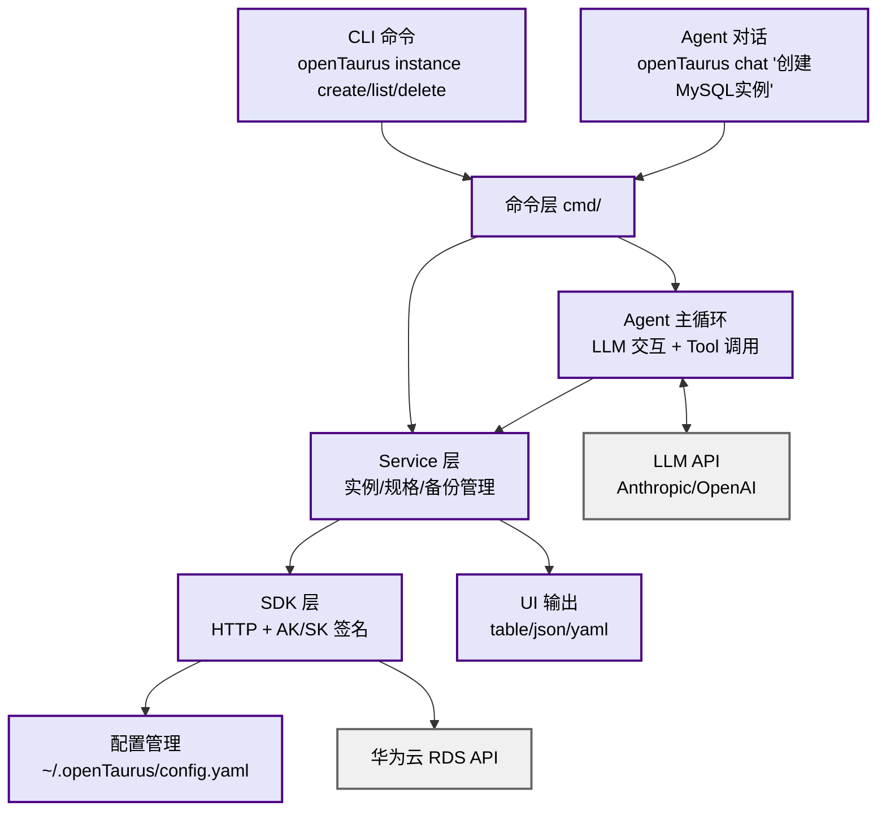

### 架构说明

**核心设计原则：两条路径，一个核心**

1. **CLI 路径**：`CLI 命令 → cmd/ → Service 层 → SDK → 华为云`
2. **Agent 路径**：`Agent 对话 → cmd/chat → Agent 主循环 ↔ LLM → Service 层 → SDK → 华为云`
3. **共享核心**：CLI 和 Agent 都调用同一个 Service 层，避免业务逻辑重复

**分层职责**

| 层次       | 职责                                  | 关键模块                         |
| ---------- | ------------------------------------- | -------------------------------- |
| 命令层     | 解析用户输入，路由到 Service 或 Agent | cmd/                             |
| Agent 层   | LLM 交互、Tool 调用、安全确认         | agent/agent.go, llm.go, tools.go |
| Service 层 | 核心业务逻辑（CLI 和 Agent 共用）     | service/instance.go, flavor.go   |
| SDK 层     | 华为云 API 封装、签名、错误处理       | sdk/client.go, signer.go         |
| 基础设施   | 配置、UI 输出                         | config/, ui/                     |

---

## 二、CLI 开发流程（第 1-6 周）

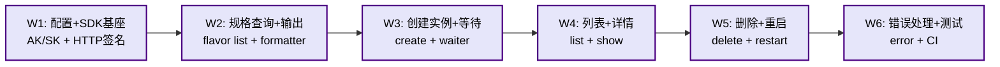

**关键里程碑**

- W1-2: 链路打通（configure + SDK 签名 + flavor list）
- W3-4: 核心功能（create / list / show）
- W5-6: 完善体验（delete / restart + 错误处理 + 测试）

---

## 三、Agent 主控循环

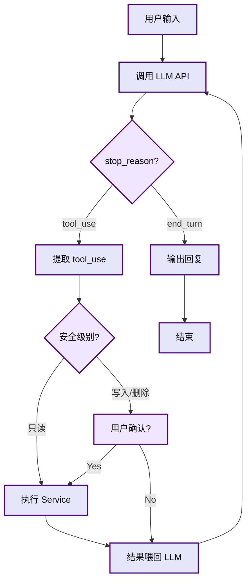

**三级安全模型**

- **直接执行**：list / show / flavor（只读操作）
- **Y/N 确认**：create / restart（写操作，展示参数摘要）
- **强确认**：delete（删除操作，需输入实例名）

---

## 四、Agent 开发流程（第 7-12 周）

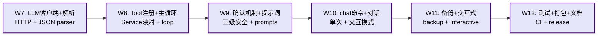

**关键里程碑**

- W7-8: Agent 跑通（LLM 客户端 + Tool-calling 循环）
- W9-10: Agent 可用（安全确认 + chat 命令）
- W11-12: 产品发布（完整功能 + 测试 + 打包）

---

## 五、完整数据流示例

用户通过 Agent 创建 MySQL 实例的完整交互流程：

```
用户: "帮我创建一个 MySQL 8.0 实例，4核16G"
  │
  ▼
Agent 循环:
  1. 调用 LLM → 返回 tool_use: list_flavors
  2. 执行查询 → 找到匹配规格 rds.mysql.m6.large.8
  3. 结果喂回 LLM → 发现缺少 VPC/密码，询问用户
  4. 用户补充: "用 prod-vpc，名字 prod-mysql，密码 MyPass123!"
  5. LLM 返回 tool_use: create_instance
  6. 展示参数摘要 → 用户确认 (Y)
  7. 执行创建 → 等待就绪
  8. 返回实例 ID + 连接信息
```

<details>
<summary>点击展开查看详细时序图</summary>

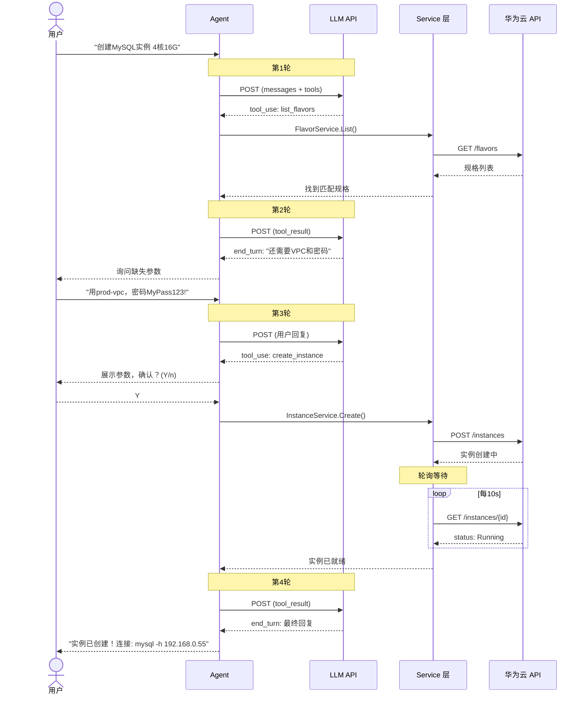

</details>

---

## 六、模块详细展开（可选查看）

# OpenTaurus 架构设计全景图

---

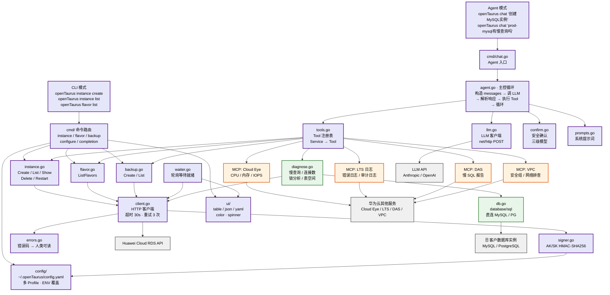

---

## 二、CLI 数据流（Phase 1）

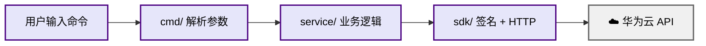

---

## 三、Agent 数据流（Phase 2 — 实例管理）

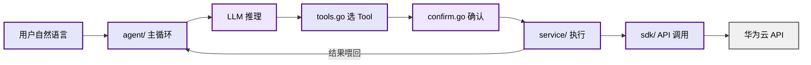

---

## 四、智能诊断数据流（Phase 3 — 内置 Tool 直连）

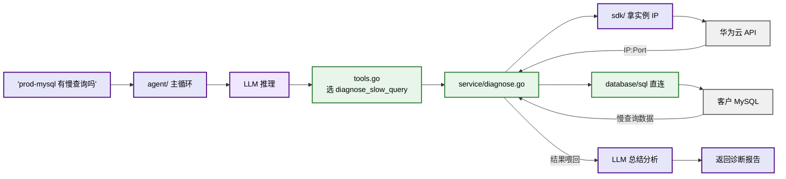

---

## 五、智能诊断数据流（Phase 3 — MCP 外部数据源）

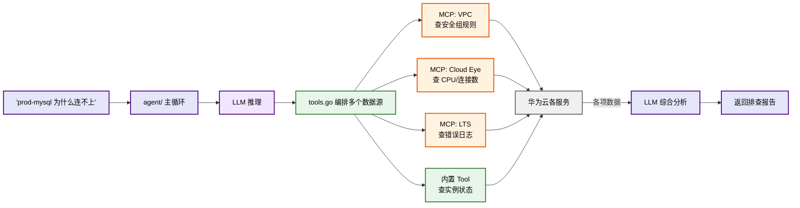

---

## 六、Agent 主控循环（含诊断分支）

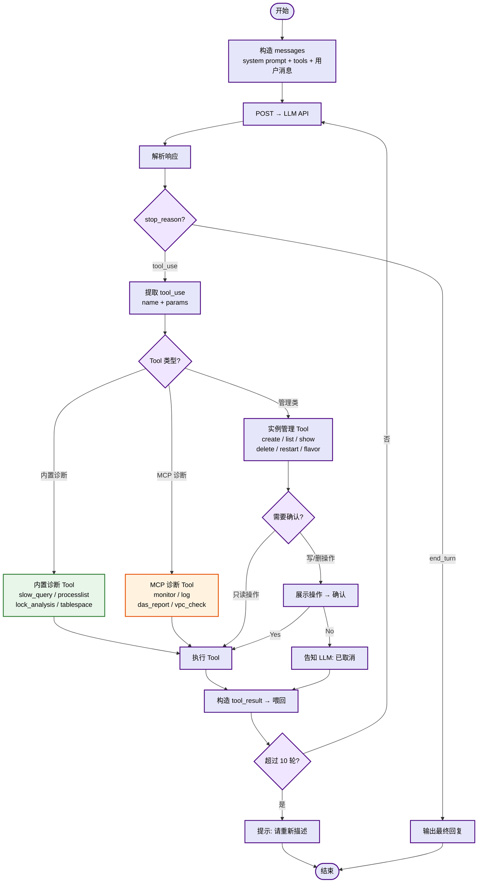

---

## 七、Tool 注册表全景

```mermaid
graph TD
    REGISTRY["tools.go · Tool 注册表"]

    REGISTRY --> G1
    REGISTRY --> G2
    REGISTRY --> G3

    G1["实例管理（Phase 1-2）"]
    G1_1["create_instance → service.Create"]
    G1_2["list_instances → service.List"]
    G1_3["show_instance → service.Show"]
    G1_4["delete_instance → service.Delete"]
    G1_5["restart_instance → service.Restart"]
    G1_6["list_flavors → service.Flavor"]
    G1_7["create_backup → service.Backup"]

    G2["内置诊断（Phase 3a）"]
    G2_1["diagnose_slow_query<br/>→ 直连 MySQL 查 slow_log"]
    G2_2["diagnose_processlist<br/>→ SHOW PROCESSLIST"]
    G2_3["diagnose_locks<br/>→ INNODB STATUS"]
    G2_4["diagnose_tablespace<br/>→ 表空间使用率"]

    G3["MCP 诊断（Phase 3b）"]
    G3_1["mcp_monitor<br/>→ Cloud Eye 监控指标"]
    G3_2["mcp_logs<br/>→ LTS 错误日志"]
    G3_3["mcp_slow_report<br/>→ DAS 慢 SQL 报告"]
    G3_4["mcp_network<br/>→ VPC 安全组排查"]

    G1 --> G1_1
    G1 --> G1_2
    G1 --> G1_3
    G1 --> G1_4
    G1 --> G1_5
    G1 --> G1_6
    G1 --> G1_7

    G2 --> G2_1
    G2 --> G2_2
    G2 --> G2_3
    G2 --> G2_4

    G3 --> G3_1
    G3 --> G3_2
    G3 --> G3_3
    G3 --> G3_4

    classDef nodeStyle fill:#E6E6FA,stroke:#4B0082,stroke-width:2px,color:#000
    classDef diagStyle fill:#E8F5E9,stroke:#2E7D32,stroke-width:2px,color:#000
    classDef mcpStyle fill:#FFF3E0,stroke:#E65100,stroke-width:2px,color:#000

    class REGISTRY,G1,G1_1,G1_2,G1_3,G1_4,G1_5,G1_6,G1_7 nodeStyle
    class G2,G2_1,G2_2,G2_3,G2_4 diagStyle
    class G3,G3_1,G3_2,G3_3,G3_4 mcpStyle
```

---

## 八、模块依赖（W1-W6 CLI + W7-W12 Agent）

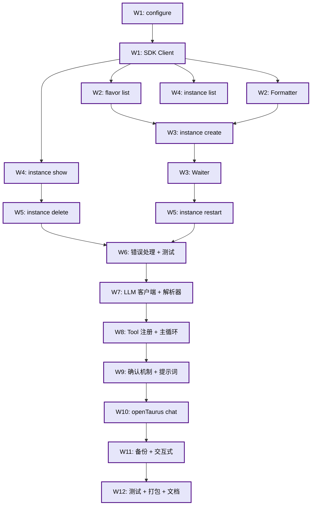

---

## 九、演进路线

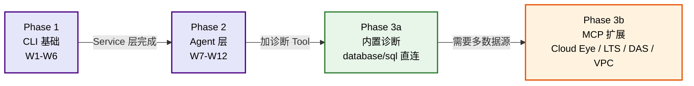

| 阶段     | 交付物                                  | 架构模式               |
| -------- | --------------------------------------- | ---------------------- |
| Phase 1  | 8 个 CLI 命令 + Service + SDK           | 纯 CLI                 |
| Phase 2  | 自定义 Agent + Tool Calling + 安全确认  | 单体 Agent + 技能库    |
| Phase 3a | 内置诊断 Tool（直连 MySQL）             | Agent + 内置诊断       |
| Phase 3b | MCP 扩展（Cloud Eye / LTS / DAS / VPC） | Agent + 内置诊断 + MCP |

---

## 十、诊断场景示例

### 场景 A：慢查询分析（内置 Tool，直连数据库）

```
用户: prod-mysql 最近有慢查询吗

Agent 执行:
  1. tool_use: show_instance → 拿到 IP 192.168.0.12:3306
  2. tool_use: diagnose_slow_query → 直连 MySQL 查 slow_log
  3. LLM 拿到 15 条慢查询记录，总结分析

Agent 回复:
  过去 24 小时有 15 条慢查询，主要集中在 orders 表：
  - SELECT * FROM orders WHERE status='pending' (avg 3.2s, 9次)
    → 建议: 给 status 字段加索引
  - SELECT * FROM orders JOIN users ON ... (avg 5.1s, 6次)
    → 建议: 优化 JOIN 条件，考虑分页
```

### 场景 B：连不上排查（MCP 多数据源）

```
用户: prod-mysql 连不上了怎么回事

Agent 执行:
  1. tool_use: show_instance → 实例状态 Running，没挂
  2. mcp_monitor → CPU 95%，连接数 500/500 已满
  3. mcp_logs → 错误日志: Too many connections
  4. mcp_network → 安全组 3306 端口已放通

Agent 回复:
  排查结果：实例正常运行，但连接数已满（500/500）。
  错误日志确认: "Too many connections"
  安全组没有问题，3306 端口已放通。

  建议:
  1. 立即: 检查应用是否有连接泄漏
  2. 短期: 调大 max_connections 参数
  3. 长期: 考虑升级实例规格或引入连接池
```

### 场景C: 如果遇到非法或者还没纳管的场景

比如用户问"帮我优化一下慢 SQL"，你的 Tool 注册表里没有这个功能，LLM 看了一圈发现没有合适的工具可以调，`stop_reason` 就会返回 end_turn 而不是 `tool_use`，然后直接用文字回答。

```text
你是华为云 RDS 管理助手。

你能做的事：
- 创建/查询/删除/重启 RDS 实例
- 查询数据库规格
- 管理备份

你不能做的事：
- 操作 RDS 以外的华为云服务
- 执行 SQL
- 修改网络/安全组

当用户问你能力范围以外的事时，
诚实告知你不支持，并建议用户通过华为云控制台操作。
```

有了这个约束，用户问超范围的问题时， LLM的回复大概是:

```text
用户: 帮我优化一下慢 SQL
Agent: 抱歉，我目前不支持 SQL 优化功能。我可以帮你管理 RDS 实例（创建、查询、删除、重启）和备份。
      SQL 优化建议通过华为云控制台的 DAS（数据管理服务）进行。
```

不会报错，不会崩溃，不会瞎编一个不存在的 Tool 去调。LLM 知道自己有哪些工具——因为你在请求里把 Tool 列表传给它了，它不会凭空造一个出来。

---

## 五、完整数据流（一次 Agent 创建实例的全链路）

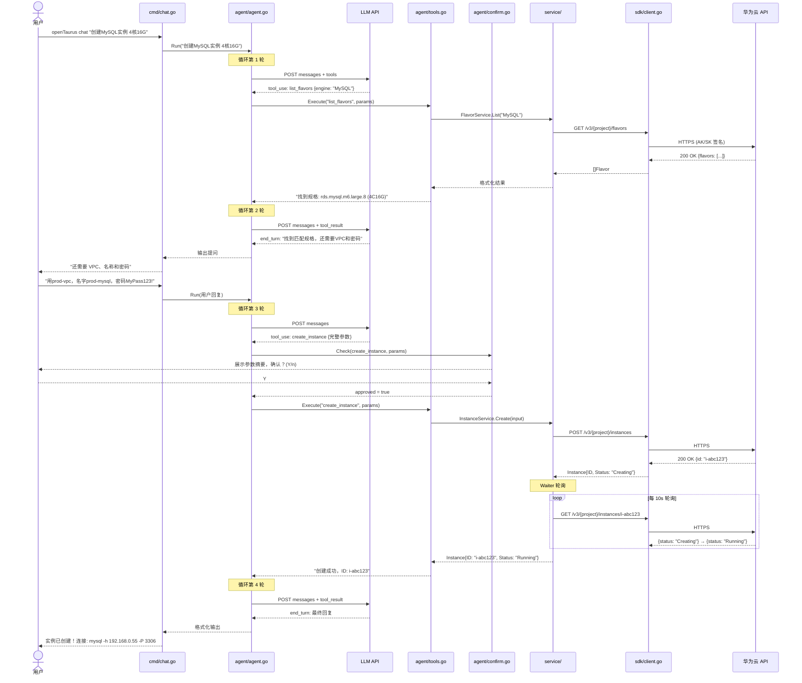

---

## 七、技术栈清单

| 用途      | 库 / 工具               | 说明                      |
| --------- | ----------------------- | ------------------------- |
| CLI 框架  | spf13/cobra             | kubectl, docker, gh 都用  |
| 配置管理  | spf13/viper             | 支持 YAML/ENV/flag        |
| 交互式 UI | AlecAivazis/survey/v2   | 终端交互选择              |
| 表格输出  | olekukonez/tablewriter  | 终端表格                  |
| 彩色输出  | fatih/color             | 状态彩色标识              |
| Spinner   | briandowns/spinner      | 加载动画                  |
| HTTP      | net/http（标准库）      | 调华为云 API + LLM API    |
| JSON      | encoding/json（标准库） | 零依赖                    |
| 测试      | stretchr/testify        | 断言 + mock               |
| 发布      | goreleaser              | 交叉编译 + GitHub Release |

---

## 八、开发计划

### 总体时间线

| 周次   | 阶段       | 核心交付物                         | 里程碑         |
| ------ | ---------- | ---------------------------------- | -------------- |
| W1-2   | CLI 基座   | configure + SDK 签名 + flavor list | 链路打通       |
| W3-4   | CLI 核心   | instance create / list / show      | 创建和查询可用 |
| W5-6   | CLI 完善   | delete / restart + 错误处理 + 测试 | CLI 生产级     |
| W7-8   | Agent 基础 | LLM 客户端 + Tool 注册 + 主循环    | Agent 跑通     |
| W9-10  | Agent 完善 | 确认机制 + 提示词 + chat 命令      | Agent 可用     |
| W11-12 | 交付       | 备份 + 测试 + 打包 + 文档          | 产品发布       |

### 开发方法论

项目采用 **SDD + TDD + CI/CD** 的开发模式：

- **SDD（Spec Driven Development）**：每个功能开发前先写规格说明
- **TDD（Test Driven Development）**：先写测试再写实现，Service 层严格驱动
- **CI/CD**：GitHub Actions 自动化 Lint + 测试 + 构建

---

## 九、总结

OpenTaurus 项目的核心价值在于：在对标 AWS 和阿里云全部基础 CLI 能力的同时，通过 AI Agent 智能交互层实现差异化竞争。

**技术选型**：选择 Go 语言，获得单二进制分发、极快启动、交叉编译等 CLI 场景的天然优势，同时通过自定义 Agent 实现避免对第三方框架的依赖。

**架构设计**：遵循"最简架构"原则，采用分层设计，CLI 和 Agent 共享 Service 层，避免业务逻辑重复。

**开发方法**：采用 SDD + TDD + CI/CD 的成熟方法论，确保 12 周内交付高质量产品。

> **核心理念：** 先构建能工作的最简单系统，然后让它随需求自然生长。—— Anthropic, Building Effective AI Agents
