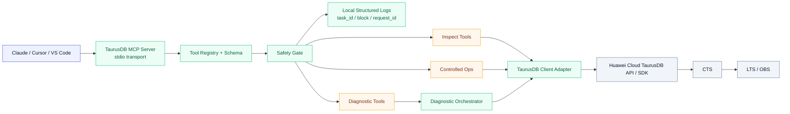

# 华为云 TaurusDB MCP Server — 需求背景与概要设计

这篇文档聚焦 6 件事：需求背景、竞品分析、功能清单、方案概要设计、测试观测点、测试用例设计。实现层面的目录边界、模块职责和协议细节，继续以 [《华为云 TaurusDB MCP Server — 架构与方案设计》](./taurusdb-architecture) 为准。

---

## 01 · 需求背景

### 1.1 问题背景

TaurusDB 的日常运维本质上是一个“多信息源、多步骤、强上下文依赖”的问题：

- 操作者通常需要在控制台、API 文档、日志、备份、参数配置之间频繁切换
- 纯控制台操作适合人工点击，但不适合 AI 助手稳定调用
- 纯 OpenAPI 能力虽然完整，但接口颗粒度偏底层，不适合直接暴露给大模型
- 数据库运维存在天然安全边界，不能把“自然语言可执行”直接等同于“默认可变更”

与此同时，MCP 正在成为 AI 客户端统一接入外部能力的事实标准。对 TaurusDB 来说，最佳切入点不是再造一个通用云管平台，而是提供一个聚焦 TaurusDB 运维与诊断场景的任务型 MCP Server。

### 1.2 目标用户

| 用户角色 | 主要诉求 | 典型问题 |
| -------- | -------- | -------- |
| 开发者 | 快速查询实例状态和备份情况 | “帮我看一下测试库有没有最近备份” |
| DBA | 参数、日志、实例健康诊断 | “这个实例慢 SQL 为什么突然变多” |
| SRE / 运维 | 标准化、可审计、低风险操作 | “给出风险说明后再发起备份” |
| 售前 / 支持 | 用自然语言快速收集诊断证据 | “汇总这个实例当前状态和风险项” |

### 1.3 设计目标

| 目标 | 说明 |
| ---- | ---- |
| 任务型工具优先 | 不把 50+ OpenAPI 原样暴露为 50+ MCP Tools |
| 诊断优先于 CRUD | 强调 `diagnose_instance`、`review_backup_risk` 这类组合能力 |
| 默认安全 | 默认只读；高风险变更保留 `confirmation_token`；真正云侧操作由 CTS 自动审计 |
| AI 友好 | 输入输出低歧义，避免大模型高频选错工具 |
| 易部署 | 支持 `npx` 零安装运行，适配 Claude Desktop、Cursor 等客户端 |
| 易扩展 | 后续可平滑接入更多 TaurusDB 能力和跨服务信号 |

### 1.4 非目标

首版不做以下事情：

- 不做“华为云全产品通用 MCP Server”
- 不直接暴露所有高风险变更操作
- 不在首版强依赖外部可观测平台或多服务联动编排
- 不把 SQL 自由执行作为默认能力开放给模型

---

## 02 · 竞品分析

### 2.1 分析口径

以下分析基于官方公开资料，时间口径统一为 **2026-04-14**。这里不追求列举所有产品，而是抽取与 TaurusDB MCP Server 最相关的设计模式。

### 2.2 阿里云与 Google Cloud 对比

| 维度 | 阿里云 | Google Cloud | 对 TaurusDB MCP 的启示 |
| ---- | ------ | ------------ | ---------------------- |
| 产品形态 | 一条线是 OpenAPI Explorer 的通用 `OpenAPI MCP Server`，另一条线是产品型 MCP，如 Hologres、CloudMonitor 2.0 | 一条线是 Google Cloud 官方远程 MCP endpoint，另一条线是 Google 维护的本地 MCP Server / GitHub 项目 | 我们应坚持“领域专用 + 任务型”路线，而不是首版做成泛华为云万能入口 |
| 工具暴露策略 | 通用 OpenAPI MCP Server 允许用户自行选择 API，并建议单个 MCP Server 不超过 30 个 API | 官方文档展示的是服务级 endpoint，Google 也在本地 MCP 项目里提供任务型工具集合 | 首版工具数应控制在 10-12 个核心任务，避免工具集合膨胀 |
| 权限模型 | 依赖 RAM 权限和 RAM Role，且已提供多账号访问模式 | 依赖 Google Cloud IAM / ADC，远程 MCP 运行在 Google 基础设施上 | Taurus 首版应先把 `region/project_id` 覆盖和 AK/SK 最小权限做好，多账号放到下一阶段 |
| 诊断能力 | CloudMonitor 2.0 MCP 强调统一日志、指标、事件和智能诊断；Hologres MCP 提供更深的产品域操作 | Gemini Cloud Assist MCP 提供 investigation 风格的任务型诊断能力 | Taurus 的差异化不应停留在“查数据”，而应落在“汇总证据并生成风险判断” |
| 客户端接入 | 面向通用 MCP 客户端，文档强调配置便利性 | 支持远程 MCP 和本地 MCP 两种模式，兼容多个 MCP Client | Taurus 首版保持本地 `stdio` 最稳妥，后续再考虑托管式 remote MCP |
| 可扩展性 | 既能做产品型 MCP，也能用通用 OpenAPI MCP 快速覆盖长尾 API | 以服务级 endpoint 和官方维护 server 组合推进生态 | Taurus 应采用“P0 任务型工具 + 内部保留 OpenAPI 能力面”的双层设计 |

### 2.3 阿里云的可借鉴点

从阿里云官方资料看，有 3 个点非常值得借鉴：

1. **控制单个 MCP Server 的工具规模。** OpenAPI MCP Server 明确建议单个服务不要塞入过多 API，这和大模型上下文长度、工具选择精度直接相关。
2. **把多账号访问显式建模。** 阿里云通过 RAM Role 处理多账号场景，这说明多账号不是“额外优化项”，而是运维类 MCP 很快就会遇到的真实需求。
3. **通用能力与产品能力并存。** Hologres、CloudMonitor 2.0 这类产品型 MCP 证明：只靠通用 API 暴露不够，真正高价值的是面向具体产品语义的工具集。

### 2.4 Google Cloud 的可借鉴点

Google Cloud 的路线给出了另一组启发：

1. **任务型诊断工具比资源型工具更有壁垒。** Gemini Cloud Assist MCP 把核心价值放在 investigation，而不是简单资源枚举。
2. **远程托管式 MCP 是明确演进方向。** 官方已经把部分 MCP 以服务 endpoint 方式提供，说明未来“平台托管 + 权限治理”会是重要形态。
3. **官方维护的产品级 MCP 能提升可信度。** 对用户来说，产品方直接维护的 MCP 在权限、契约和升级节奏上更容易被接受。

### 2.5 对 TaurusDB MCP 的产品结论

综合竞品后，TaurusDB MCP Server 的首版定位应明确为：

- **不是** 通用华为云 OpenAPI 包装器
- **而是** 面向 TaurusDB 运维和诊断的任务型 MCP Server
- 首版优先解决“查询、诊断、备份风险审查、受控低风险写操作”
- 工具数量控制在小而精的范围，内部仍保留完整 OpenAPI/SDK 能力面
- 审计链路默认对标阿里云 / 华为云：云侧动作走平台自动审计，本地只保留轻量结构化日志
- 高风险变更额外保留 `confirmation_token`，用更强的事前控制覆盖数据库运维场景

---

## 03 · 功能清单

### 3.1 用户可见功能

| 编号 | 功能 | 描述 | 优先级 |
| ---- | ---- | ---- | ------ |
| F-01 | 配置与初始化 | 支持初始化 AK/SK、`project_id`、`region` 和客户端配置 | P0 |
| F-02 | 实例列表查询 | 查询实例列表，返回关键字段摘要 | P0 |
| F-03 | 单实例详情查询 | 获取实例状态、规格、网络和基础信息 | P0 |
| F-04 | 备份查询 | 查询最近备份、备份状态和备份策略 | P0 |
| F-05 | 创建备份 | 发起单次备份，返回异步任务信息 | P0 |
| F-06 | 日志排查 | 查询慢日志、错误日志 | P0 |
| F-07 | 参数核查 | 查询实例关键参数配置 | P0 |
| F-08 | 实例诊断 | 聚合实例详情、日志、参数、备份策略，输出健康结论 | P0 |
| F-09 | 备份风险审查 | 输出备份覆盖、失败记录和改进建议 | P0 |
| F-10 | 异步任务跟踪 | 查询任务状态、等待任务完成 | P0 |
| F-11 | 高风险操作受控开放 | 重启、改参等高风险动作进入 P1，并强制确认 | P1 |
| F-12 | 多区域 / 多项目覆盖 | 每次工具调用可局部覆盖默认上下文 | P1 |

### 3.2 系统能力功能

| 编号 | 模块 | 描述 | 优先级 |
| ---- | ---- | ---- | ------ |
| S-01 | Tool Registry | 统一注册工具元数据、Schema 和风险等级 | P0 |
| S-02 | Credential Loader | 多来源读取凭证，统一认证上下文 | P0 |
| S-03 | TaurusDB Client Adapter | SDK 优先，OpenAPI 兜底 | P0 |
| S-04 | Diagnostic Orchestrator | 聚合多个底层能力，生成 `summary/findings/evidence` | P0 |
| S-05 | Safety Gate | 只读默认、确认 token、工具级风险拦截 | P0 |
| S-06 | Formatter | 统一成功/失败 envelope，降低模型解析成本 | P0 |
| S-07 | Waiter | 处理异步任务轮询、退避和超时 | P0 |
| S-08 | Local Structured Log | 记录轻量本地结构化日志，并关联 `task_id/request_id` | P1 |
| S-09 | Multi-project Context | 管理默认上下文和局部覆盖策略 | P1 |
| S-10 | Capability Promotion | 根据使用频次把内部 API 逐步升格为独立 Tool | P1 |

### 3.3 MVP 范围

| 范围 | 内容 |
| ---- | ---- |
| 查询类 | `list_instances`、`get_instance`、`list_backups`、`get_backup_policy`、`list_slow_logs`、`list_error_logs`、`get_instance_configuration` |
| 低歧义写操作 | `create_backup` |
| 辅助工具 | `get_operation_status`、`wait_operation` |
| 差异化诊断 | `diagnose_instance`、`review_backup_risk` |
| 安全边界 | 默认只读，高风险写操作不进入首版默认暴露集合 |

### 3.4 关键术语

| 术语 | 含义 |
| ---- | ---- |
| 查询工具 | 只读工具，不改变 TaurusDB 资源状态，例如 `list_instances`、`get_instance` |
| `mutation` / 写操作工具 | 会改变远端资源状态的工具，例如 `create_backup`、`restart_instance`、`update_instance_configuration` |
| 高风险工具 | 一旦执行就可能影响可用性、配置稳定性或数据安全的写操作，需要额外保护 |
| 默认不暴露 | 服务启动时不把该工具注册进 `tools/list`，模型默认看不到也选不到 |
| `confirmation_token` | 服务端在第一次高风险调用时签发的短期有效确认令牌，绑定工具名、目标资源、参数摘要和过期时间；第二次调用带上它才允许真正执行 |
| `task_id` | 每次 MCP 工具调用的内部关联 ID，用于串联结构化日志和响应 |
| `CTS` | 华为云云审计服务，用于记录真正触达云侧的资源操作 |
| `CTS 追踪器` | 将 CTS 审计事件转储到 LTS/OBS 的配置 |
| `request_id` | 华为云 API 在真正发起上游请求后返回的请求号，可用于工单定位和云侧排障；如果请求在本地就被拦截，则不会有这个字段 |

---

## 04 · 方案概要设计

### 4.1 设计原则

| 原则 | 说明 |
| ---- | ---- |
| 任务面高于接口面 | 工具命名和语义对齐用户任务，不对齐底层 API 目录 |
| 证据优先 | 诊断输出必须带证据，不输出无依据结论 |
| 安全左移 | 最小权限、默认不暴露、高风险确认和 CTS 自动审计组合收口 |
| 结果统一 | 所有工具输出统一 envelope，便于 AI 客户端消费 |
| 实现可演进 | 首版 `stdio`，后续可演进到 remote MCP |

### 4.2 整体架构

### 4.3 模块划分

| 模块 | 责任 |
| ---- | ---- |
| `index.ts` / `server.ts` | Server 启动、客户端接入、工具注册 |
| `auth/` | 凭证加载、签名、认证上下文管理 |
| `client/` | TaurusDB SDK / OpenAPI 适配、错误归一 |
| `tools/` | 查询类、写操作类、异步辅助类工具实现 |
| `diagnostics/` | `diagnose_instance`、`review_backup_risk` 等组合能力 |
| `utils/safety.ts` | 默认只读、确认 token、权限与风险控制 |
| `utils/formatter.ts` | 统一响应封装、字段裁剪、错误摘要 |
| `utils/waiter.ts` | 轮询异步任务、退避和超时控制 |

### 4.4 工具域划分

| 工具域 | 示例 | 设计目的 |
| ------ | ---- | -------- |
| Inspect | `list_instances`、`get_instance` | 让模型先拿到上下文 |
| Backup & Config | `list_backups`、`get_backup_policy`、`get_instance_configuration` | 覆盖数据库运维最常见核查面 |
| Diagnostics | `diagnose_instance`、`review_backup_risk` | 提供高价值聚合判断 |
| Operation Helpers | `get_operation_status`、`wait_operation` | 管理异步任务状态 |
| Controlled Ops | `create_backup`，后续 `restart_instance` | 在受控边界内逐步开放写操作 |

### 4.5 审计与确认策略

| 操作类型 | 代表工具 | 默认策略 |
| -------- | -------- | -------- |
| 只读查询 | `list_instances`、`get_instance` | 只受权限控制，不需要 confirmation；不产生云侧变更审计 |
| 低歧义写操作 | `create_backup` | 受权限控制；真正执行后由 CTS 自动审计 |
| 高风险变更 | `restart_instance`、`resize_instance`、`update_instance_configuration` | 默认不暴露；即使暴露也要求 `confirmation_token`；执行后再由 CTS 自动审计 |
| 销毁性操作 | `delete_instance`、`reset_password` | 首版不暴露 |

### 4.6 与架构文的分工

本篇只定义“为什么做、做什么、首版怎么收口”。更细的实现细节以 [taurusdb-architecture.md](./taurusdb-architecture) 为准，包括：

- 目录结构
- Tool Schema 设计
- 统一响应模型
- npm 发布方案
- 安全实现细节

---

## 05 · 测试观测点

### 5.1 链路级观测点

| 链路节点 | 测试场景 | 关键断言 |
| -------- | -------- | -------- |
| MCP Server 启动 | 启动服务并执行 `tools/list` | Server 名称、版本、P0 工具集合与预期一致 |
| Credential Loader | 环境变量、配置文件、缺失凭证三类场景 | 凭证来源优先级正确；缺失时错误可解释 |
| Tool Registry | 查询类和写操作类工具注册 | 默认只暴露只读工具；启用 mutations 后才出现写工具 |
| Safety Gate | 高风险工具首次调用 | 返回影响说明和 `confirmation_token`，不直接执行；同时写本地结构化日志 |
| TaurusDB Client Adapter | SDK 成功、OpenAPI fallback、权限错误 | 错误被统一归类；只要真实请求到了云侧，`request_id` 就会透出到 metadata |
| Diagnostic Orchestrator | 聚合实例详情、日志、备份策略 | 输出包含 `summary/findings/evidence/recommendations` |
| Formatter | 查询成功、异步 accepted、权限错误 | envelope 字段稳定；`summary` 可直接给模型消费 |
| Waiter | 任务成功、任务失败、任务超时 | 轮询退避符合预期；超时不会无限等待 |
| Audit | 高风险写操作确认通过 / 拒绝 | 本地结构化日志完整；真实云侧操作可通过 `request_id` 关联 CTS |

### 5.2 核心指标

| 指标 | 目标 |
| ---- | ---- |
| `tools/list` 启动耗时 | < 2s |
| 单次查询工具 P95 | < 5s |
| `diagnose_instance` 首次返回 P95 | < 8s |
| 异步任务状态查询 P95 | < 3s |
| 高风险操作漏拦截率 | 0 |
| 敏感字段脱敏命中率 | 100% |
| 已发起云侧请求的响应中 `request_id` 透出率 | 100% |
| 本地拦截路径中 `task_id` 透出率 | 100% |

### 5.3 故障注入观测点

| 场景 | 注入方式 | 通过标准 |
| ---- | -------- | -------- |
| SDK 调用失败 | Mock SDK 抛错 | 自动切到 fallback 或返回可解释错误 |
| OpenAPI 403 | Mock 权限不足 | 返回 `ACCESS_DENIED` 类错误，不重试 |
| OpenAPI 429 / 5xx | Mock 限流和服务端错误 | 可重试错误才重试，最终结果带 `retryable` |
| 日志接口超时 | 慢日志 / 错误日志接口长时间无响应 | 诊断输出降级，但不导致整个服务崩溃 |
| 确认 token 过期 | 使用旧 token 再次发起变更 | 动作被阻断，并提示重新确认 |
| 本地结构化日志写入失败 | Mock JSONL 写入失败 | 查询链路可降级；高风险写操作首次签发 token 时至少要记录一条本地日志 |

---

## 06 · 测试用例设计

### 6.1 核心测试用例

| 用例 ID | 场景 | 前置条件 | 步骤 | 预期结果 |
| ------- | ---- | -------- | ---- | -------- |
| TC-01 | 查询实例列表成功 | 已配置合法凭证 | 调用 `list_instances` | 返回实例摘要列表，`ok=true` |
| TC-02 | 查询单实例详情成功 | 实例存在 | 调用 `get_instance` | 返回实例核心字段和状态 |
| TC-03 | 查询备份策略成功 | 实例存在 | 调用 `get_backup_policy` | 返回备份周期、保留天数等关键信息 |
| TC-04 | 创建备份成功 | 已开启低风险写操作 | 调用 `create_backup` | 返回 `accepted` 和 `operation_id` |
| TC-05 | 创建备份权限不足 | 凭证无写权限 | 调用 `create_backup` | 返回可解释的权限错误，不假成功 |
| TC-06 | 实例诊断成功 | 实例、日志、备份信息可读 | 调用 `diagnose_instance` | 返回结论、证据、风险等级和建议 |
| TC-07 | 备份风险审查命中风险 | 最近备份失败或策略不合理 | 调用 `review_backup_risk` | 返回 `medium/high` 风险和明确建议 |
| TC-08 | 日志接口超时时诊断降级 | Mock 日志查询超时 | 调用 `diagnose_instance` | 输出降级说明，但给出当前可得结论 |
| TC-09 | 高风险工具首次调用被拦截 | 已启用 `restart_instance` | 首次调用重启 | 返回确认说明和 token，不执行动作 |
| TC-10 | 高风险工具确认通过 | 已获得有效 token | 带 token 再次调用重启 | 动作执行一次，审计完整 |
| TC-11 | 高风险工具确认过期 | token 已过期 | 带过期 token 调用 | 动作被阻断，提示重新确认 |
| TC-12 | 错误 envelope 稳定 | Mock 403 / 404 / 429 / 500 | 调用任意工具 | 错误结构字段完整，`retryable` 判断正确 |
| TC-13 | 本地拦截请求的关联字段 | 高风险工具首次调用且未真正下发云侧请求 | 调用一次 `restart_instance` | 返回 `task_id`、`confirmation_token`，且没有伪造 `request_id` |
| TC-14 | 云侧执行后的审计关联 | 高风险工具确认通过且云侧已接受请求 | 调用一次确认后的 `restart_instance` | 返回 `task_id` + `request_id`，并可用于后续关联 CTS 事件 |

### 6.2 回归测试包

| 回归包 | 包含用例 | 目的 |
| ------ | -------- | ---- |
| 冒烟回归 | `TC-01`, `TC-02`, `TC-06` | 验证查询和诊断主链路可用 |
| 备份回归 | `TC-03`, `TC-04`, `TC-05`, `TC-07` | 验证备份和风险审查能力 |
| 安全回归 | `TC-09`, `TC-10`, `TC-11`, `TC-14` | 验证确认机制和 CTS 关联链路 |
| 错误回归 | `TC-08`, `TC-12` | 验证降级和错误可解释性 |

### 6.3 发布验收标准

首版发布前至少满足以下条件：

- P0 工具均有可重复执行的契约测试
- 高风险写操作默认关闭，且测试覆盖首次调用、确认通过、确认过期三类路径
- 诊断工具输出固定结构，且结论必带证据
- 关键错误类型具备稳定 `summary + error.code + task_id`，如已触达云侧则额外带 `request_id`
- 高风险变更执行后的响应可以通过 `request_id` 继续关联 CTS 事件
- 文档与侧边栏已同步，用户能从专栏页直接进入需求文档和架构文档

---

## 07 · 参考资料

以下资料用于竞品分析，口径均为官方资料，访问日期为 **2026-04-14**：

- [Alibaba Cloud OpenAPI MCP Server User Guide](https://www.alibabacloud.com/help/en/openapi/user-guide/openapi-mcp-server-guide)
- [Alibaba Cloud OpenAPI MCP Server multi-account guide](https://www.alibabacloud.com/help/doc-detail/2983734.html)
- [Alibaba Cloud Hologres MCP Server](https://www.alibabacloud.com/help/doc-detail/2980817.html)
- [Alibaba Cloud CloudMonitor 2.0 MCP integration](https://www.alibabacloud.com/help/doc-detail/2987178.html)
- [Google Cloud MCP servers overview](https://docs.cloud.google.com/mcp)
- [Google Cloud MCP supported products](https://docs.cloud.google.com/mcp/supported-products)
- [GoogleCloudPlatform/gemini-cloud-assist-mcp](https://github.com/GoogleCloudPlatform/gemini-cloud-assist-mcp)
