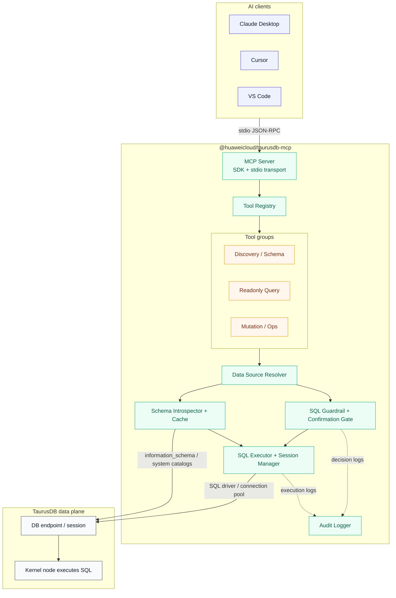
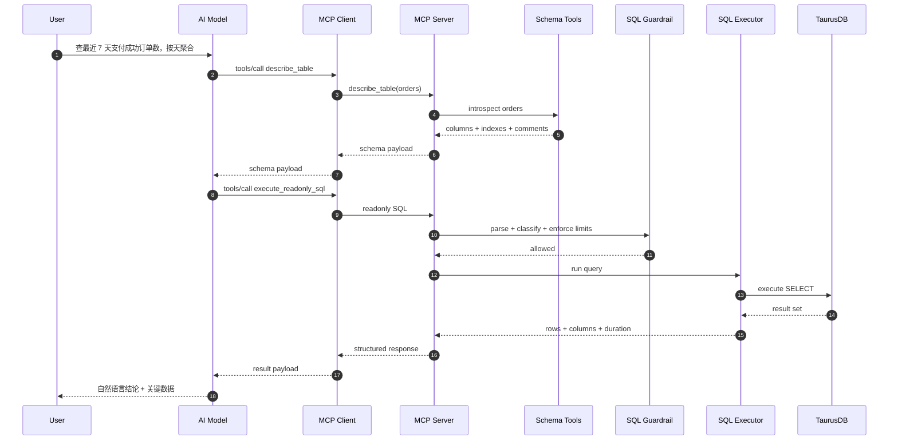
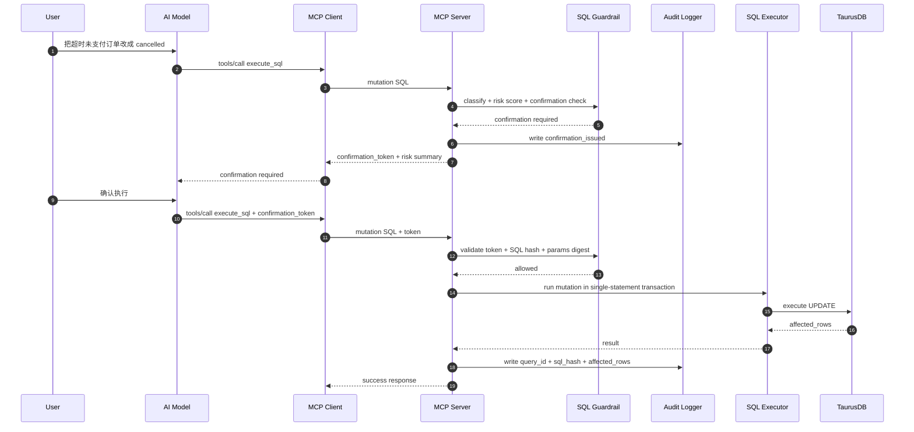

# 华为云 TaurusDB 数据面 MCP Server — 架构与方案设计

## 1. 项目概述

### 1.1 目标

构建一个符合 Model Context Protocol (MCP) 标准的服务器，让 AI 助手（Claude Desktop、Cursor、VS Code 等）能够通过自然语言与华为云 TaurusDB 的**数据面**交互，完成 schema 探查、只读 SQL 查询、Explain 分析和受控 SQL 执行。

这里的核心链路是：

```text
自然语言
→ schema 上下文
→ SQL
→ 风险校验
→ 数据面执行
→ 结构化结果
```

### 1.2 核心定位

| 维度 | 决策 |
| ---- | ---- |
| 语言 | TypeScript（npm 生态和 MCP SDK 最成熟） |
| 分发 | npm 包，用户通过 `npx @huaweicloud/taurusdb-mcp` 零安装运行 |
| 传输 | `stdio`，本地 JSON-RPC over stdin/stdout |
| 首要认证 | 数据库连接凭证或数据源 profile |
| 可选认证 | AK/SK 仅用于辅助发现实例、地址等管控面上下文 |
| 执行路径 | 直接建立数据库会话，由 TaurusDB 数据面执行 SQL |
| 安全边界 | SQL AST 分类、结果限制、超时限制、确认 token、审计日志 |
| 推荐部署位点 | 与 TaurusDB 同 VPC、同可达网络的跳板机 / Sidecar / 本地安全环境 |

### 1.3 管控面与数据面的边界

| 维度 | 管控面 | 数据面 |
| ---- | ------ | ------ |
| 连接对象 | OpenAPI / SDK | 数据库会话 |
| 主要能力 | 查实例、备份、参数、日志 | 查库、查表、执行 SQL |
| 结果粒度 | 资源元数据 | 真实业务数据 |
| 风险类型 | 资源变更风险 | 数据误改、慢查询、敏感数据暴露 |
| 本项目优先级 | P2 | P0 |

结论是：这个 MCP Server 首先是一个 **SQL 执行与治理层**，不是一个数据库运维控制台。

---

## 2. 系统架构

### 2.1 分层架构



### 2.2 主数据流

一次完整的只读查询调用流程：

```text
用户自然语言
→ AI 先选择 schema 工具获取表结构
→ AI 组织 SQL
→ MCP Client 发起 tools/call
→ Server 解析数据源、数据库、schema 上下文
→ SQL Guardrail 解析 SQL，判定语句类型、风险和限制
→ Schema Introspector 提供字段信息辅助校验
→ SQL Executor 在数据面建立会话执行
→ 返回 rows / columns / truncated / duration_ms / query_id
→ AI 组织最终自然语言回答
```

### 2.3 关键交互示例

#### 2.3.1 自然语言到只读 SQL

**用户问：“查最近 7 天支付成功订单数，按天聚合。”**



#### 2.3.2 受控写 SQL

**用户问：“把超时未支付订单改成 cancelled。”**



### 2.4 为什么强调“内核节点执行”

这里说的“内核节点执行”，不是要求 MCP Server 必须部署进数据库进程内部，而是强调：

- SQL 的最终执行落点是 TaurusDB 的数据库内核，而不是云管 API
- 结果来自真实表数据，而不是资源元数据
- 风险控制必须围绕 SQL 执行语义，而不是只围绕 API 权限

所以部署建议是“尽量靠近数据面”，例如：

- 与 TaurusDB 同 VPC 的运维主机
- 客户侧堡垒机或跳板机
- 受控的本地开发环境

---

## 3. 模块设计

### 3.1 目录结构

```text
@huaweicloud/taurusdb-mcp/
├── src/
│   ├── index.ts                    # 入口：CLI 分发 + MCP Server 启动
│   ├── server.ts                   # MCP Server 初始化、Tool 注册
│   ├── auth/
│   │   ├── sql-profile-loader.ts   # 数据源 profile / DSN / env 加载
│   │   └── secret-resolver.ts      # 密码、密钥等敏感配置解析
│   ├── context/
│   │   ├── datasource-resolver.ts  # 默认数据源 / database / schema 覆盖
│   │   └── session-context.ts      # 单次调用上下文
│   ├── schema/
│   │   ├── introspector.ts         # 系统表 / catalog 查询
│   │   ├── cache.ts                # schema 短期缓存
│   │   └── adapters/               # 各内核类型的 schema 适配
│   ├── executor/
│   │   ├── sql-executor.ts         # SQL 执行主入口
│   │   ├── connection-pool.ts      # 连接池管理
│   │   ├── query-tracker.ts        # query_id 状态管理
│   │   └── adapters/               # MySQL / PostgreSQL compatible adapters
│   ├── safety/
│   │   ├── sql-classifier.ts       # AST 分类
│   │   ├── sql-validator.ts        # 黑白名单、单语句限制、风险规则
│   │   ├── confirmation-store.ts   # confirmation_token 签发与校验
│   │   └── redaction.ts            # 结果脱敏与字段裁剪
│   ├── tools/
│   │   ├── discovery.ts            # list_data_sources / list_databases
│   │   ├── schema.ts               # list_tables / describe_table / sample_rows
│   │   ├── query.ts                # execute_readonly_sql / explain_sql
│   │   ├── mutations.ts            # execute_sql
│   │   └── operations.ts           # get_query_status / cancel_query
│   ├── commands/
│   │   └── init.ts                 # 一键写入 MCP 客户端配置
│   └── utils/
│       ├── formatter.ts            # 统一 envelope
│       ├── audit.ts                # 审计落盘
│       └── hash.ts                 # SQL fingerprint / digest
├── tests/
│   ├── unit/
│   │   ├── sql-classifier.test.ts
│   │   ├── sql-validator.test.ts
│   │   ├── formatter.test.ts
│   │   └── confirmation-store.test.ts
│   └── integration/
│       ├── schema-tools.test.ts
│       ├── query-tools.test.ts
│       └── mutation-tools.test.ts
└── package.json
```

### 3.2 各模块职责

#### 3.2.1 入口层 (`index.ts`)

入口只做两件事：识别子命令和启动 MCP Server。

```typescript
#!/usr/bin/env node

if (args[0] === "init") {
  await runInit(args);
  process.exit(0);
}

const server = createServer();
const transport = new StdioServerTransport();
await server.connect(transport);
```

#### 3.2.2 数据源与凭证层 (`auth/` + `context/`)

数据面 MCP 的首要上下文不是 `region/project_id`，而是：

- `datasource`
- `database`
- `schema`
- `engine`
- `credential_source`

建议的加载优先级：

```text
1. Tool 显式参数        → datasource / database / schema
2. 命名 profile         → ~/.config/taurusdb-mcp/profiles.json
3. 环境变量             → TAURUSDB_SQL_DSN / HOST / PORT / USER / PASSWORD
4. init 写入的本地配置   → 面向 Claude / Cursor 的默认 profile
```

核心要求：

- 数据源与数据库上下文必须能被单次调用覆盖
- 密码不直接回显到工具结果
- 允许区分只读账号与写账号
- 为后续接入 Secret Manager 预留接口

#### 3.2.3 Schema 层 (`schema/`)

Schema 层负责做 3 件事：

1. 从系统表中抽取数据库、表、字段、索引、主键、注释
2. 输出 AI 易消费的结构化 schema 信息
3. 对高频元数据做短 TTL 缓存，减少重复查 catalog 的开销

推荐返回字段至少包括：

- `database`
- `table_name`
- `column_name`
- `data_type`
- `nullable`
- `default_value`
- `index_name`
- `is_primary_key`
- `comment`

为了让模型更容易生成正确 SQL，`describe_table` 建议额外返回：

- 常用 where 字段提示
- 可排序字段提示
- 时间字段识别
- 样本值摘要，而不是全量样本

#### 3.2.4 SQL 执行层 (`executor/`)

SQL 执行层是整个项目的中心。它不是单纯的 `query(sql)` 包装，而是一个受控会话执行器：

```typescript
class SqlExecutor {
  async explain(sql: string, context: SessionContext): Promise<ExplainResult>;

  async executeReadonly(
    sql: string,
    context: SessionContext,
    options?: QueryOptions,
  ): Promise<QueryResult>;

  async executeMutation(
    sql: string,
    context: SessionContext,
    options?: MutationOptions,
  ): Promise<MutationResult>;

  async getQueryStatus(queryId: string): Promise<QueryStatus>;
  async cancelQuery(queryId: string): Promise<CancelResult>;
}
```

关键设计决策：

- 按内核类型加载 driver adapter，而不是把所有引擎硬编码在一个执行器里
- 只允许单语句执行
- 只读查询与写查询走不同入口
- 每次执行都生成 `query_id`
- 长查询可查询状态、可取消
- 写 SQL 由服务端包裹为单次事务边界，避免客户端自己发 `BEGIN/COMMIT`

#### 3.2.5 安全层 (`safety/`)

安全层是数据面 MCP 和“直接给模型一个数据库账号”之间的根本区别。

核心步骤如下：

1. SQL 解析：把 SQL 解析为 AST，识别语句类型
2. 单语句校验：禁止多语句批量执行
3. 语句分级：区分只读、写入、高风险、阻断
4. 规则检查：检查是否命中黑名单、缺少限制条件、可能大范围扫描
5. Explain / 成本评估：对复杂只读和全部写 SQL 生成成本摘要
6. 确认策略：命中风险规则时签发 `confirmation_token`
7. 脱敏与裁剪：结果输出前统一裁剪和脱敏

风险分层建议：

| 风险等级 | 典型 SQL | 默认策略 |
| -------- | -------- | -------- |
| `low` | `SHOW TABLES`、有明确 `LIMIT` 的简单查询 | 直接执行 |
| `medium` | 联表聚合、大范围扫描风险、带 `WHERE` 的 `UPDATE` | 先解释，必要时要求确认 |
| `high` | 大范围 `UPDATE/DELETE`、`ALTER TABLE` | 默认阻断或仅在显式开关下允许确认 |
| `blocked` | `DROP DATABASE`、`TRUNCATE`、`GRANT`、`REVOKE`、多语句 | 直接拒绝 |

阻断规则至少包括：

- 多语句
- DCL 语句
- `DROP DATABASE`
- `TRUNCATE`
- 文件系统相关 SQL
- 会修改全局参数的 SQL

#### 3.2.6 审计层 (`utils/audit.ts`)

数据面场景下，光有数据库自身日志还不够，因为还需要记录 MCP 服务端的决策过程。建议每次调用都记录：

- `task_id`
- `query_id`
- `datasource`
- `database`
- `statement_type`
- `risk_level`
- `sql_hash`
- `decision`
- `duration_ms`
- `row_count` 或 `affected_rows`

默认建议：

- 本地只落结构化 JSONL
- 不默认保存完整结果集
- 原始 SQL 文本可选保存，默认只保存 hash 和归一化摘要

---

## 4. Tool 设计

### 4.1 Tool 筛选原则

每个候选 Tool 按 4 个维度评估：

- 高频
- 高价值
- 低歧义
- 安全可收口

这里不再优先“实例诊断”“备份审查”，而是优先那些能构成数据查询闭环的 Tool。

### 4.2 P0 Tool 集合

| Tool | 默认暴露 | 角色定位 |
| ---- | -------- | -------- |
| `list_data_sources` | 是 | 查看可用数据源和默认上下文 |
| `list_databases` | 是 | 查看数据库列表 |
| `list_tables` | 是 | 查看表列表 |
| `describe_table` | 是 | 查看字段、索引、主键、注释 |
| `sample_rows` | 是 | 拉取少量样本帮助理解字段 |
| `execute_readonly_sql` | 是 | 只读查询主入口 |
| `explain_sql` | 是 | SQL 计划和风险解释入口 |
| `get_query_status` | 是 | 长查询状态跟踪 |
| `cancel_query` | 是 | 取消仍在运行的查询 |
| `execute_sql` | 否 | 变更 SQL 执行入口，需显式开启 |

### 4.3 Tool 参数设计

所有核心 Tool 都建议支持以下上下文字段：

```typescript
{
  datasource?: string;
  database?: string;
  schema?: string;
  timeout_ms?: number;
}
```

`execute_readonly_sql` 的核心参数：

```typescript
{
  sql: z.string().describe("Readonly SQL to execute"),
  datasource: z.string().optional(),
  database: z.string().optional(),
  max_rows: z.number().int().positive().max(1000).optional(),
  timeout_ms: z.number().int().positive().max(30000).optional()
}
```

`execute_sql` 额外参数：

```typescript
{
  sql: z.string().describe("Single mutation SQL statement"),
  datasource: z.string().optional(),
  database: z.string().optional(),
  confirmation_token: z.string().optional(),
  dry_run: z.boolean().optional()
}
```

### 4.4 为什么不单独做 `generate_sql`

`generate_sql` 很容易变成“模型调模型”的重复层。这里更合理的分工是：

- 模型本身负责自然语言到 SQL 的生成
- MCP Server 负责 schema 提供、风险校验、Explain 和执行

真正应该产品化的是执行与治理，不是把 SQL 文本生成本身再封一层 Tool。

---

## 5. MCP 协议与响应模型

### 5.1 Server 声明

```typescript
const server = new McpServer({
  name: "huaweicloud-taurusdb",
  version: "0.1.0",
  capabilities: {
    tools: {},
  },
});
```

### 5.2 统一响应结构

所有 Tool 继续返回统一 envelope，优先保证模型稳定消费。

**只读成功响应**

```json
{
  "ok": true,
  "summary": "Query succeeded and returned 42 rows.",
  "data": {
    "columns": [
      { "name": "dt", "type": "date" },
      { "name": "order_count", "type": "bigint" }
    ],
    "rows": [
      ["2026-04-09", 128],
      ["2026-04-10", 141]
    ],
    "row_count": 42,
    "truncated": false
  },
  "metadata": {
    "task_id": "task-01",
    "query_id": "qry-01",
    "sql_hash": "8bb4...",
    "statement_type": "select",
    "duration_ms": 182
  }
}
```

**需确认响应**

```json
{
  "ok": false,
  "summary": "This SQL will modify data and requires explicit confirmation.",
  "error": {
    "code": "CONFIRMATION_REQUIRED",
    "message": "Re-run the same SQL with confirmation_token to continue.",
    "retryable": true
  },
  "data": {
    "confirmation_token": "ctok_eyJhbGciOi...",
    "risk_level": "medium",
    "sql_hash": "c194..."
  },
  "metadata": {
    "task_id": "task-02"
  }
}
```

**阻断响应**

```json
{
  "ok": false,
  "summary": "The SQL statement is blocked by safety policy.",
  "error": {
    "code": "BLOCKED_SQL",
    "message": "TRUNCATE and DROP DATABASE are not allowed.",
    "retryable": false
  },
  "metadata": {
    "task_id": "task-03",
    "sql_hash": "95d2..."
  }
}
```

### 5.3 结果裁剪策略

结果返回必须有上限，否则模型上下文会很快失控。建议策略：

- 默认 `max_rows=200`
- 列数超阈值时提示用户缩小查询范围
- 大文本字段按字符数截断
- 二进制字段不直接回传
- 敏感字段按规则脱敏

---

## 6. 安全与部署策略

### 6.1 默认安全策略

| 策略 | 说明 |
| ---- | ---- |
| 默认只读 | 默认只注册 schema 和只读工具 |
| mutations 需显式开启 | 设置 `TAURUSDB_MCP_ENABLE_MUTATIONS=true` 后才暴露 `execute_sql` |
| 单语句 | 不允许一次调用执行多条 SQL |
| 默认超时 | 每次查询都有最大执行时长 |
| 结果上限 | 返回行数、列数、文本长度都有限制 |
| 审计必达 | 至少记录 `task_id`、`query_id/sql_hash` 和决策结果 |

### 6.2 数据库权限建议

建议至少区分两套账号：

- 只读账号：用于默认 MCP 运行
- 写账号：仅在明确开启 `execute_sql` 的环境使用

不要让默认 profile 直接使用高权限 DBA 账号。

### 6.3 推荐环境变量

```bash
TAURUSDB_DEFAULT_DATASOURCE=prod_orders
TAURUSDB_SQL_PROFILES=/path/to/profiles.json
TAURUSDB_MCP_ENABLE_MUTATIONS=false
TAURUSDB_MCP_MAX_ROWS=200
TAURUSDB_MCP_MAX_COLUMNS=50
TAURUSDB_MCP_MAX_STATEMENT_MS=15000
TAURUSDB_MCP_AUDIT_LOG_PATH=~/.taurusdb-mcp/audit.jsonl
```

### 6.4 部署建议

优先顺序建议如下：

1. 与 TaurusDB 同 VPC 的运维主机
2. 企业堡垒机 / 跳板机
3. 受控本地开发机

不建议把拥有生产库写权限的 MCP Server 暴露在公共网络中。

---

## 7. 测试与演进

### 7.1 测试重点

单元测试应覆盖：

- SQL 分类
- 风险规则
- token 签发与校验
- 结果裁剪和脱敏

集成测试应覆盖：

- schema 工具链路
- 只读执行链路
- 写 SQL 二阶段确认
- 长查询取消

### 7.2 Phase 2 演进方向

在首版数据面闭环稳定后，再考虑：

- 慢 SQL 摘要和热点表分析
- 管控面实例发现与 endpoint 解析
- MCP Resources 形式的 schema 快照
- 预设 Prompt 模板，如“按业务问题自动补齐 schema 上下文”
- 更细粒度的行列级访问策略
