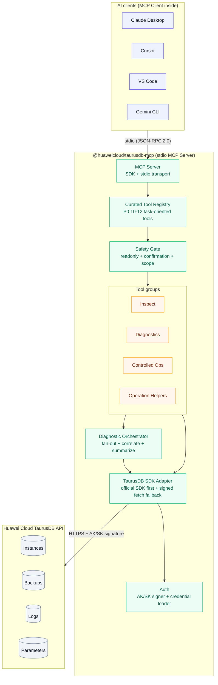
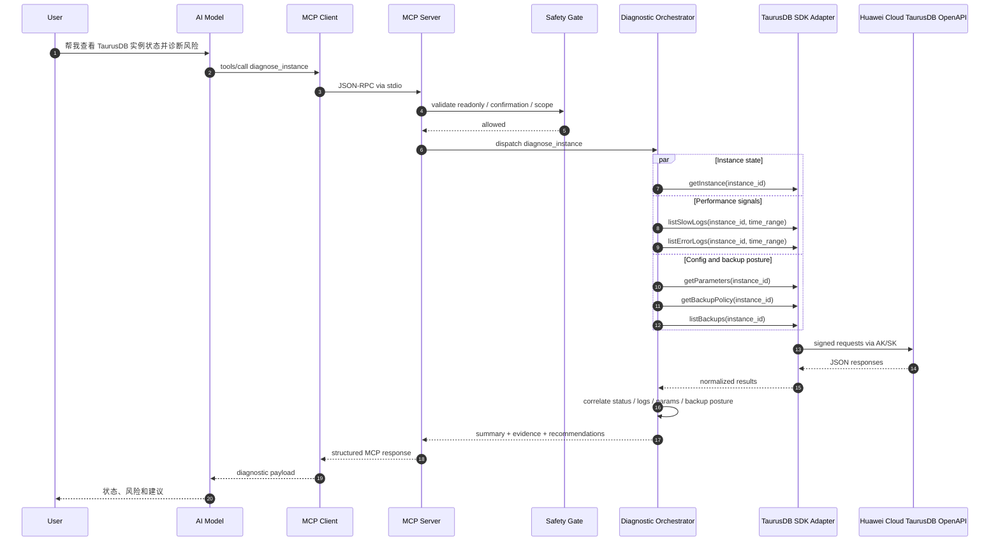
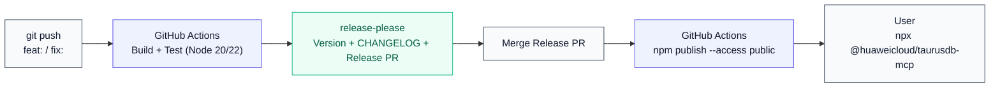

# 华为云 TaurusDB MCP Server — 架构与方案设计

## 1. 项目概述

### 1.1 目标

构建一个符合 Model Context Protocol (MCP) 标准的服务器，让 AI 助手（Claude Desktop、Cursor、VS Code 等）能够通过自然语言与华为云 TaurusDB 服务进行交互，实现实例查询、备份管理、日志分析、参数调优等操作。

说明：本文已按 TaurusDB 口径整理，具体 OpenAPI 名称、服务 endpoint 和 IAM 策略名以实际 TaurusDB 文档为准；文中的接口路径和工具分组用于说明架构与实现方式。

### 1.2 核心定位

| 维度   | 决策                                                        |
| ------ | ----------------------------------------------------------- |
| 语言   | TypeScript（npm 原生生态，MCP SDK 最成熟）                  |
| 分发   | npm 包，用户通过 `npx @huaweicloud/taurusdb-mcp` 零安装运行 |
| 传输   | stdio（本地运行，JSON-RPC over stdin/stdout）               |
| 认证   | 华为云 AK/SK 签名（兼容华为云 JS SDK）                      |
| 调用层 | 官方 SDK 优先，OpenAPI 兜底                                 |
| 参考   | Google 的 `@google-cloud/gcloud-mcp` 开源项目               |

### 1.3 与 gcloud-mcp 的关键差异

gcloud-mcp 通过封装 `gcloud` CLI 命令来操作 Google Cloud，本质上是"让 AI 执行 CLI"。我们的方案**不封装 CLI，而是直接基于 TaurusDB SDK / OpenAPI 调用云服务**，原因如下：

- 华为云没有类似 gcloud 的统一 CLI 工具生态
- 直接调用 API 可以精确控制输入输出的数据结构，对 AI 更友好
- 可以使用华为云官方 JS SDK，获得类型安全和自动签名

---

## 2. 系统架构

### 2.1 分层架构



### 2.2 数据流

一次完整的工具调用流程：

```
用户自然语言 → AI 模型推理 → MCP Client 发送 tools/call
    → stdio → MCP Server 路由到对应 Tool Handler
    → Safety Gate 校验只读模式 / 确认 token / 作用域
    → 如为诊断类工具，Diagnostic Orchestrator 并发聚合多个 TaurusDB 数据源
    → TaurusDB SDK Adapter 调用官方 SDK，必要时回退到签名 OpenAPI
    → 解析响应 → 格式化为结构化 MCP Content → 返回给 AI
    → AI 模型组织自然语言回答 → 呈现给用户
```

### 2.3 关键数据流示例

**用户问 "帮我诊断 TaurusDB 实例当前状态和风险"**

```
1. AI 选择调用 `diagnose_instance` 工具，参数为 `instance_id`
2. MCP Server 收到 JSON-RPC 请求：
   { "method": "tools/call", "params": { "name": "diagnose_instance", ... } }
3. Safety Gate 校验当前是否允许执行该工具
4. Diagnostic Orchestrator 并发调用实例详情、慢日志、错误日志、参数、备份策略
5. TaurusDB SDK Adapter 通过官方 SDK 或签名 OpenAPI 获取原始响应
6. 诊断层聚合结果，生成 `summary / findings / evidence / recommendations`
7. AI 基于结构化诊断结果，用自然语言给出状态判断和运维建议
```



---

## 3. 模块设计

### 3.1 目录结构

```
@huaweicloud/taurusdb-mcp/
├── src/
│   ├── index.ts                  # 入口：CLI 分发 + MCP Server 启动
│   ├── server.ts                 # MCP Server 初始化、Tool 注册
│   ├── auth/
│   │   ├── credential-loader.ts  # 多来源凭证加载（环境变量 > 配置文件 > SDK）
│   │   └── signer.ts             # AK/SK 请求签名实现
│   ├── client/
│   │   ├── taurusdb-client.ts    # TaurusDB SDK 适配层（SDK 优先，OpenAPI 兜底）
│   │   └── types.ts              # API 请求/响应类型定义
│   ├── diagnostics/
│   │   ├── diagnose-instance.ts  # 实例健康诊断
│   │   ├── review-backup-risk.ts # 备份风险审查
│   │   └── evidence.ts           # 诊断证据归一化
│   ├── tools/
│   │   ├── index.ts              # Tool 注册汇总
│   │   ├── instances.ts          # 实例查询类工具
│   │   ├── backups.ts            # 备份类工具
│   │   ├── logs.ts               # 日志类工具
│   │   ├── parameters.ts         # 参数类工具
│   │   ├── diagnostics.ts        # 诊断类工具
│   │   ├── operations.ts         # 长任务辅助（2 个工具）
│   │   └── mutations.ts          # 受控写操作（P1）
│   ├── commands/
│   │   └── init.ts               # 一键配置各 AI 客户端
│   └── utils/
│       ├── formatter.ts          # API 响应格式化（简化给 AI 看的数据）
│       ├── safety.ts             # 危险操作拦截 / 确认机制
│       └── waiter.ts             # 长任务轮询 / 超时 / 退避
├── tests/
│   ├── unit/
│   │   ├── signer.test.ts
│   │   ├── credential-loader.test.ts
│   │   ├── formatter.test.ts
│   │   ├── diagnose-instance.test.ts
│   │   └── waiter.test.ts
│   └── integration/
│       ├── tools.test.ts         # Mock API 的工具集成测试
│       ├── diagnostics.test.ts   # 诊断工具集成测试
│       └── operations.test.ts    # 长任务辅助工具集成测试
├── package.json
├── tsconfig.json
├── vitest.config.ts
├── .github/workflows/ci.yml
├── release-please-config.json
├── README.md
├── CHANGELOG.md
└── LICENSE
```

### 3.2 各模块职责

#### 3.2.1 入口层 (`index.ts`)

负责两件事：识别子命令、启动 MCP Server。

```typescript
#!/usr/bin/env node

// 子命令分发
if (args[0] === "init") {
  runInit(args); // 配置 AI 客户端
  process.exit(0);
}

// 默认：启动 MCP Server
const server = createServer();
const transport = new StdioServerTransport();
await server.connect(transport);
```

这里参考了 gcloud-mcp 的模式：npm 包的 `bin` 入口既是 MCP Server（默认），也是配置工具（带 `init` 子命令）。

#### 3.2.2 认证层 (`auth/`)

**凭证加载优先级**（参考华为云 SDK 的标准做法）：

```
1. 环境变量    → HUAWEICLOUD_AK / SK / PROJECT_ID / REGION
2. 配置文件    → ~/.huaweicloud/credentials (INI 格式)
3. 华为云 SDK  → 如果安装了 @huaweicloud/huaweicloud-sdk-core，使用其凭证链
```

**签名模块**设计为独立可测试的纯函数：

```typescript
function signRequest(
  credentials: Credentials,
  method: string,
  path: string,
  headers: Record<string, string>,
  body: string,
): Record<string, string>; // 返回包含 Authorization 的完整 headers
```

#### 3.2.3 API 客户端层 (`client/`)

封装 TaurusDB SDK 和签名 OpenAPI 调用，提供统一、可测试的服务访问层：

```typescript
class TaurusDbClient {
  async listInstances(
    params?: ListInstancesParams,
    context?: RequestContext,
  ): Promise<ListInstancesResponse>;

  async getInstance(
    instanceId: string,
    context?: RequestContext,
  ): Promise<InstanceDetail>;

  async createBackup(
    params: CreateBackupParams,
    context?: RequestContext,
  ): Promise<AcceptedOperation>;

  async getOperationStatus(
    operationId: string,
    context?: RequestContext,
  ): Promise<OperationStatus>;
  // ...
}
```

关键设计决策：

- **SDK 优先**：优先复用华为云官方 TaurusDB SDK，减少签名、错误码和接口演进成本
- **OpenAPI 兜底**：当官方 SDK 覆盖不足或更新滞后时，再回退到手写签名 `fetch`
- **上下文可覆盖**：每个请求都支持可选 `region` / `project_id`，优先于全局默认配置
- **自动重试**：默认仅对查询类请求和任务轮询请求重试；写操作只有在 API 明确支持幂等标识时才重试
- **超时控制**：默认 30 秒，可通过环境变量 `TAURUSDB_MCP_TIMEOUT` 配置
- **长任务归一化**：所有异步写操作统一转换为 `AcceptedOperation` / `OperationStatus` 结构，避免 AI 将“已受理”误判为“已完成”

#### 3.2.4 工具层 (`tools/`)

这是核心业务层。这里不追求把 50+ TaurusDB OpenAPI 一比一映射为 50+ MCP Tools，而是只暴露最关键、最高频、最适合 AI 调用的任务型工具。

所有工具默认接受可选 `region` / `project_id` 参数，用于覆盖默认上下文，支持多区域和多项目切换。

### 3.2.4.1 Tool 筛选方法

每个候选工具都按以下 4 个维度评估，单项 1-5 分：

- **高频**：用户是否会反复发起这个任务
- **高价值**：一次调用是否能明显减少排障时间或操作时间
- **低歧义**：输入输出是否清晰，模型是否不容易误用
- **可组合**：该工具是否能聚合多个 API，形成比单个 OpenAPI 更高的任务价值

筛选规则：

- 总分 `>= 16` 的候选项优先进入 P0
- 高风险写操作即使得分高，也默认降级到 P1，并强制走安全闸门
- 与现有诊断工具高度重叠的候选项延后，避免工具集合膨胀
- 未暴露为 MCP Tool 的 OpenAPI 仍可作为内部能力，被诊断工具和编排层复用

### 3.2.4.2 P0 首批 MCP Tools

| Tool | 高频 | 高价值 | 低歧义 | 可组合 | 总分 | 角色定位 |
|------|------|--------|--------|--------|------|----------|
| `list_instances` | 5 | 4 | 5 | 4 | 18 | 实例总览入口 |
| `get_instance` | 5 | 5 | 5 | 4 | 19 | 单实例详情入口 |
| `list_backups` | 4 | 4 | 5 | 4 | 17 | 备份可用性核查 |
| `get_backup_policy` | 3 | 4 | 5 | 4 | 16 | 备份策略核查 |
| `create_backup` | 3 | 5 | 5 | 3 | 16 | 低歧义、高价值写操作 |
| `list_slow_logs` | 4 | 5 | 4 | 4 | 17 | 性能问题排查 |
| `list_error_logs` | 4 | 5 | 4 | 4 | 17 | 故障排查 |
| `get_instance_configuration` | 4 | 4 | 4 | 4 | 16 | 参数核查 |
| `get_operation_status` | 3 | 4 | 5 | 4 | 16 | 异步任务辅助 |
| `wait_operation` | 3 | 4 | 5 | 4 | 16 | 异步任务辅助 |
| `diagnose_instance` | 5 | 5 | 4 | 5 | 19 | 聚合诊断主入口 |
| `review_backup_risk` | 4 | 5 | 5 | 5 | 19 | 备份风险审查 |

说明：

- `diagnose_instance` 是 P0 中最重要的差异化工具，它不是单个 API 封装，而是对实例状态、日志、参数、备份姿态做聚合判断
- `review_backup_risk` 通过组合 `list_backups`、`get_backup_policy` 等能力，给出风险等级和改进建议
- `create_backup` 是唯一进入 P0 的写操作，因为它高价值、低歧义，且安全后果明显小于重启、扩容、改参

### 3.2.4.3 P1 延后工具

这些工具有价值，但不适合首批暴露，原因通常是高风险、低频，或与 P0 工具功能重叠：

| Tool | 处理建议 | 延后原因 |
|------|----------|----------|
| `restart_instance` | P1 | 高风险写操作，需严格确认 |
| `set_backup_policy` | P1 | 写操作，需要明确变更意图 |
| `update_instance_configuration` | P1 | 高风险，错误参数可能引发业务波动 |
| `resize_instance` | P2 | 低频且影响面大 |
| `list_datastores` | P2 | 更偏资源规划，不是日常高频运维 |
| `list_flavors` | P2 | 更偏选型场景，不是运维主路径 |
| `delete_backup` | 暂不开放 | 风险高且收益低 |

### 3.2.4.4 OpenAPI 与 MCP Tool 的关系

这里的核心原则是：

- **OpenAPI 是能力面**：TaurusDB 现有 50+ OpenAPI 和 SDK 方法，代表服务能力全集
- **MCP Tool 是任务面**：MCP Tool 应该对应用户真正会问的问题，而不是接口目录
- **诊断工具是组合面**：多个 OpenAPI 可以由一个诊断工具统一编排，对 AI 更友好

因此，未暴露为 MCP Tool 的 OpenAPI 并不会“浪费”：

- 它们仍然由 `taurusdb-client.ts` 和 `diagnostics/` 复用
- 当用户行为证明某类需求足够高频时，再增量升格为独立 Tool
- 这样可以把首批工具集合控制在 10-12 个核心任务附近，保持 AI 选 tool 的稳定性

#### 3.2.5 诊断编排层 (`diagnostics/`)

诊断层是 TaurusDB MCP Server 的核心差异化模块，它负责把多个底层 OpenAPI 结果组合成真正可执行的运维判断。

首批诊断能力：

- `diagnose_instance`：聚合实例详情、慢日志、错误日志、关键参数、备份策略，输出健康状态、风险项和建议动作
- `review_backup_risk`：聚合备份策略、最近备份、失败记录，输出备份覆盖风险和改进建议

统一输出结构：

- `summary`：一句话结论
- `findings`：风险发现列表
- `evidence`：支撑结论的原始证据
- `risk_level`：`low / medium / high`
- `recommendations`：可执行建议

MVP 的诊断边界：

- 先只消费 TaurusDB 自身可获得的实例、备份、日志、参数信息
- 暂不强依赖外部监控、告警、事件系统，避免 Phase 1 依赖面过大
- Phase 2 再考虑接入云监控、告警事件等跨服务信号

#### 3.2.6 安全模块 (`utils/safety.ts`)

参考 gcloud-mcp 的命令黑名单机制，我们对高风险操作添加更强的服务端保护：

**策略 1：默认只读**
服务端默认只注册查询类工具；只有设置 `TAURUSDB_MCP_ENABLE_MUTATIONS=true` 后才暴露写操作工具。

**策略 2：高风险操作二阶段确认**
`restart_instance`、`resize_instance`、`delete_backup`、`update_instance_configuration` 首次调用只返回影响说明和 `confirmation_token`，第二次调用携带 token 才真正执行。

**策略 3：Tool 描述中嵌入警告**
高风险工具的描述中仍然保留明确警告，帮助模型在交互层主动要求人工确认。

**策略 4：不暴露销毁性操作**
首期不提供 `delete_instance`（删除实例）和 `reset_password`（重置密码）工具。这类操作应通过控制台手动执行。

---

## 4. MCP 协议接入细节

### 4.1 Server 声明

```typescript
const server = new McpServer({
  name: "huaweicloud-taurusdb",
  version: "0.1.0",
  capabilities: {
    tools: {}, // 支持工具调用
    // resources: {},    // 未来可暴露实例信息为 MCP Resource
    // prompts: {},      // 未来可提供预设 Prompt 模板
  },
});
```

### 4.2 Tool 定义规范

每个工具遵循统一的定义模式：

```typescript
server.tool(
  "tool_name", // 工具名（snake_case）
  "Description for the AI...", // 给 AI 看的描述（英文，清晰准确）
  {
    // 参数 Schema（Zod 定义）
    param1: z.string().describe("..."),
    region: z.string().optional().describe("Override default region"),
    project_id: z.string().optional().describe("Override default project"),
    confirmation_token: z
      .string()
      .optional()
      .describe("Required for high-risk mutations"),
  },
  async (params) => {
    // 处理函数
    try {
      const result = await client.someApiCall(params);
      return {
        content: [
          {
            type: "text",
            text: JSON.stringify(formatSuccess(result), null, 2),
          },
        ],
      };
    } catch (error) {
      return {
        content: [
          { type: "text", text: JSON.stringify(formatError(error), null, 2) },
        ],
        isError: true,
      };
    }
  },
);
```

### 4.3 统一响应与错误模型

为了让 AI 更稳定地消费工具结果，所有工具统一返回一个结构化 envelope。考虑到不同 MCP 客户端兼容性，首期仍通过 `TextContent` 返回 JSON 字符串，但 JSON 内部结构保持固定。

**成功响应**

```json
{
  "ok": true,
  "summary": "Restart request accepted for instance prod-mysql-01.",
  "data": {
    "status": "accepted",
    "operation_id": "job-123",
    "instance_id": "a4b5c6"
  },
  "metadata": {
    "region": "cn-north-4",
    "project_id": "05d7...",
    "request_id": "9f4c...",
    "retryable": false,
    "poll_after_ms": 5000
  }
}
```

**错误响应**

```json
{
  "ok": false,
  "summary": "Huawei Cloud API rejected the request.",
  "error": {
    "code": "ACCESS_DENIED",
    "message": "Permission denied.",
    "status_code": 403,
    "retryable": false
  },
  "metadata": {
    "region": "cn-north-4",
    "request_id": "9f4c..."
  }
}
```

设计要求：

- `summary` 面向 AI，总结当前结果，不要求模型重新解析整段原始 JSON
- `data` 保留原始业务结果或裁剪后的关键字段
- `metadata` 必须包含 `request_id`，便于排障和工单定位
- 异步操作统一使用 `accepted`、`running`、`succeeded`、`failed` 四态
- 错误对象必须显式给出 `retryable`，避免模型盲目重试

### 4.4 响应格式化策略

API 返回的原始 JSON 往往包含大量对 AI 无用的字段。格式化策略：

**保留关键原始信息**（推荐方案）：

- 在 `data` 中保留完整业务结果或最小必要子集，不丢失诊断所需字段
- 在 `summary` 中提炼 AI 最常用的关键信息，降低模型解析成本
- 在 `metadata` 中补充请求上下文、重试性和任务轮询提示

**精简格式**（后续优化）：

- 对 `list_instances` 等返回大量数据的接口，提取关键字段
- 例如只保留 `id, name, status, engine, flavor, created_at`
- 通过 `formatter.ts` 统一处理

---

## 5. npm 包发布方案

### 5.1 包信息

```json
{
  "name": "@huaweicloud/taurusdb-mcp",
  "version": "0.1.0",
  "bin": {
    "huaweicloud-taurusdb-mcp": "dist/index.js"
  },
  "files": ["dist/", "README.md", "LICENSE"],
  "engines": { "node": ">=20.0.0" },
  "publishConfig": { "access": "public" }
}
```

### 5.2 CI/CD 流水线



### 5.3 版本策略

采用 Conventional Commits + release-please 自动管理：

| Commit 前缀                   | 版本变化              | 示例                                |
| ----------------------------- | --------------------- | ----------------------------------- |
| `fix:`                        | Patch (0.1.0 → 0.1.1) | `fix: handle API timeout correctly` |
| `feat:`                       | Minor (0.1.0 → 0.2.0) | `feat: add storage resize tool`     |
| `feat!:` / `BREAKING CHANGE:` | Major (0.x → 1.0)     | `feat!: change auth config format`  |

### 5.4 用户安装体验

用户无需 `npm install`，直接一行命令完成配置：

```bash
# 自动下载 + 配置 Claude Desktop
npx @huaweicloud/taurusdb-mcp init --client=claude-desktop

# 或手动配置
npx @huaweicloud/taurusdb-mcp init  # 打印配置说明
```

---

## 6. 认证与安全设计

### 6.1 凭证管理

```
优先级 1: 环境变量（推荐用于 CI/CD 和容器环境）
  HUAWEICLOUD_AK=xxxx
  HUAWEICLOUD_SK=xxxx
  HUAWEICLOUD_PROJECT_ID=xxxx
  HUAWEICLOUD_REGION=cn-north-4

优先级 2: 配置文件（推荐用于本地开发）
  ~/.huaweicloud/credentials
  [default]
  ak = xxxx
  sk = xxxx
  project_id = xxxx
  region = cn-north-4

优先级 3: MCP 客户端配置中传入
  通过 env 字段在 mcp.json 中传入
```

### 6.2 最小权限原则

建议用户创建专用 IAM 用户，按使用场景授权：

| 场景     | 推荐 IAM 策略                              | 工具范围        |
| -------- | ------------------------------------------ | --------------- |
| 只读运维 | TaurusDB 只读策略（按实际 IAM 策略名配置） | list/get 类工具 |
| 日常运维 | TaurusDB 运维策略（按实际 IAM 策略名配置） | 全部工具        |
| 生产环境 | 自定义策略（排除 delete）                  | 查询 + 备份     |

### 6.3 安全边界

**不做的事**：

- 不存储凭证到磁盘（从环境变量/配置文件实时读取）
- 不在日志中输出 AK/SK
- 不提供删除实例、重置密码等不可逆操作的工具

**做的事**：

- 所有 API 调用走 HTTPS
- AK/SK 每次请求实时签名，不缓存签名结果
- 默认只读；只有显式设置 `TAURUSDB_MCP_ENABLE_MUTATIONS=true` 才开启写操作
- 高风险操作采用二阶段确认 token，而不是只依赖模型“先问一句”
- 每个工具允许 `region` / `project_id` 局部覆盖默认配置

---

## 7. 测试策略

### 7.1 测试分层

```
单元测试 (vitest)
├── auth/signer.test.ts          # 签名算法正确性（固定输入验证输出）
├── auth/credential-loader.test.ts  # 多来源凭证加载逻辑
├── utils/formatter.test.ts      # 数据格式化
├── diagnostics/diagnose-instance.test.ts  # 诊断证据聚合与结论生成
├── utils/safety.test.ts         # 安全策略判断
├── utils/waiter.test.ts         # 长任务轮询、超时与退避
└── commands/init.test.ts        # 配置文件生成

集成测试 (vitest + mock)
├── tools/instances.test.ts      # Mock HTTP → 验证 Tool 输入输出
├── tools/backups.test.ts
├── tools/diagnostics.test.ts    # diagnose_instance / review_backup_risk
├── tools/logs.test.ts
└── tools/operations.test.ts     # operation status / wait 行为

E2E 测试 (手动 / CI with real credentials)
└── 使用 MCP Inspector 连接实际服务验证
```

### 7.2 Mock 策略

集成测试中 mock HTTP 层（不 mock MCP 协议层），确保 Tool Handler 的完整逻辑被覆盖：

```typescript
vi.mock("../src/client/taurusdb-client", () => ({
  TaurusDbClient: vi.fn().mockImplementation(() => ({
    listInstances: vi.fn().mockResolvedValue({
      total_count: 1,
      instances: [{ id: "xxx", name: "test-db", status: "ACTIVE" }],
    }),
  })),
}));
```

### 7.3 关键契约测试

除了 API mock 之外，还需要覆盖以下协议层契约：

- `TAURUSDB_MCP_ENABLE_MUTATIONS` 未开启时，高风险工具不注册或调用即失败
- 高风险工具首次调用只返回 `confirmation_token`，不会真实执行
- 所有异步写操作返回统一的四态状态字段和 `operation_id`
- 所有错误响应都包含 `request_id`、`status_code`、`retryable`
- `wait_operation` 在成功、失败、超时三种路径下都能稳定返回
- `diagnose_instance` 必须稳定输出 `summary`、`findings`、`evidence`、`recommendations`

---

## 8. 后续演进规划

### Phase 1 — MVP (当前)

- 10-12 个精选 TaurusDB MCP Tools
- 包含 2 个长任务辅助工具和 2 个聚合诊断工具
- stdio 本地传输
- 官方 SDK 优先，OpenAPI 兜底
- npm 包发布
- 基础文档
- 默认只读 + 二阶段确认

### Phase 2 — 增强

- 扩展 P1 受控写操作（如重启、改参、修改备份策略）
- 接入云监控、告警事件等外部运维信号
- 添加 MCP Resources（将实例信息暴露为可订阅资源）
- 添加 MCP Prompts（预设运维 Prompt 模板）
- 响应格式优化（精简 JSON，提取关键字段）

### Phase 3 — 生态扩展

- 支持 Streamable HTTP 传输（可部署为远程 MCP Server）
- 扩展到华为云其他服务（ECS、OBS、VPC）→ monorepo 架构
- 发布到 MCP Server 注册表（如 GitHub MCP Registry）
- 添加 Model Armor 风格的安全审计

### Phase 4 — 企业级

- 多租户支持（不同项目/区域切换）
- 审计日志（记录所有 AI 执行的操作）
- 集成华为云 IAM 细粒度权限
- 部署到华为云 FunctionGraph（Serverless MCP Server）

---

## 9. 技术依赖

### 运行时依赖

| 包                          | 用途             | 大小  |
| --------------------------- | ---------------- | ----- |
| `@modelcontextprotocol/sdk` | MCP 协议实现     | ~50KB |
| `zod`                       | 参数 Schema 验证 | ~60KB |
| TaurusDB 官方 SDK（可选）   | 服务访问优先实现 | 视实际包体而定 |

总计约 110KB，非常轻量。用户通过 npx 首次下载约 2-3 秒。

### 开发依赖

| 包           | 用途              |
| ------------ | ----------------- |
| `typescript` | 编译              |
| `vitest`     | 测试框架          |
| `tsx`        | 开发时直接运行 TS |
| `eslint`     | 代码规范          |

### SDK 选型策略

推荐采用“**SDK 优先，OpenAPI 兜底**”的实现方式：

- 优先使用官方 TaurusDB SDK，减少协议细节、错误码和签名维护成本
- 对 SDK 尚未覆盖或更新滞后的接口，由 `taurusdb-client.ts` 回退到签名 `fetch`
- 这样既能利用官方生态，又不会因为 SDK 覆盖问题卡住 MCP Tool 迭代

### 为什么不把 50+ OpenAPI 全做成 MCP Tools？

因为 MCP Tool 不是接口目录，而是任务入口。

- 如果把 50+ OpenAPI 一比一暴露为 Tools，模型选错工具的概率会明显升高
- 很多低频接口更适合作为诊断编排的内部能力，而不是独立暴露给 AI
- 精选 10-12 个高频、高价值、低歧义、可组合的任务型工具，更符合 MCP 的使用方式

---

## 10. 风险与应对

| 风险                | 影响                  | 应对                                         |
| ------------------- | --------------------- | -------------------------------------------- |
| 华为云 API 版本更新 | 部分工具失效          | 集成测试覆盖 + 定期验证                      |
| MCP SDK 破坏性更新  | Server 无法启动       | 锁定 SDK 主版本 + renovate 自动 PR           |
| Tool 集合膨胀       | AI 选错工具、维护成本上升 | 按四维评分控制 P0 数量，OpenAPI 默认先不暴露 |
| npm scope 占用      | 无法使用 @huaweicloud | 备选: `huaweicloud-taurusdb-mcp`（无 scope） |
| AK/SK 泄露          | 安全事故              | 文档强调最小权限 + 不提供销毁性工具          |
| AI 误操作生产库     | 数据损坏              | 只读模式 + 二阶段确认 + 高风险工具警告       |
