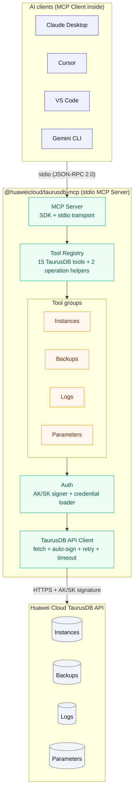
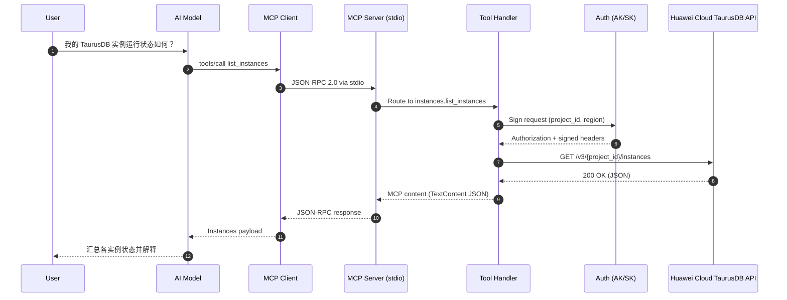
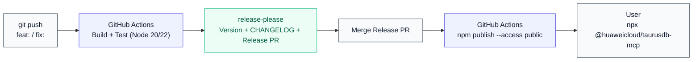

# 华为云 TaurusDB MCP Server — 架构与方案设计

## 1. 项目概述

### 1.1 目标

构建一个符合 Model Context Protocol (MCP) 标准的服务器，让 AI 助手（Claude Desktop、Cursor、VS Code 等）能够通过自然语言与华为云 TaurusDB 服务进行交互，实现实例查询、备份管理、日志分析、参数调优等操作。

说明：本文已按 TaurusDB 口径整理，具体 OpenAPI 名称、服务 endpoint 和 IAM 策略名以实际 TaurusDB 文档为准；文中的接口路径和工具分组用于说明架构与实现方式。

### 1.2 核心定位

| 维度 | 决策 |
|------|------|
| 语言 | TypeScript（npm 原生生态，MCP SDK 最成熟） |
| 分发 | npm 包，用户通过 `npx @huaweicloud/taurusdb-mcp` 零安装运行 |
| 传输 | stdio（本地运行，JSON-RPC over stdin/stdout） |
| 认证 | 华为云 AK/SK 签名（兼容华为云 JS SDK） |
| 参考 | Google 的 `@google-cloud/gcloud-mcp` 开源项目 |

### 1.3 与 gcloud-mcp 的关键差异

gcloud-mcp 通过封装 `gcloud` CLI 命令来操作 Google Cloud，本质上是"让 AI 执行 CLI"。我们的方案**直接调用华为云 TaurusDB OpenAPI**，原因如下：

- 华为云没有类似 gcloud 的统一 CLI 工具生态
- 直接调用 API 可以精确控制输入输出的数据结构，对 AI 更友好
- 可以使用华为云官方 JS SDK，获得类型安全和自动签名

---

## 2. 系统架构

### 2.1 分层架构



### 2.2 数据流

一次完整的工具调用流程：

```
用户自然语言 → AI 模型推理 → MCP Client 发送 tools/call
    → stdio → MCP Server 路由到对应 Tool Handler
    → Tool Handler 构建 API 请求
    → Auth 模块签名
    → HTTP Client 发送到华为云 TaurusDB API
    → 解析响应 → 格式化为 MCP Content → 返回给 AI
    → AI 模型组织自然语言回答 → 呈现给用户
```

### 2.3 关键数据流示例

**用户问 "我的 TaurusDB 实例运行状态如何？"**

```
1. AI 选择调用 `list_instances` 工具
2. MCP Server 收到 JSON-RPC 请求：
   { "method": "tools/call", "params": { "name": "list_instances", ... } }
3. Tool Handler 调用:
   GET https://{taurusdb-endpoint}/v3/{project_id}/instances
4. 返回 JSON → 格式化为 MCP TextContent
5. AI 基于返回的实例列表，用自然语言告知用户各实例的运行状态
```



---

## 3. 模块设计

### 3.1 目录结构

```
@huaweicloud/taurusdb-mcp/
├── src/
│   ├── index.ts                  # 入口：CLI 分发 + MCP Server 启动
│   ├── server.ts                 # MCP Server 初始化、Tool 注册
│   ├── auth/
│   │   ├── credential-loader.ts  # 多来源凭证加载（环境变量 > 配置文件 > SDK）
│   │   └── signer.ts             # AK/SK 请求签名实现
│   ├── client/
│   │   ├── taurusdb-client.ts    # 华为云 TaurusDB API HTTP 客户端
│   │   └── types.ts              # API 请求/响应类型定义
│   ├── tools/
│   │   ├── index.ts              # Tool 注册汇总
│   │   ├── instances.ts          # 实例管理（6 个工具）
│   │   ├── backups.ts            # 备份管理（5 个工具）
│   │   ├── logs.ts               # 日志查询（2 个工具）
│   │   ├── parameters.ts         # 参数配置（2 个工具）
│   │   ├── operations.ts         # 长任务辅助（2 个工具）
│   │   └── storage.ts            # 存储管理（2 个工具，可选）
│   ├── commands/
│   │   └── init.ts               # 一键配置各 AI 客户端
│   └── utils/
│       ├── formatter.ts          # API 响应格式化（简化给 AI 看的数据）
│       ├── safety.ts             # 危险操作拦截 / 确认机制
│       └── waiter.ts             # 长任务轮询 / 超时 / 退避
├── tests/
│   ├── unit/
│   │   ├── signer.test.ts
│   │   ├── credential-loader.test.ts
│   │   ├── formatter.test.ts
│   │   └── waiter.test.ts
│   └── integration/
│       ├── tools.test.ts         # Mock API 的工具集成测试
│       └── operations.test.ts    # 长任务辅助工具集成测试
├── package.json
├── tsconfig.json
├── vitest.config.ts
├── .github/workflows/ci.yml
├── release-please-config.json
├── README.md
├── CHANGELOG.md
└── LICENSE
```

### 3.2 各模块职责

#### 3.2.1 入口层 (`index.ts`)

负责两件事：识别子命令、启动 MCP Server。

```typescript
#!/usr/bin/env node

// 子命令分发
if (args[0] === "init") {
  runInit(args);    // 配置 AI 客户端
  process.exit(0);
}

// 默认：启动 MCP Server
const server = createServer();
const transport = new StdioServerTransport();
await server.connect(transport);
```

这里参考了 gcloud-mcp 的模式：npm 包的 `bin` 入口既是 MCP Server（默认），也是配置工具（带 `init` 子命令）。

#### 3.2.2 认证层 (`auth/`)

**凭证加载优先级**（参考华为云 SDK 的标准做法）：

```
1. 环境变量    → HUAWEICLOUD_AK / SK / PROJECT_ID / REGION
2. 配置文件    → ~/.huaweicloud/credentials (INI 格式)
3. 华为云 SDK  → 如果安装了 @huaweicloud/huaweicloud-sdk-core，使用其凭证链
```

**签名模块**设计为独立可测试的纯函数：

```typescript
function signRequest(
  credentials: Credentials,
  method: string,
  path: string,
  headers: Record<string, string>,
  body: string
): Record<string, string>   // 返回包含 Authorization 的完整 headers
```

#### 3.2.3 API 客户端层 (`client/`)

封装 HTTP 调用，提供类型安全的方法：

```typescript
class TaurusDbClient {
  async listInstances(
    params?: ListInstancesParams,
    context?: RequestContext
  ): Promise<ListInstancesResponse>

  async getInstance(
    instanceId: string,
    context?: RequestContext
  ): Promise<InstanceDetail>

  async createBackup(
    params: CreateBackupParams,
    context?: RequestContext
  ): Promise<AcceptedOperation>

  async getOperationStatus(
    operationId: string,
    context?: RequestContext
  ): Promise<OperationStatus>
  // ...
}
```

关键设计决策：
- **使用原生 `fetch`**，不引入 axios 等额外依赖，保持包体小
- **上下文可覆盖**：每个请求都支持可选 `region` / `project_id`，优先于全局默认配置
- **自动重试**：默认仅对查询类请求和任务轮询请求重试；写操作只有在 API 明确支持幂等标识时才重试
- **超时控制**：默认 30 秒，可通过环境变量 `TAURUSDB_MCP_TIMEOUT` 配置
- **长任务归一化**：所有异步写操作统一转换为 `AcceptedOperation` / `OperationStatus` 结构，避免 AI 将“已受理”误判为“已完成”

#### 3.2.4 工具层 (`tools/`)

这是核心业务层。每个文件对应一组相关工具。

所有工具默认接受可选 `region` / `project_id` 参数，用于覆盖默认上下文，支持多区域和多项目切换。

具体工具集合以 TaurusDB 实际 OpenAPI 能力为准；MVP 先保持与当前方案一致的信息架构，落地时再对不适用的接口做裁剪。

**实例管理 (instances.ts)**

| 工具名 | 对应 API | 风险等级 | 说明 |
|--------|---------|---------|------|
| `list_instances` | GET /instances | 低 | 列出所有实例 |
| `get_instance` | GET /instances/{id} | 低 | 获取实例详情 |
| `list_datastores` | GET /datastores/{engine} | 低 | 查询可用引擎版本 |
| `list_flavors` | GET /flavors/{engine} | 低 | 查询可用规格 |
| `restart_instance` | POST /instances/{id}/action | **高** | 重启实例 |
| `resize_instance` | POST /instances/{id}/action | **高** | 变更实例规格 |

**备份管理 (backups.ts)**

| 工具名 | 对应 API | 风险等级 | 说明 |
|--------|---------|---------|------|
| `list_backups` | GET /backups | 低 | 查询备份列表 |
| `create_backup` | POST /backups | 中 | 创建手动备份 |
| `delete_backup` | DELETE /backups/{id} | **高** | 删除备份 |
| `get_backup_policy` | GET /instances/{id}/backups/policy | 低 | 查询备份策略 |
| `set_backup_policy` | PUT /instances/{id}/backups/policy | 中 | 修改备份策略 |

**日志查询 (logs.ts)**

| 工具名 | 对应 API | 风险等级 | 说明 |
|--------|---------|---------|------|
| `list_slow_logs` | GET /instances/{id}/slowlog | 低 | 慢日志 |
| `list_error_logs` | GET /instances/{id}/errorlog | 低 | 错误日志 |

**参数配置 (parameters.ts)**

| 工具名 | 对应 API | 风险等级 | 说明 |
|--------|---------|---------|------|
| `get_instance_configuration` | GET /instances/{id}/configurations | 低 | 查看参数 |
| `update_instance_configuration` | PUT /instances/{id}/configurations | **高** | 修改参数 |

**长任务辅助 (operations.ts)**

| 工具名 | 对应 API | 风险等级 | 说明 |
|--------|---------|---------|------|
| `get_operation_status` | 任务状态查询接口 | 低 | 查询异步任务当前状态 |
| `wait_operation` | 任务状态查询接口 | 低 | 轮询任务直到完成或超时 |

设计约束：
- 所有写操作工具必须返回 `accepted`、`running`、`succeeded`、`failed` 之一，而不是默认宣称“已经完成”
- `restart_instance`、`resize_instance`、`create_backup`、`update_instance_configuration` 等工具返回 `operation_id`
- AI 可根据需要继续调用 `get_operation_status` 或 `wait_operation`

#### 3.2.5 安全模块 (`utils/safety.ts`)

参考 gcloud-mcp 的命令黑名单机制，我们对高风险操作添加更强的服务端保护：

**策略 1：默认只读**
服务端默认只注册查询类工具；只有设置 `TAURUSDB_MCP_ENABLE_MUTATIONS=true` 后才暴露写操作工具。

**策略 2：高风险操作二阶段确认**
`restart_instance`、`resize_instance`、`delete_backup`、`update_instance_configuration` 首次调用只返回影响说明和 `confirmation_token`，第二次调用携带 token 才真正执行。

**策略 3：Tool 描述中嵌入警告**
高风险工具的描述中仍然保留明确警告，帮助模型在交互层主动要求人工确认。

**策略 4：不暴露销毁性操作**
首期不提供 `delete_instance`（删除实例）和 `reset_password`（重置密码）工具。这类操作应通过控制台手动执行。

---

## 4. MCP 协议接入细节

### 4.1 Server 声明

```typescript
const server = new McpServer({
  name: "huaweicloud-taurusdb",
  version: "0.1.0",
  capabilities: {
    tools: {},           // 支持工具调用
    // resources: {},    // 未来可暴露实例信息为 MCP Resource
    // prompts: {},      // 未来可提供预设 Prompt 模板
  },
});
```

### 4.2 Tool 定义规范

每个工具遵循统一的定义模式：

```typescript
server.tool(
  "tool_name",                    // 工具名（snake_case）
  "Description for the AI...",    // 给 AI 看的描述（英文，清晰准确）
  {                               // 参数 Schema（Zod 定义）
    param1: z.string().describe("..."),
    region: z.string().optional().describe("Override default region"),
    project_id: z.string().optional().describe("Override default project"),
    confirmation_token: z.string().optional().describe("Required for high-risk mutations"),
  },
  async (params) => {             // 处理函数
    try {
      const result = await client.someApiCall(params);
      return {
        content: [{
          type: "text",
          text: JSON.stringify(formatSuccess(result), null, 2),
        }],
      };
    } catch (error) {
      return {
        content: [{ type: "text", text: JSON.stringify(formatError(error), null, 2) }],
        isError: true,
      };
    }
  }
);
```

### 4.3 统一响应与错误模型

为了让 AI 更稳定地消费工具结果，所有工具统一返回一个结构化 envelope。考虑到不同 MCP 客户端兼容性，首期仍通过 `TextContent` 返回 JSON 字符串，但 JSON 内部结构保持固定。

**成功响应**

```json
{
  "ok": true,
  "summary": "Restart request accepted for instance prod-mysql-01.",
  "data": {
    "status": "accepted",
    "operation_id": "job-123",
    "instance_id": "a4b5c6"
  },
  "metadata": {
    "region": "cn-north-4",
    "project_id": "05d7...",
    "request_id": "9f4c...",
    "retryable": false,
    "poll_after_ms": 5000
  }
}
```

**错误响应**

```json
{
  "ok": false,
  "summary": "Huawei Cloud API rejected the request.",
  "error": {
    "code": "ACCESS_DENIED",
    "message": "Permission denied.",
    "status_code": 403,
    "retryable": false
  },
  "metadata": {
    "region": "cn-north-4",
    "request_id": "9f4c..."
  }
}
```

设计要求：
- `summary` 面向 AI，总结当前结果，不要求模型重新解析整段原始 JSON
- `data` 保留原始业务结果或裁剪后的关键字段
- `metadata` 必须包含 `request_id`，便于排障和工单定位
- 异步操作统一使用 `accepted`、`running`、`succeeded`、`failed` 四态
- 错误对象必须显式给出 `retryable`，避免模型盲目重试

### 4.4 响应格式化策略

API 返回的原始 JSON 往往包含大量对 AI 无用的字段。格式化策略：

**保留关键原始信息**（推荐方案）：
- 在 `data` 中保留完整业务结果或最小必要子集，不丢失诊断所需字段
- 在 `summary` 中提炼 AI 最常用的关键信息，降低模型解析成本
- 在 `metadata` 中补充请求上下文、重试性和任务轮询提示

**精简格式**（后续优化）：
- 对 `list_instances` 等返回大量数据的接口，提取关键字段
- 例如只保留 `id, name, status, engine, flavor, created_at`
- 通过 `formatter.ts` 统一处理

---

## 5. npm 包发布方案

### 5.1 包信息

```json
{
  "name": "@huaweicloud/taurusdb-mcp",
  "version": "0.1.0",
  "bin": {
    "huaweicloud-taurusdb-mcp": "dist/index.js"
  },
  "files": ["dist/", "README.md", "LICENSE"],
  "engines": { "node": ">=20.0.0" },
  "publishConfig": { "access": "public" }
}
```

### 5.2 CI/CD 流水线



### 5.3 版本策略

采用 Conventional Commits + release-please 自动管理：

| Commit 前缀 | 版本变化 | 示例 |
|-------------|---------|------|
| `fix:` | Patch (0.1.0 → 0.1.1) | `fix: handle API timeout correctly` |
| `feat:` | Minor (0.1.0 → 0.2.0) | `feat: add storage resize tool` |
| `feat!:` / `BREAKING CHANGE:` | Major (0.x → 1.0) | `feat!: change auth config format` |

### 5.4 用户安装体验

用户无需 `npm install`，直接一行命令完成配置：

```bash
# 自动下载 + 配置 Claude Desktop
npx @huaweicloud/taurusdb-mcp init --client=claude-desktop

# 或手动配置
npx @huaweicloud/taurusdb-mcp init  # 打印配置说明
```

---

## 6. 认证与安全设计

### 6.1 凭证管理

```
优先级 1: 环境变量（推荐用于 CI/CD 和容器环境）
  HUAWEICLOUD_AK=xxxx
  HUAWEICLOUD_SK=xxxx
  HUAWEICLOUD_PROJECT_ID=xxxx
  HUAWEICLOUD_REGION=cn-north-4

优先级 2: 配置文件（推荐用于本地开发）
  ~/.huaweicloud/credentials
  [default]
  ak = xxxx
  sk = xxxx
  project_id = xxxx
  region = cn-north-4

优先级 3: MCP 客户端配置中传入
  通过 env 字段在 mcp.json 中传入
```

### 6.2 最小权限原则

建议用户创建专用 IAM 用户，按使用场景授权：

| 场景 | 推荐 IAM 策略 | 工具范围 |
|------|-------------|---------|
| 只读运维 | TaurusDB 只读策略（按实际 IAM 策略名配置） | list/get 类工具 |
| 日常运维 | TaurusDB 运维策略（按实际 IAM 策略名配置） | 全部工具 |
| 生产环境 | 自定义策略（排除 delete） | 查询 + 备份 |

### 6.3 安全边界

**不做的事**：
- 不存储凭证到磁盘（从环境变量/配置文件实时读取）
- 不在日志中输出 AK/SK
- 不提供删除实例、重置密码等不可逆操作的工具

**做的事**：
- 所有 API 调用走 HTTPS
- AK/SK 每次请求实时签名，不缓存签名结果
- 默认只读；只有显式设置 `TAURUSDB_MCP_ENABLE_MUTATIONS=true` 才开启写操作
- 高风险操作采用二阶段确认 token，而不是只依赖模型“先问一句”
- 每个工具允许 `region` / `project_id` 局部覆盖默认配置

---

## 7. 测试策略

### 7.1 测试分层

```
单元测试 (vitest)
├── auth/signer.test.ts          # 签名算法正确性（固定输入验证输出）
├── auth/credential-loader.test.ts  # 多来源凭证加载逻辑
├── utils/formatter.test.ts      # 数据格式化
├── utils/safety.test.ts         # 安全策略判断
├── utils/waiter.test.ts         # 长任务轮询、超时与退避
└── commands/init.test.ts        # 配置文件生成

集成测试 (vitest + mock)
├── tools/instances.test.ts      # Mock HTTP → 验证 Tool 输入输出
├── tools/backups.test.ts
├── tools/logs.test.ts
└── tools/operations.test.ts     # operation status / wait 行为

E2E 测试 (手动 / CI with real credentials)
└── 使用 MCP Inspector 连接实际服务验证
```

### 7.2 Mock 策略

集成测试中 mock HTTP 层（不 mock MCP 协议层），确保 Tool Handler 的完整逻辑被覆盖：

```typescript
vi.mock("../src/client/taurusdb-client", () => ({
  TaurusDbClient: vi.fn().mockImplementation(() => ({
    listInstances: vi.fn().mockResolvedValue({
      total_count: 1,
      instances: [{ id: "xxx", name: "test-db", status: "ACTIVE" }],
    }),
  })),
}));
```

### 7.3 关键契约测试

除了 API mock 之外，还需要覆盖以下协议层契约：

- `TAURUSDB_MCP_ENABLE_MUTATIONS` 未开启时，高风险工具不注册或调用即失败
- 高风险工具首次调用只返回 `confirmation_token`，不会真实执行
- 所有异步写操作返回统一的四态状态字段和 `operation_id`
- 所有错误响应都包含 `request_id`、`status_code`、`retryable`
- `wait_operation` 在成功、失败、超时三种路径下都能稳定返回

---

## 8. 后续演进规划

### Phase 1 — MVP (当前)

- 15 个核心 TaurusDB 工具 + 2 个长任务辅助工具
- stdio 本地传输
- npm 包发布
- 基础文档
- 默认只读 + 二阶段确认

### Phase 2 — 增强

- 接入华为云官方 JS SDK（替换手写签名）
- 添加 MCP Resources（将实例信息暴露为可订阅资源）
- 添加 MCP Prompts（预设运维 Prompt 模板）
- 响应格式优化（精简 JSON，提取关键字段）

### Phase 3 — 生态扩展

- 支持 Streamable HTTP 传输（可部署为远程 MCP Server）
- 扩展到华为云其他服务（ECS、OBS、VPC）→ monorepo 架构
- 发布到 MCP Server 注册表（如 GitHub MCP Registry）
- 添加 Model Armor 风格的安全审计

### Phase 4 — 企业级

- 多租户支持（不同项目/区域切换）
- 审计日志（记录所有 AI 执行的操作）
- 集成华为云 IAM 细粒度权限
- 部署到华为云 FunctionGraph（Serverless MCP Server）

---

## 9. 技术依赖

### 运行时依赖

| 包 | 用途 | 大小 |
|---|------|------|
| `@modelcontextprotocol/sdk` | MCP 协议实现 | ~50KB |
| `zod` | 参数 Schema 验证 | ~60KB |

总计约 110KB，非常轻量。用户通过 npx 首次下载约 2-3 秒。

### 开发依赖

| 包 | 用途 |
|---|------|
| `typescript` | 编译 |
| `vitest` | 测试框架 |
| `tsx` | 开发时直接运行 TS |
| `eslint` | 代码规范 |

### 为什么不直接用华为云 JS SDK？

华为云对应数据库服务的 JS SDK 模块通常会携带较完整的 API 类型定义，这会显著增加 `npx` 首次下载时间。当前方案手写 HTTP 调用 + 签名，优先保持包体小；Phase 2 再评估是否切换到对应的官方 SDK。

---

## 10. 风险与应对

| 风险 | 影响 | 应对 |
|------|------|------|
| 华为云 API 版本更新 | 部分工具失效 | 集成测试覆盖 + 定期验证 |
| MCP SDK 破坏性更新 | Server 无法启动 | 锁定 SDK 主版本 + renovate 自动 PR |
| npm scope 占用 | 无法使用 @huaweicloud | 备选: `huaweicloud-taurusdb-mcp`（无 scope） |
| AK/SK 泄露 | 安全事故 | 文档强调最小权限 + 不提供销毁性工具 |
| AI 误操作生产库 | 数据损坏 | 只读模式 + 高风险工具描述警告 |
