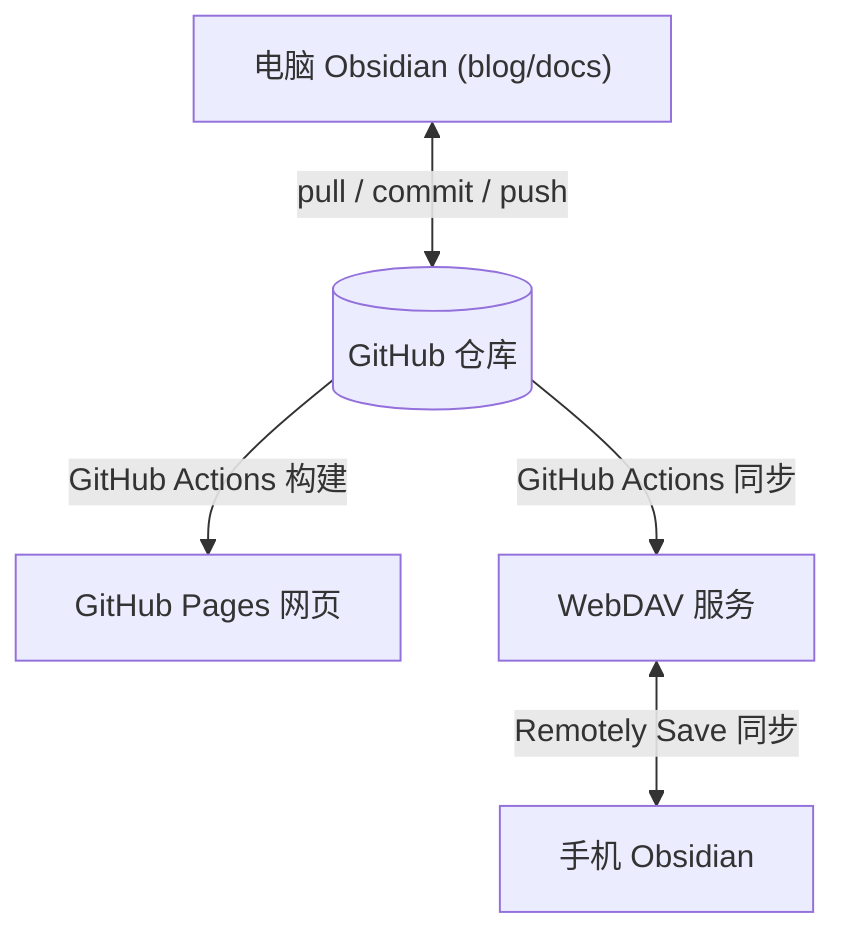

# Obsidian + GitHub 多端同步博客方案

这套方案的目标是让同一批 Markdown 同时服务于三个场景：

- 电脑端 Obsidian：主要写作环境，通过 Git 与 GitHub 同步。
- 手机端 Obsidian：通过 WebDAV 同步原始内容，查看和少量编辑。
- GitHub Pages：网页发布，通过 GitHub Actions 自动构建。

核心原则：**GitHub 仓库作为唯一真源**。电脑端通过 Git 与 GitHub 同步，GitHub Actions 同时部署到 GitHub Pages（网页发布）和 WebDAV（手机端同步原始内容）。



## 推荐目录设计

当前项目可以这样理解：

```text
blog/
├── docs/                  # Obsidian Vault，也是 VitePress 内容目录
│   ├── .obsidian/         # Obsidian 配置
│   ├── posts/             # 博客文章
│   ├── tutorials/         # 教程
│   └── .vitepress/        # VitePress 配置
├── package.json
└── README.md
```

建议在 Obsidian 里打开 `blog/docs`，而不是打开整个 `blog`：

- Obsidian 只关心 Markdown、附件和 `.obsidian` 配置。
- `package.json`、`node_modules`、构建脚本留在外层，减少手机端同步负担。
- VitePress 默认也是从 `docs` 目录读取内容。

如果已经用 Obsidian 打开过整个 `blog`，可以关闭当前 Vault，重新选择 `blog/docs` 作为 Vault。

## 整体工作流

日常使用时按这个顺序：

```text
开始写作前：pull
写作完成后：commit
离开设备前：push
换设备前：先 pull
```

不要同时在电脑和手机改同一篇文章。最容易冲突的是同一个 Markdown 文件、`.obsidian/workspace.json` 和附件文件名。

## 第一步：准备 GitHub 仓库

为什么用 GitHub 仓库作为真源？

- **版本控制**：每次修改都有记录，可以回溯历史版本。
- **多端同步**：电脑和手机都从同一个仓库拉取和推送，避免文件丢失或版本混乱。
- **自动发布**：配合 GitHub Actions，推送后自动构建并同步到 WebDAV。
- **免费稳定**：公开仓库免费，GitHub 服务稳定可靠。

在电脑端完成 GitHub 仓库初始化和推送即可。

## 第二步：配置电脑端 Obsidian

电脑端建议使用 Obsidian 社区插件 `Obsidian Git`。

操作步骤：

1. 打开 Obsidian。
2. 打开 Vault：选择 `blog/docs`。
3. 进入 Settings。
4. 打开 Community plugins。
5. 关闭 Restricted mode。
6. 搜索并安装 `Obsidian Git`。
7. 启用插件。

推荐配置：

| 配置项                                     | 建议值                      | 说明                                       |
| --------------------------------------- | ------------------------ | ---------------------------------------- |
| Auto pull interval (minutes)            | `10` 到 `30` 分钟           | 自动拉取 GitHub 最新内容                         |
| Auto commit-and-sync interval (minutes) | `10` 到 `30` 分钟           | 自动 commit 并 push（原 Auto backup interval） |
| Commit message on auto commit-and-sync  | `vault backup: {{date}}` | 自动提交信息，建议加 `{{date}}` 占位符带时间戳            |
| Pull updates on startup                 | 开启                       | 打开 Obsidian 时先同步                         |
| Push on commit-and-sync                 | 开启                       | 自动备份后推送到 GitHub（原 Push on backup）        |

手动命令也要会用：

- `Obsidian Git: Pull`
- `Obsidian Git: Commit all changes`
- `Obsidian Git: Push`
- `Obsidian Git: Create backup`

建议先手动执行一次 `Pull`，再执行 `Create backup`，确认没有报错。

## 第三步：配置手机端 Obsidian

手机端推荐使用 `Remotely Save` 插件配合 WebDAV 进行同步。

### Remotely Save + WebDAV

如果 Obsidian Git 插件在手机端遇到权限、认证或路径问题，可以使用 `Remotely Save` 插件配合 WebDAV 进行同步。

操作步骤：

1. 准备一个 WebDAV 服务（如 NAS 自带 WebDAV、坚果云、Nextcloud 等）。
2. 在手机 Obsidian 打开 `blog/docs` Vault。
3. 进入 Settings → Community plugins → 搜索安装 `Remotely Save`。
4. 启用插件后进入设置页面。
5. 选择远程类型为 **WebDAV**，配置：
   - 服务器地址（如 `https://dav.jianguoyun.com/dav/`）
   - 用户名
   - 密码
6. 点击检查连接，确认配置正确。
7. 开启自动同步间隔（建议 10-30 分钟）。

常用 WebDAV 服务：

| 服务 | 说明 |
| --- | --- |
| 坚果云 | 国内服务，免费额度足够个人使用 |
| Nextcloud | 自建私有云，需要自己部署 |
| NAS WebDAV | 群晖、威联通等 NAS 自带 |

Remotely Save 的优点：

- 不依赖 Git 命令行，纯 API 调用。
- 支持增量同步，只传输变更文件。
- 支持端到端加密。

注意事项：

- 电脑端也需要安装 Remotely Save 并配置相同的 WebDAV 服务。
- 与 Git 方案互斥，二选一即可。

## 第四步：配置 GitHub Actions 自动发布

GitHub Actions 在每次推送到 main 分支时同时完成两件事：
1. 构建并部署到 GitHub Pages（网页发布）
2. 同步原始内容到 WebDAV（手机端同步）

### 创建 Workflow 文件

在仓库根目录创建 `.github/workflows/deploy.yml`：

```yaml
name: Deploy VitePress to GitHub Pages and WebDAV

on:
  push:
    branches: [main]
  workflow_dispatch:

permissions:
  contents: read
  pages: write
  id-token: write

concurrency:
  group: pages
  cancel-in-progress: false

jobs:
  build:
    runs-on: ubuntu-latest
    steps:
      - name: Checkout
        uses: actions/checkout@v4
        with:
          fetch-depth: 0

      - name: Setup Node
        uses: actions/setup-node@v4
        with:
          node-version: 20
          cache: npm

      - name: Setup Pages
        uses: actions/configure-pages@v4

      - name: Install dependencies
        run: npm ci

      - name: Build with VitePress
        run: npm run docs:build

      - name: Upload artifact
        uses: actions/upload-pages-artifact@v3
        with:
          path: docs/.vitepress/dist

  deploy-pages:
    environment:
      name: github-pages
      url: ${{ steps.deployment.outputs.page_url }}
    needs: build
    runs-on: ubuntu-latest
    name: Deploy to GitHub Pages
    steps:
      - name: Deploy to GitHub Pages
        id: deployment
        uses: actions/deploy-pages@v4

  sync-webdav:
    needs: build
    runs-on: ubuntu-latest
    environment:
      name: github-pages
    name: Sync to WebDAV
    steps:
      - name: Checkout
        uses: actions/checkout@v4
        with:
          fetch-depth: 0

      - name: Install rclone
        run: curl https://rclone.org/install.sh | sudo bash

      - name: Configure rclone
        run: |
          rclone config create mywebdav webdav \
            url="${{ secrets.WEBDAV_URL }}" \
            vendor=other \
            user="${{ secrets.WEBDAV_USER }}" \
            pass=$(rclone obscure "${{ secrets.WEBDAV_PASS }}")

      - name: Sync docs to WebDAV
        run: rclone sync docs mywebdav:/blog --progress
```

> 关键点：
>
> - `WEBDAV_URL` 必须填写真正支持 WebDAV 的入口，例如 `https://dav.yourdomain.com/` 或 `http://服务器IP:8080/`。
> - 不要把它填成博客前台域名或普通应用域名。那类入口通常只支持 GET/POST，`rclone` 在读取 WebDAV metadata 时会发 `PROPFIND`，很容易直接报 `405 Method Not Allowed`。
> - 上面示例默认使用 `bytemark/webdav` 的目录布局。该镜像的 WebDAV 根目录通常对应容器内 `/var/lib/dav/data`，因此 `mywebdav:/blog` 会落到 `/var/lib/dav/data/blog`。
> - 如果你换了别的 WebDAV 服务，远程路径可能不是 `/blog`，需要按服务端实际根目录调整。

### 配置 Secrets

在 GitHub 仓库设置中添加 WebDAV 凭据：

1. 进入 Settings → Secrets and variables → Actions。
2. 添加以下 secrets：
   - `WEBDAV_URL`：WebDAV 服务地址，必须是支持 DAV 方法的真实入口（如 `https://dav.jianguoyun.com/dav/`、`https://dav.yourdomain.com/` 或 `http://服务器IP:8080/`）
   - `WEBDAV_USER`：WebDAV 用户名

> 还有一个容易漏掉的点：如果你把 `WEBDAV_URL`、`WEBDAV_USER`、`WEBDAV_PASS` 配在 GitHub 的 **Environment secrets** 里，那么执行 `rclone` 的 job 也必须显式绑定同一个 environment，例如：
>
> ```yaml
> sync-webdav:
>   environment:
>     name: github-pages
> ```
>
> 否则这个 job 仍然会去读 `Repository secrets`。我这次线上排查时，虽然已经把 `WEBDAV_URL` 改成了 `https://dav.youwei-agent.com/`，但 `sync-webdav` 没绑定 `github-pages`，结果 GitHub Actions 还是继续访问旧地址 `http://服务器IP:8080/`，日志里会看到：
>
> ```text
> PROPFIND / HTTP/1.1 405
> Referer: http://服务器IP:8080/
> ```
>
> 如果你发现远程服务已经修好了，但 Actions 还是打旧地址，优先检查的不是密码，而是 job 有没有绑定正确的 environment。
   - `WEBDAV_PASS`：WebDAV 密码

常见错误：

- 把 `WEBDAV_URL` 填成博客站点域名，例如 `https://blog.yourdomain.com/`
- 把 `WEBDAV_URL` 填成普通应用 API 域名
- 反向代理没有正确转发 WebDAV 方法

如果 Actions 日志里出现：

```text
read metadata failed: 405 Method Not Allowed
```

优先检查 `WEBDAV_URL` 是否指向了错误入口，而不是先怀疑 `rclone sync docs mywebdav:/blog` 这条命令本身。

### 生产环境补充：不要把构建产物发布到笔记同步 WebDAV 的子目录

如果你使用的是 `bytemark/webdav` 这类 Apache WebDAV 镜像，并且既想：

- 用 WebDAV 同步 Obsidian 原始笔记
- 又想用 GitHub Actions 发布博客构建产物

不要直接把构建产物同步到现有 WebDAV 的子目录，例如：

```bash
rclone sync dist mywebdav:/blog --progress
```

原因是某些 WebDAV 服务对根目录 `/` 的 `PROPFIND` 支持正常，但对子目录（例如 `/blog/`）会被解析成 `/blog/index.html`，从而返回：

```text
405 Method Not Allowed
Allow: OPTIONS,HEAD,GET,POST,TRACE
```

这会导致 `rclone` 在创建 `mywebdav:/blog` 文件系统、读取 metadata 时直接失败。

更稳的做法是拆成两个用途：

1. **原始笔记同步 WebDAV**
   - 继续给 Obsidian / Remotely Save 使用
   - 保持目录结构，例如 `blog/`、`docs/`

2. **博客发布专用 WebDAV**
   - 单独一个 WebDAV 入口
   - 让 WebDAV 根目录直接对应博客构建产物目录
   - GitHub Actions 直接同步到远程根目录：

```bash
rclone sync dist mywebdav:/ --progress
```

这样 `rclone` 只需要对 WebDAV 根目录做 `PROPFIND`，兼容性最好。

在我的实际部署里，采用的是：

- `obsidian-webdav`：保留给原始笔记同步
- `blog-publish-webdav`：新增一个发布专用 WebDAV 服务
- `dav.youwei-agent.com`：反代到发布专用 WebDAV

注意：如果你还没有给 `dav.youwei-agent.com` 配 DNS 和 HTTPS，GitHub Actions 先不要切过去。先把域名解析到服务器，再配置证书。

### 一次真实故障排查：为什么这里最终要改成同步到根目录

我在实际部署里遇到过一次典型报错：

```text
CRITICAL: Failed to create file system for "mywebdav:/blog": read metadata failed: 405 Method Not Allowed
```

一开始最容易怀疑的是这几项：

- `WEBDAV_USER` / `WEBDAV_PASS` 填错
- `WEBDAV_URL` 指到了普通网站入口，而不是 WebDAV 入口
- `rclone` 或 `vendor=other` 配置有问题

但实际排查后，问题并不在认证。服务端和 GitHub Actions 两侧的账号密码都没问题，真正的根因有两层：

1. 原来的 WebDAV 服务同时承担了“Obsidian 原始笔记同步”和“博客构建产物发布”两种用途。
2. 这套基于 `bytemark/webdav` 的服务对 WebDAV 根目录 `/` 的 `PROPFIND` 正常，但对子目录 `/blog/` 的 `PROPFIND` 会返回 `405 Method Not Allowed`。

而 `rclone sync dist mywebdav:/blog` 在真正开始上传前，会先对 `mywebdav:/blog` 做 metadata 探测，也就是发 `PROPFIND`。所以它会在“读取远程目录信息”这一步就直接失败，还没走到实际文件同步。

我最终是按下面顺序确认并修复的：

1. 先验证 WebDAV 根目录可用：`GET /` 返回 `200`，`PROPFIND /` 返回 `207 Multi-Status`。
2. 再验证问题路径：`PROPFIND /blog/` 返回 `405 Method Not Allowed`。
3. 不再把博客发布依赖在“笔记同步 WebDAV 的子目录”上。
4. 新建一个**博客发布专用 WebDAV**，让它的远程根目录直接对应博客构建产物目录。
5. 给它单独挂一个反向代理域名，例如 `https://dav.yourdomain.com/`。
6. 把 GitHub Actions 改成：

```bash
rclone sync dist mywebdav:/ --progress
```

这样做之后，`rclone` 只需要对远程根目录做 `PROPFIND`，避开了 `/blog/` 这类子目录兼容性问题。

如果你在自己的环境里也遇到同样的 `405`，更可靠的排查顺序是：

1. 先检查 `WEBDAV_URL` 是否真的是 WebDAV 入口。
2. 再用 `curl` 验证根目录的 `GET` 和 `PROPFIND`。
3. 最后再检查你是不是把发布目标放到了一个不支持 `PROPFIND` 的子目录上。


### 配置 GitHub Pages

1. 进入 Settings → Pages。
2. Source 选择 `GitHub Actions`。
3. 推送到 `main` 后，Actions 会自动构建并发布。

推送代码后，GitHub Actions 会自动：
- 构建并部署到 GitHub Pages（网页访问）
- 同步 `docs` 目录到 WebDAV（手机端通过 Remotely Save 获取原始内容）

## 第五步：同步 Obsidian 配置

`.obsidian` 配置必须提交到 GitHub，才能通过 WebDAV 同步到手机端。否则手机端 Obsidian 会缺少电脑端的界面配置、插件设置等。

建议提交：

- `.obsidian/app.json`
- `.obsidian/appearance.json`
- `.obsidian/core-plugins.json`
- `.obsidian/community-plugins.json`
- `.obsidian/plugins/obsidian-git/`
- `.obsidian/plugins/remotely-save/`

建议谨慎提交：

- `.obsidian/workspace.json`
- `.obsidian/workspace-mobile.json`

原因是 workspace 文件记录窗口布局、当前打开文件、设备状态，不同设备之间很容易频繁变化。

如果发现每次打开 Obsidian 都产生 `.obsidian/workspace.json` 改动，可以把它加入 `.gitignore`：

```text
docs/.obsidian/workspace.json
docs/.obsidian/workspace-mobile.json
```

## 第六步：配置自定义域名（阿里云 CNAME + GitHub Pages HTTPS）

GitHub Pages 默认域名是 `<username>.github.io`，可以绑定自己的域名，让博客地址更专业。

### 6.1 在阿里云添加 CNAME 记录

打开阿里云 **云解析 DNS** 控制台，添加一条 CNAME 记录：

| 字段 | 填写内容 |
|------|---------|
| 记录类型 | CNAME |
| 主机记录 | `blog`（或你想用的子域名前缀） |
| 记录值 | `<username>.github.io` |
| TTL | 默认即可 |

这里以 `blog` 为例，最终域名是 `blog.youwei-agent.com`。

### 6.2 在 GitHub Pages 设置自定义域名

1. 进入仓库 **Settings** → **Pages**。
2. 在 **Custom domain** 输入框填入 `blog.youwei-agent.com`，点击 **Save**。
3. GitHub 会自动在仓库根目录创建/更新 `CNAME` 文件。
4. 等待 DNS 验证，页面会显示 **DNS check successful**。

> 如果用的是 VitePress，可以在 `docs/.vitepress/public/` 目录下手动创建 `CNAME` 文件，写入域名（如 `blog.youwei-agent.com`），VitePress 构建时会把它复制到产物根目录，这样每次部署都会保留自定义域名。

### 6.3 启用 HTTPS

DNS 验证成功后，在同一个 **Pages** 设置页面，找到并勾选：

- ✅ **Enforce HTTPS**

这会让 GitHub 自动为自定义域名申请 SSL 证书，所有 HTTP 访问自动跳转到 HTTPS。

### 6.4 验证访问

等待 1~5 分钟（GitHub 生成 SSL 证书需要时间），然后在浏览器访问：

```text
https://blog.youwei-agent.com
```

应该能正常看到 GitHub Pages 博客网站。

### 配置检查清单

| 步骤 | 状态 | 说明 |
|------|------|------|
| 阿里云 CNAME 记录 | ✅ | `blog` → `<username>.github.io` |
| GitHub Custom domain | ✅ | Settings → Pages 中填入域名 |
| DNS check successful | ✅ | GitHub 显示 DNS 验证成功 |
| Enforce HTTPS | ✅ | 勾选强制 HTTPS |

> 相关域名购买和实名认证流程参考 [域名解析与反向代理部署](../dns-proxy/deploy-dns-nginx.md)。

## 日常使用清单

电脑端：

1. 打开 Obsidian。
2. 等待自动 Pull，或手动执行 Pull。
3. 编辑文章。
4. 执行 Create backup，或等待自动备份。
5. 确认 Push 成功。

手机端：

1. 打开 Obsidian。
2. 等待 Remotely Save 自动同步，或手动触发同步。
3. 查看或编辑文章。
4. 再次同步确认成功。

自动发布：

1. GitHub 收到 Push。
2. GitHub Actions 自动构建。
3. 构建产物部署到 GitHub Pages（通过自定义域名 `https://blog.youwei-agent.com` 访问）。
4. 原始内容同步到 WebDAV（手机端获取）。

## 推荐最终方案

```text
电脑：Obsidian + Obsidian Git（与 GitHub 同步）
手机：Obsidian + Remotely Save（与 WebDAV 同步原始内容）
网页：GitHub Pages + 自定义域名 + HTTPS（GitHub Actions 自动构建发布）
真源：GitHub 仓库 main 分支
```

最重要的习惯：**电脑端换设备前先 Push，开始写作前先 Pull**。
