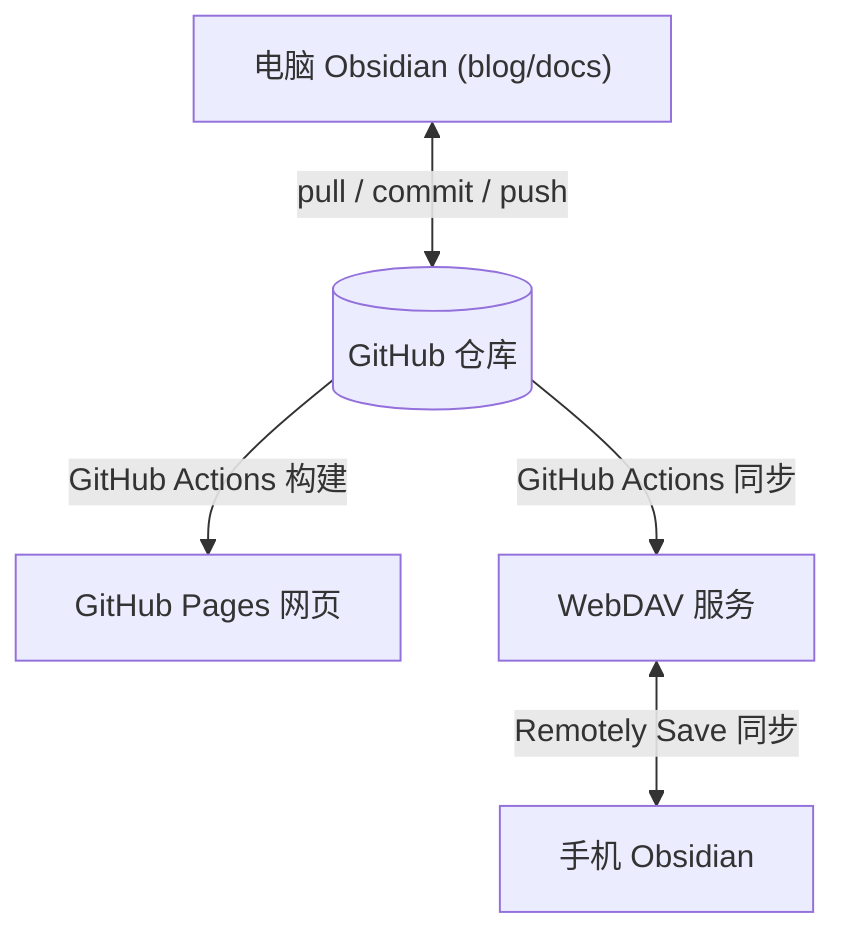

# Obsidian + GitHub 多端同步博客方案

这套方案的目标是让同一批 Markdown 同时服务于三个场景：

- 电脑端 Obsidian：主要写作环境，通过 Git 与 GitHub 同步。
- 手机端 Obsidian：通过 WebDAV 同步原始内容，查看和少量编辑。
- GitHub Pages：网页发布，通过 GitHub Actions 自动构建。

核心原则：**GitHub 仓库作为唯一真源**。电脑端通过 Git 与 GitHub 同步，GitHub Actions 同时部署到 GitHub Pages（网页发布）和 WebDAV（手机端同步原始内容）。



## 推荐目录设计

当前项目可以这样理解：

```text
blog/
├── docs/                  # Obsidian Vault，也是 VitePress 内容目录
│   ├── .obsidian/         # Obsidian 配置
│   ├── posts/             # 博客文章
│   ├── tutorials/         # 教程
│   └── .vitepress/        # VitePress 配置
├── package.json
└── README.md
```

建议在 Obsidian 里打开 `blog/docs`，而不是打开整个 `blog`：

- Obsidian 只关心 Markdown、附件和 `.obsidian` 配置。
- `package.json`、`node_modules`、构建脚本留在外层，减少手机端同步负担。
- VitePress 默认也是从 `docs` 目录读取内容。

如果已经用 Obsidian 打开过整个 `blog`，可以关闭当前 Vault，重新选择 `blog/docs` 作为 Vault。

## 整体工作流

日常使用时按这个顺序：

```text
开始写作前：pull
写作完成后：commit
离开设备前：push
换设备前：先 pull
```

不要同时在电脑和手机改同一篇文章。最容易冲突的是同一个 Markdown 文件、`.obsidian/workspace.json` 和附件文件名。

## 第一步：准备 GitHub 仓库

为什么用 GitHub 仓库作为真源？

- **版本控制**：每次修改都有记录，可以回溯历史版本。
- **多端同步**：电脑和手机都从同一个仓库拉取和推送，避免文件丢失或版本混乱。
- **自动发布**：配合 GitHub Actions，推送后自动构建并同步到 WebDAV。
- **免费稳定**：公开仓库免费，GitHub 服务稳定可靠。

在电脑端完成 GitHub 仓库初始化和推送即可。

## 第二步：配置电脑端 Obsidian

电脑端建议使用 Obsidian 社区插件 `Obsidian Git`。

操作步骤：

1. 打开 Obsidian。
2. 打开 Vault：选择 `blog/docs`。
3. 进入 Settings。
4. 打开 Community plugins。
5. 关闭 Restricted mode。
6. 搜索并安装 `Obsidian Git`。
7. 启用插件。

推荐配置：

| 配置项                                     | 建议值                      | 说明                                       |
| --------------------------------------- | ------------------------ | ---------------------------------------- |
| Auto pull interval (minutes)            | `10` 到 `30` 分钟           | 自动拉取 GitHub 最新内容                         |
| Auto commit-and-sync interval (minutes) | `10` 到 `30` 分钟           | 自动 commit 并 push（原 Auto backup interval） |
| Commit message on auto commit-and-sync  | `vault backup: {{date}}` | 自动提交信息，建议加 `{{date}}` 占位符带时间戳            |
| Pull updates on startup                 | 开启                       | 打开 Obsidian 时先同步                         |
| Push on commit-and-sync                 | 开启                       | 自动备份后推送到 GitHub（原 Push on backup）        |

手动命令也要会用：

- `Obsidian Git: Pull`
- `Obsidian Git: Commit all changes`
- `Obsidian Git: Push`
- `Obsidian Git: Create backup`

建议先手动执行一次 `Pull`，再执行 `Create backup`，确认没有报错。

## 第三步：配置手机端 Obsidian

手机端推荐使用 `Remotely Save` 插件配合 WebDAV 进行同步。

### Remotely Save + WebDAV

如果 Obsidian Git 插件在手机端遇到权限、认证或路径问题，可以使用 `Remotely Save` 插件配合 WebDAV 进行同步。

操作步骤：

1. 准备一个 WebDAV 服务（如 NAS 自带 WebDAV、坚果云、Nextcloud 等）。
2. 在手机 Obsidian 打开 `blog/docs` Vault。
3. 进入 Settings → Community plugins → 搜索安装 `Remotely Save`。
4. 启用插件后进入设置页面。
5. 选择远程类型为 **WebDAV**，配置：
   - 服务器地址（如 `https://dav.jianguoyun.com/dav/`）
   - 用户名
   - 密码
6. 点击检查连接，确认配置正确。
7. 开启自动同步间隔（建议 10-30 分钟）。

常用 WebDAV 服务：

| 服务 | 说明 |
| --- | --- |
| 坚果云 | 国内服务，免费额度足够个人使用 |
| Nextcloud | 自建私有云，需要自己部署 |
| NAS WebDAV | 群晖、威联通等 NAS 自带 |

Remotely Save 的优点：

- 不依赖 Git 命令行，纯 API 调用。
- 支持增量同步，只传输变更文件。
- 支持端到端加密。

注意事项：

- 电脑端也需要安装 Remotely Save 并配置相同的 WebDAV 服务。
- 与 Git 方案互斥，二选一即可。

## 第四步：配置 GitHub Actions 自动发布

GitHub Actions 在每次推送到 main 分支时同时完成两件事：
1. 构建并部署到 GitHub Pages（网页发布）
2. 同步原始内容到 WebDAV（手机端同步）

### 创建 Workflow 文件

在仓库根目录创建 `.github/workflows/deploy.yml`：

```yaml
name: Deploy VitePress to GitHub Pages and WebDAV

on:
  push:
    branches: [main]
  workflow_dispatch:

permissions:
  contents: read
  pages: write
  id-token: write

concurrency:
  group: pages
  cancel-in-progress: false

jobs:
  build:
    runs-on: ubuntu-latest
    steps:
      - name: Checkout
        uses: actions/checkout@v4
        with:
          fetch-depth: 0

      - name: Setup Node
        uses: actions/setup-node@v4
        with:
          node-version: 20
          cache: npm

      - name: Setup Pages
        uses: actions/configure-pages@v4

      - name: Install dependencies
        run: npm ci

      - name: Build with VitePress
        run: npm run docs:build

      - name: Upload artifact
        uses: actions/upload-pages-artifact@v3
        with:
          path: docs/.vitepress/dist

  deploy-pages:
    environment:
      name: github-pages
      url: ${{ steps.deployment.outputs.page_url }}
    needs: build
    runs-on: ubuntu-latest
    name: Deploy to GitHub Pages
    steps:
      - name: Deploy to GitHub Pages
        id: deployment
        uses: actions/deploy-pages@v4

  sync-webdav:
    needs: build
    runs-on: ubuntu-latest
    name: Sync to WebDAV
    steps:
      - name: Checkout
        uses: actions/checkout@v4
        with:
          fetch-depth: 0

      - name: Install rclone
        run: curl https://rclone.org/install.sh | sudo bash

      - name: Configure rclone
        run: |
          rclone config create mywebdav webdav \
            url="${{ secrets.WEBDAV_URL }}" \
            vendor=other \
            user="${{ secrets.WEBDAV_USER }}" \
            pass=$(rclone obscure "${{ secrets.WEBDAV_PASS }}")

      - name: Sync docs to WebDAV
        run: rclone sync docs mywebdav:/blog --progress
```

### 配置 Secrets

在 GitHub 仓库设置中添加 WebDAV 凭据：

1. 进入 Settings → Secrets and variables → Actions。
2. 添加以下 secrets：
   - `WEBDAV_URL`：WebDAV 服务地址（如 `https://dav.jianguoyun.com/dav/`）
   - `WEBDAV_USER`：WebDAV 用户名
   - `WEBDAV_PASS`：WebDAV 密码

### 配置 GitHub Pages

1. 进入 Settings → Pages。
2. Source 选择 `GitHub Actions`。
3. 推送到 `main` 后，Actions 会自动构建并发布。

推送代码后，GitHub Actions 会自动：
- 构建并部署到 GitHub Pages（网页访问）
- 同步 `docs` 目录到 WebDAV（手机端通过 Remotely Save 获取原始内容）

## 第五步：同步 Obsidian 配置

`.obsidian` 配置必须提交到 GitHub，才能通过 WebDAV 同步到手机端。否则手机端 Obsidian 会缺少电脑端的界面配置、插件设置等。

建议提交：

- `.obsidian/app.json`
- `.obsidian/appearance.json`
- `.obsidian/core-plugins.json`
- `.obsidian/community-plugins.json`
- `.obsidian/plugins/obsidian-git/`
- `.obsidian/plugins/remotely-save/`

建议谨慎提交：

- `.obsidian/workspace.json`
- `.obsidian/workspace-mobile.json`

原因是 workspace 文件记录窗口布局、当前打开文件、设备状态，不同设备之间很容易频繁变化。

如果发现每次打开 Obsidian 都产生 `.obsidian/workspace.json` 改动，可以把它加入 `.gitignore`：

```text
docs/.obsidian/workspace.json
docs/.obsidian/workspace-mobile.json
```

## 第六步：附件和图片规则

为了让 Obsidian 和 VitePress 都能稳定识别图片，建议统一附件路径。

推荐方式：

```text
docs/.vitepress/public/images/posts/YYYY/MM/
```

Markdown 里引用：

```markdown

```

这样：

- VitePress 构建后可以正常访问图片。
- Obsidian 里也能保存 Markdown 引用。
- 图片路径不会因为文章移动而失效。

如果更重视 Obsidian 体验，也可以把附件放在文章同目录，但 VitePress 迁移和公共路径管理会稍微麻烦。

## 第七步：冲突处理规则

发生冲突时，先不要继续写作。按顺序处理：

1. 在当前设备执行 Pull。
2. 打开冲突文件，搜索：

```text
<<<<<<<
=======
>>>>>>>
```

3. 保留正确内容，删除冲突标记。
4. 重新提交：

```bash
git add .
git commit -m "fix: resolve sync conflict"
git push
```

常见冲突来源：

| 文件 | 原因 | 建议 |
| --- | --- | --- |
| Markdown 文章 | 两台设备同时编辑 | 一次只在一台设备编辑同一篇 |
| `.obsidian/workspace.json` | 设备布局不同 | 加入 `.gitignore` |
| 图片附件 | 两台设备生成同名图片 | 图片文件名加日期和主题 |
| `package-lock.json` | 多设备安装依赖 | 手机端不要运行 npm install |

## 日常使用清单

电脑端：

1. 打开 Obsidian。
2. 等待自动 Pull，或手动执行 Pull。
3. 编辑文章。
4. 执行 Create backup，或等待自动备份。
5. 确认 Push 成功。

手机端：

1. 打开 Obsidian。
2. 等待 Remotely Save 自动同步，或手动触发同步。
3. 查看或编辑文章。
4. 再次同步确认成功。

自动发布：

1. GitHub 收到 Push。
2. GitHub Actions 自动构建。
3. 构建产物部署到 GitHub Pages（网页访问）。
4. 原始内容同步到 WebDAV（手机端获取）。

## 推荐最终方案

```text
电脑：Obsidian + Obsidian Git（与 GitHub 同步）
手机：Obsidian + Remotely Save（与 WebDAV 同步原始内容）
网页：GitHub Pages（GitHub Actions 自动构建发布）
真源：GitHub 仓库 main 分支
```

最重要的习惯：**电脑端换设备前先 Push，开始写作前先 Pull**。
