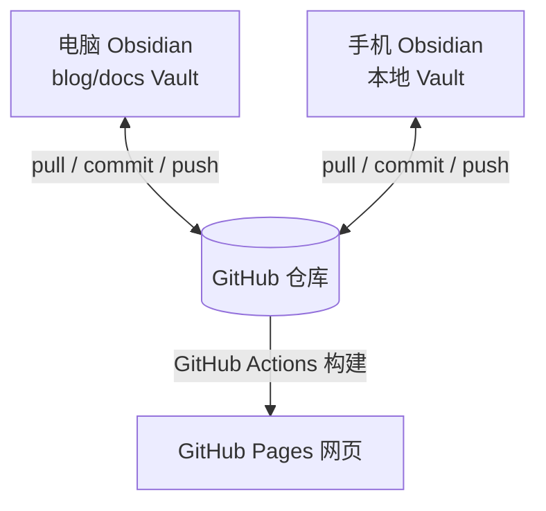

# Obsidian + GitHub 多端同步博客方案

这套方案的目标是让同一批 Markdown 同时服务于三个场景：

- 电脑端 Obsidian：主要写作环境。
- 手机端 Obsidian：查看、少量编辑、同步同一个 Vault。
- GitHub Pages：把博客内容发布成网页。

核心原则：**GitHub 仓库作为唯一真源**。电脑和手机都从 GitHub 拉取最新内容，编辑后再推回 GitHub；GitHub Pages 只负责把仓库内容构建成网页。



## 推荐目录设计

当前项目可以这样理解：

```text
blog/
├── docs/                  # Obsidian Vault，也是 VitePress 内容目录
│   ├── .obsidian/         # Obsidian 配置
│   ├── posts/             # 博客文章
│   ├── tutorials/         # 教程
│   └── .vitepress/        # VitePress 配置
├── package.json
└── README.md
```

建议在 Obsidian 里打开 `blog/docs`，而不是打开整个 `blog`：

- Obsidian 只关心 Markdown、附件和 `.obsidian` 配置。
- `package.json`、`node_modules`、构建脚本留在外层，减少手机端同步负担。
- VitePress 默认也是从 `docs` 目录读取内容。

如果已经用 Obsidian 打开过整个 `blog`，可以关闭当前 Vault，重新选择 `blog/docs` 作为 Vault。

## 整体工作流

日常使用时按这个顺序：

```text
开始写作前：pull
写作完成后：commit
离开设备前：push
换设备前：先 pull
```

不要同时在电脑和手机改同一篇文章。最容易冲突的是同一个 Markdown 文件、`.obsidian/workspace.json` 和附件文件名。

## 第一步：准备 GitHub 仓库

在电脑端完成：

```bash
git status
git remote -v
```

如果还没有绑定 GitHub 仓库：

```bash
git remote add origin git@github.com:<你的用户名>/<仓库名>.git
git branch -M main
git push -u origin main
```

如果你使用 HTTPS，也可以：

```bash
git remote add origin https://github.com/<你的用户名>/<仓库名>.git
git branch -M main
git push -u origin main
```

建议优先使用 SSH，因为电脑和手机端 Git 工具都更适合长期保存 SSH key。

## 第二步：配置电脑端 Obsidian

电脑端建议使用 Obsidian 社区插件 `Obsidian Git`。

操作步骤：

1. 打开 Obsidian。
2. 打开 Vault：选择 `blog/docs`。
3. 进入 Settings。
4. 关闭 Restricted mode。
5. 打开 Community plugins。
6. 搜索并安装 `Obsidian Git`。
7. 启用插件。

推荐配置：

| 配置项 | 建议值 | 说明 |
| --- | --- | --- |
| Auto pull interval | `10` 到 `30` 分钟 | 自动拉取 GitHub 最新内容 |
| Auto backup interval | `10` 到 `30` 分钟 | 自动 commit 和 push |
| Commit message | `vault backup: {{date}}` | 自动提交信息 |
| Pull updates on startup | 开启 | 打开 Obsidian 时先同步 |
| Push on backup | 开启 | 自动备份后推送到 GitHub |

手动命令也要会用：

- `Obsidian Git: Pull`
- `Obsidian Git: Commit all changes`
- `Obsidian Git: Push`
- `Obsidian Git: Create backup`

建议先手动执行一次 `Pull`，再执行 `Create backup`，确认没有报错。

## 第三步：配置手机端 Obsidian

手机端有两条路线：iPhone 用 Working Copy 更稳，Android 可以用 Obsidian Git 或 Termux。

### iPhone：Working Copy + Obsidian

推荐组合：

```text
GitHub 仓库
↕
Working Copy
↕
Obsidian Mobile
```

操作步骤：

1. 在 App Store 安装 `Working Copy`。
2. 在 Working Copy 里登录 GitHub。
3. Clone 你的 `blog` 仓库。
4. 在 Obsidian Mobile 里创建或打开本地 Vault，选择 Working Copy 中的 `blog/docs` 目录。
5. 写作前在 Working Copy 里 Pull。
6. 写作后在 Working Copy 里 Commit。
7. Commit 后 Push 到 GitHub。

iPhone 上的关键点：

- Obsidian 负责编辑文件。
- Working Copy 负责 Git 同步。
- 不要绕过 Working Copy 直接依赖 GitHub Pages，因为 GitHub Pages 不是文件同步工具。

### Android：Obsidian Git 或 Termux

Android 有两种常见方式。

方式 A：Obsidian Git 插件

1. 在 Android Obsidian 打开 `blog/docs` Vault。
2. 安装并启用 `Obsidian Git`。
3. 配置 GitHub 认证。
4. 使用 Pull、Commit、Push 同步。

方式 B：Termux + Git

1. 安装 Termux。
2. 安装 Git：

```bash
pkg update
pkg install git openssh
```

3. 配置 Git 身份：

```bash
git config --global user.name "你的名字"
git config --global user.email "你的邮箱"
```

4. Clone 仓库到手机本地目录。
5. 用 Obsidian 打开仓库里的 `docs` 目录。
6. 在 Termux 里执行 pull、commit、push。

Android 如果能稳定使用 Obsidian Git 插件，优先用方式 A；如果插件受系统权限、认证或文件路径限制，再换 Termux。

## 第四步：配置 GitHub Pages 发布

这个项目使用 VitePress，构建命令是：

```bash
npm run docs:build
```

GitHub Pages 推荐使用 GitHub Actions 自动发布。仓库需要有类似这个 workflow：

```yaml
name: Deploy VitePress site to Pages

on:
  push:
    branches: [main]
  workflow_dispatch:

permissions:
  contents: read
  pages: write
  id-token: write

concurrency:
  group: pages
  cancel-in-progress: false

jobs:
  build:
    runs-on: ubuntu-latest
    steps:
      - name: Checkout
        uses: actions/checkout@v4

      - name: Setup Node
        uses: actions/setup-node@v4
        with:
          node-version: 20
          cache: npm

      - name: Install dependencies
        run: npm ci

      - name: Build
        run: npm run docs:build

      - name: Upload artifact
        uses: actions/upload-pages-artifact@v3
        with:
          path: docs/.vitepress/dist

  deploy:
    environment:
      name: github-pages
      url: ${{ steps.deployment.outputs.page_url }}
    needs: build
    runs-on: ubuntu-latest
    steps:
      - name: Deploy to GitHub Pages
        id: deployment
        uses: actions/deploy-pages@v4
```

GitHub 仓库设置：

1. 进入 Settings。
2. 进入 Pages。
3. Source 选择 `GitHub Actions`。
4. 推送到 `main` 后，Actions 会自动构建并发布。

当前 `docs/.vitepress/config.mjs` 里配置了：

```js
base: "/blog/",
```

如果仓库名不是 `blog`，需要把它改成你的仓库名。例如仓库是 `notes`，就改成：

```js
base: "/notes/",
```

如果仓库是 `<用户名>.github.io`，通常改成：

```js
base: "/",
```

## 第五步：处理 Obsidian 配置同步

`.obsidian` 可以同步，但建议只同步必要配置。

建议提交：

- `.obsidian/app.json`
- `.obsidian/appearance.json`
- `.obsidian/core-plugins.json`
- `.obsidian/community-plugins.json`
- `.obsidian/plugins/obsidian-git/`

建议谨慎提交：

- `.obsidian/workspace.json`
- `.obsidian/workspace-mobile.json`

原因是 workspace 文件记录窗口布局、当前打开文件、设备状态，不同设备之间很容易频繁变化。

如果发现每次打开 Obsidian 都产生 `.obsidian/workspace.json` 改动，可以把它加入 `.gitignore`：

```text
docs/.obsidian/workspace.json
docs/.obsidian/workspace-mobile.json
```

## 第六步：附件和图片规则

为了让 Obsidian 和 VitePress 都能稳定识别图片，建议统一附件路径。

推荐方式：

```text
docs/.vitepress/public/images/posts/YYYY/MM/
```

Markdown 里引用：

```markdown

```

这样：

- VitePress 构建后可以正常访问图片。
- Obsidian 里也能保存 Markdown 引用。
- 图片路径不会因为文章移动而失效。

如果更重视 Obsidian 体验，也可以把附件放在文章同目录，但 VitePress 迁移和公共路径管理会稍微麻烦。

## 第七步：冲突处理规则

发生冲突时，先不要继续写作。按顺序处理：

1. 在当前设备执行 Pull。
2. 打开冲突文件，搜索：

```text
<<<<<<<
=======
>>>>>>>
```

3. 保留正确内容，删除冲突标记。
4. 重新提交：

```bash
git add .
git commit -m "fix: resolve sync conflict"
git push
```

常见冲突来源：

| 文件 | 原因 | 建议 |
| --- | --- | --- |
| Markdown 文章 | 两台设备同时编辑 | 一次只在一台设备编辑同一篇 |
| `.obsidian/workspace.json` | 设备布局不同 | 加入 `.gitignore` |
| 图片附件 | 两台设备生成同名图片 | 图片文件名加日期和主题 |
| `package-lock.json` | 多设备安装依赖 | 手机端不要运行 npm install |

## 日常使用清单

电脑端：

1. 打开 Obsidian。
2. 等待自动 Pull，或手动执行 Pull。
3. 编辑文章。
4. 执行 Create backup，或等待自动备份。
5. 确认 Push 成功。

手机端：

1. 打开 Working Copy、Obsidian Git 或 Termux。
2. 先 Pull。
3. 打开 Obsidian Mobile 编辑。
4. 回到 Git 工具 Commit。
5. Push 到 GitHub。

网页端：

1. GitHub 收到 Push。
2. GitHub Actions 自动构建。
3. GitHub Pages 更新网页。

## 推荐最终方案

免费优先：

```text
电脑：Obsidian + Obsidian Git
手机 iPhone：Obsidian Mobile + Working Copy
手机 Android：Obsidian Mobile + Obsidian Git 或 Termux
发布：GitHub Actions + GitHub Pages
真源：GitHub 仓库 main 分支
```

省心优先：

```text
Obsidian Sync 负责电脑和手机同步
GitHub 负责代码仓库和网页发布
GitHub Pages 负责博客访问
```

如果使用免费方案，最重要的习惯是：**换设备前先 Push，开始写作前先 Pull**。
